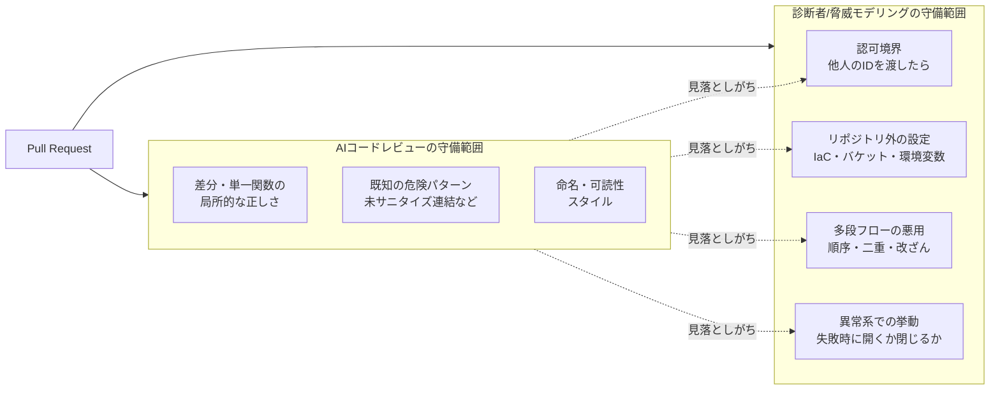
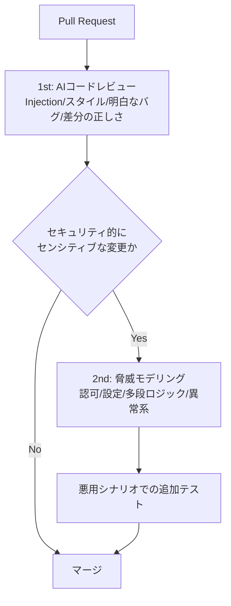

## TL;DR

- 「AIが実装し、AIがテストし、AIが『問題ありません』と言う」開発フローが一般化してきたが、この「問題ありません」は**動作の正しさ（正常系）**の保証であって、**悪用されないこと（攻撃者視点）**の保証ではない。ここを混同すると危ない。
- セキュリティ診断の現場で「LLMのレビューは通っているのに毎回引っかかる」欠陥は、だいたい次の4カテゴリに収束する: **①認可の欠落 / ②設定・デフォルトの穴 / ③設計・多段ロジックの悪用 / ④異常系の握り（fail open）**。
- この4つは偶然ではなく、LLMコードレビューの**構造的な制約**（差分単位のコンテキスト、正常系に最適化された学習分布、リポジトリ外設定への非到達）から必然的に漏れる。
- 2025年11月に更新された **OWASP Top 10:2025** でも、1位は依然 Broken Access Control（対象アプリの平均3.73%が該当）、2位に Security Misconfiguration が5位から急上昇（3.00%）。AIが得意な「Injection撲滅」とは別のレイヤーが上位を占めている。
- 対策は「AIレビューをやめる」ではなく、**AIレビュー（網羅・機械的）と人間の脅威モデリング（意図・悪用）を守備範囲で分担する二段構え**にすること。チェックリストを最後に置いた。

> ⚠️ 本記事のコードは説明用の最小例です。実測の件数・工数は環境に強く依存するため、私自身の数値は `[ここに実際の数値を記入]` としてプレースホルダーにしています（数字の捏造をしないため）。OWASPの割合など出典のある数値のみ実値で記載しています。

## 背景：「AIが問題ないと言った」で止まってしまう問題

ここ数週間、技術系のランキングを眺めていると「AIにコードを書かせ、AIにテストさせ、AIにレビューさせる」ワークフローの記事が上位を占めるようになりました。実装〜テスト〜レビューまでAIが回すこと自体は生産性の観点で理にかなっています。

問題は、そのアウトプットの受け取り方です。AIコードレビューが返す「問題ありません（LGTM）」を、そのまま**セキュリティ的にも安全**という意味で受け取ってしまうケースが増えています。しかし脆弱性診断を生業にしていると、この「問題ありません」の対象範囲が実は狭いことが体感で分かります。

LLMが得意なのは「このコードは意図どおり動くか」「明らかなアンチパターン（未サニタイズのSQL連結など）はないか」の判定です。一方、診断で見つかる欠陥の多くは「**コードは意図どおり正しく動くが、攻撃者が意図しない使い方をすると破れる**」タイプで、これはコードの正しさとは直交します。

まずは客観的な事実として、最新のOWASP Top 10で「今どこが危ないのか」を確認しておきます。

## 事実確認：OWASP Top 10:2025 の上位はAIが苦手なレイヤー

OWASP Top 10 は2025年11月（グローバルAppSecカンファレンス）で更新され、2025年版が最新です。上位を抜き出すと次のとおりです。

| 順位 | カテゴリ | 2021→2025の動き |
|---|---|---|
| A01:2025 | Broken Access Control（認可の不備） | 1位を維持。SSRFがこのカテゴリに統合された |
| A02:2025 | Security Misconfiguration（設定不備） | 5位 → **2位に急上昇** |
| A03:2025 | Software Supply Chain Failures | 新設（旧「脆弱で古いコンポーネント」を拡張） |
| A04:2025 | Cryptographic Failures | — |
| A05:2025 | Injection | — |
| A06:2025 | Insecure Design（安全でない設計） | 4位 → 6位 |
| A07:2025 | Authentication Failures | — |
| A10:2025 | Mishandling of Exceptional Conditions（異常系の扱い誤り） | **新設** |

出典（OWASP公式）: 1位 Broken Access Control は対象アプリの平均 **3.73%** が該当（40個のCWEを内包）、2位 Security Misconfiguration は **3.00%**。SSRFは単独カテゴリから A01 に統合されました。

ここで注目したいのは、**AIコードレビューが最も得意な Injection が5位まで後退**している一方で、**AIが苦手な「認可」「設定」「設計」「異常系」が上位と新設カテゴリを占めている**という構図です。つまり「AIレビューを入れたから安全」という感覚と、実際にアプリが破られている場所には、明確なズレがあります。

## なぜAIレビューは構造的にこの4分類を漏らすのか

具体例に入る前に、「たまたま見落とした」ではなく「構造的に漏れる」と言い切れる理由を3つ挙げます。



1. **コンテキストが差分・関数単位に閉じがち**：レビューは通常「変更された行」中心で走ります。認可や多段ロジックの欠陥は「呼び出し元」「別ファイルのミドルウェア」「DBの制約」を横断して初めて見える。差分だけを見ると各行は正しい。
2. **学習分布が正常系に最適化されている**：LLMは「よくある正しい書き方」を大量に学習しているため、正常系のコードを再現・肯定するのは得意です。攻撃者は定義上「稀で異常な入力」を送るので、その方向は分布の外側で相対的に弱い。
3. **コードの外に答えがある欠陥に到達できない**：S3バケットのポリシー、IAMの信頼関係、環境変数のデフォルト、リバースプロキシの設定などは、レビュー対象のコード差分に現れないことが多い。差分に無いものはレビューできません（A02が2位に上がった理由とも重なります）。

以下、この3つの制約から漏れる4カテゴリを、最小コードで示します。

## カテゴリ①：認可の欠落（A01 / IDOR）

最頻出です。コードは「ログイン済みユーザーに対して正しく動く」ので、AIも人間もパッと見で通してしまいます。

```python
# FastAPI 風の擬似コード
@app.get("/orders/{order_id}")
def get_order(order_id: int, user=Depends(current_user)):
    # ログインは確認している（認証OK）
    order = db.query(Order).filter(Order.id == order_id).first()
    return order  # ← order.user_id が「呼び出したユーザー」のものか確認していない
```

- **AIが「問題なし」と言う理由**：認証（ログイン）は入っているし、SQLもパラメータ化されていてInjectionもない。関数単体としては“正しく動く”。
- **診断者が見る点**：`/orders/1002` を、権限のない別ユーザーのセッションで叩く。他人の注文が返ればIDOR（安全でない直接オブジェクト参照）。修正は「所有者チェック」を**サーバ側で**必ず入れる。

```python
    order = db.query(Order).filter(
        Order.id == order_id, Order.user_id == user.id  # 認可条件をクエリに含める
    ).first()
    if order is None:
        raise HTTPException(status_code=404)  # 存在秘匿のため403ではなく404で返すことも多い
```

このカテゴリはOWASP Top 10:2025でも堂々の1位です。SSRF（ユーザー入力から組み立てたURLへサーバが通信してしまう）も2025年版ではこの A01 に統合されており、「サーバがどの宛先・どのリソースにアクセスしてよいか」という**境界の設計**が根っこで共通しています。

## カテゴリ②：設定・デフォルトの穴（A02）

2025年版で5位→2位に上がった、いま最も勢いのあるカテゴリです。そして**差分レビューが最も届きにくい**領域でもあります。

```yaml
# IaC（擬似）: 一見ただのストレージ定義
resources:
  ReportBucket:
    type: storage/bucket
    properties:
      name: my-app-reports
      # public-read がデフォルトのまま／暗号化未指定／ログ無効
```

- **AIが「問題なし」と言う理由**：そもそもアプリのソースコード差分にこの設定が出てこないことが多い。出てきても「構文として正しいIaC」なので機械的には通る。
- **診断者/クラウド視点で見る点**：バケットの公開設定、IAMロールの過剰権限（`*` 付与）、デフォルト認証情報、詳細エラーの本番露出、CORSの `*`。コードが完璧でも、ここが一つ緩いと全部が無効化されます。

AWS周りでよく見るのは「動かすために一旦 `s3:*` / `Resource: "*"` にして、そのまま本番に残る」パターン。最小権限に絞るだけで攻撃面が大きく下がります。**設定はコードと別レイヤーとして、別のチェックリストで見る**のが鉄則です。

## カテゴリ③：設計・多段ロジックの悪用（A06 Insecure Design）

単一関数のレビューでは原理的に見つからない、「複数ステップの正しい関数を、攻撃者が想定外の順序・回数・値で組み合わせる」タイプ。

```python
def apply_coupon(cart, coupon_code):
    coupon = get_coupon(coupon_code)      # 有効なクーポンか検証：OK
    cart.discount += coupon.amount        # 割引を加算：関数単体では正しい
    return cart
# 同じクーポンを2回POSTすると割引が二重に乗る／合計がマイナスになる、を防いでいない
```

- **AIが「問題なし」と言う理由**：`apply_coupon` は仕様どおり正しく割引を適用している。バグではない。
- **診断者が見る点**：冪等性・回数制限・状態遷移・下限（合計がマイナスにならないか）・レースコンディション。これは「悪用シナリオ」を人間が能動的に作らないと出てこない。OWASPが「Insecure Design」を独立カテゴリとして残しているのは、まさに**実装の正しさとは別に、設計段階で脅威を潰す必要がある**からです。

## カテゴリ④：異常系の握り（A10 Mishandling of Exceptional Conditions）

OWASP Top 10:2025で**新設**されたカテゴリ。AIは正常系（ハッピーパス）のコードを生成・肯定するのが得意な反面、「失敗したときにどう倒れるか」は手薄になりがちです。

```python
def is_admin(token):
    try:
        claims = verify_jwt(token)          # 検証に失敗すると例外
        return claims.get("role") == "admin"
    except Exception:
        return True   # ← 検証失敗時に True を返している（fail open）。最悪の実装
```

- **AIが「問題なし」と言う理由**：正常系のテスト（正しいadminトークン）は通る。例外分岐は“エラーを握って落ちないようにしている親切なコード”に見えることすらある。
- **診断者が見る点**：失敗時に**閉じる（deny）**か**開く（allow）**か。認証・認可・支払い・権限判定は必ず「失敗＝拒否（fail closed）」に倒す。壊れた/期限切れ/欠損トークンを投げて挙動を確認する。

```python
    except Exception:
        return False  # 失敗は必ず拒否側へ
```

「例外を握りつぶして処理を継続する」コードは、可用性のためには一見よさそうに見えて、認可の文脈では致命的になり得ます。新設カテゴリになっただけの実害があります。

## 実務への組み込み方：AIレビューと人間レビューの二段構え

結論は「AIレビューをやめる」ではありません。**守備範囲を分ける**のが答えです。AIには網羅性・機械的な一貫性を担わせ、人間（または脅威モデリング用の別プロンプト）には「悪用の意図」を担わせます。



「センシティブな変更」の判定は、変更ファイルのパスやキーワード（`auth` / `permission` / `payment` / `iam` / `bucket` / `token` など）で機械的に振り分けると運用に乗せやすいです。

### レビュー時チェックリスト（4カテゴリ対応）

- [ ] **認可**：このリソースは「今のユーザー」のものか、サーバ側でクエリ/コードに所有者条件が入っているか。IDを他人のものに差し替えて叩いたか。
- [ ] **設定**：差分の外（IaC・IAM・バケット・CORS・環境変数）に緩い箇所はないか。権限は `*` になっていないか。本番で詳細エラーが露出しないか。
- [ ] **設計**：同じ操作を2回/逆順/大量に投げたら破れないか。金額・在庫などに下限/上限/冪等性があるか。
- [ ] **異常系**：認証/認可/支払いの失敗時に「拒否側」に倒れるか（fail closed）。壊れた入力・期限切れトークンで挙動を確認したか。
- [ ] **総括**：この変更で新しく増えた「攻撃者が触れる入力口」はどこか、を一言で言えるか。

## AIレビュー vs 診断者レビュー（守備範囲の比較）

| 観点 | AIコードレビュー | 診断者/脅威モデリング |
|---|---|---|
| 得意 | 差分の正しさ、既知パターン、スタイル、網羅の一貫性 | 悪用シナリオ、境界、意図の逸脱 |
| コンテキスト | 差分・関数単位に閉じやすい | リポジトリ外（設定・運用）まで横断 |
| 入力の想定 | 正常系に最適化 | 異常系・攻撃入力を能動的に生成 |
| Injection(A05) | ◎ 強い | ○ |
| Broken Access Control(A01) | △ 見落としがち | ◎ |
| Misconfiguration(A02) | △ 差分に出ないと届かない | ◎ |
| Insecure Design(A06) | △ | ◎ |
| 異常系(A10) | △ ハッピーパス寄り | ◎ |
| コスト/速度 | 速い・安い・24h | 人的コスト高・スポット |

要は**排他ではなく補完**です。AIで面を張り、人間で刺されそうな点を潰す。

## 数字の総括（実測はプレースホルダー）

- 直近の診断/レビューで、AIレビューを通過したのに指摘した件数の内訳: 認可 `[ここに実際の件数を記入]` 件 / 設定 `[ここに実際の件数を記入]` 件 / 設計 `[ここに実際の件数を記入]` 件 / 異常系 `[ここに実際の件数を記入]` 件。
- 二段レビュー導入前後で、マージ後に発見された脆弱性の変化: `[ここに実際の数値を記入]`。
- 二段目（脅威モデリング）にかかる追加工数の目安: 1PRあたり `[ここに実際の分数を記入]` 分。
- 参考となる外部の実測値（OWASP公式）: Broken Access Control は対象アプリの平均 **3.73%**、Security Misconfiguration は **3.00%** が該当。

## Q&A

**Q. AIに「セキュリティ観点でもレビューして」と頼めば済むのでは？**
A. プロンプトで観点を足すと表層のパターン（未サニタイズ等）の検出率は上がります。ただし①差分外の設定、②呼び出し元を横断する認可、③多段の悪用シナリオは、コンテキストと入力分布の制約が残るため取りこぼしが出ます。プロンプト改善は有効ですが「二段目を省ける」根拠にはなりません。

**Q. 小さな個人開発でもここまで要る？**
A. 全部は不要です。まず①認可と④異常系（fail closed）の2つだけを毎回チェックするだけで、実害の大きい欠陥はかなり防げます。②設定はクラウドに公開リソースがある場合に足す、で十分です。

**Q. 静的解析(SAST)ツールがあればAIレビューと合わせて足りる？**
A. SASTはInjection系や既知CWEに強い一方、認可やビジネスロジックは苦手で、この記事の①③はSASTでも漏れがちです。ツール（SAST/AI）は「面」、人間は「意図」と役割分担するのが結局いちばん堅いです。

**Q. なぜ失敗時は必ず拒否（fail closed）なの？可用性が下がらない？**
A. 認証・認可・支払いといった「守るための判定」は、壊れたときに通してしまうと守りが消えます。可用性を優先すべき箇所（例: 表示系のキャッシュ）とは分けて考え、セキュリティ判定だけは拒否側に倒すのが原則です。

## まとめ

- 「AIが問題ないと言った」は**正常系の正しさ**の保証であって、**悪用されない**保証ではない。この2つは直交する。
- AIレビューが構造的に漏らすのは **①認可 / ②設定 / ③設計・多段ロジック / ④異常系（fail open）** の4カテゴリ。差分単位のコンテキスト、正常系寄りの学習分布、コード外設定への非到達という制約から必然的に生じる。
- OWASP Top 10:2025でも上位はこの4カテゴリ側（A01/A02/A06/A10）に寄っており、AIが得意なInjectionは5位まで後退している。
- 対策はAIレビューの廃止ではなく、**AI（網羅）＋人間の脅威モデリング（悪用）の二段構え**と、パスキーワードによる自動振り分け。最後のチェックリスト5項目から始めるのが現実的。

## 参考リンク

- OWASP Top Ten（プロジェクトトップ）: https://owasp.org/www-project-top-ten/
- OWASP Top 10:2025: https://owasp.org/Top10/2025/
- OWASP Top 10:2025 Introduction（順位と統計）: https://owasp.org/Top10/2025/0x00_2025-Introduction/
- OWASP A01:2021 Broken Access Control（解説の基礎資料）: https://owasp.org/Top10/A01_2021-Broken_Access_Control/
- OWASP Cheat Sheet Series（実装別の対策集）: https://cheatsheetseries.owasp.org/
