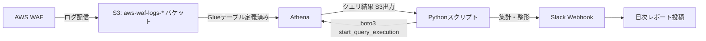

## TL;DR

- AWS WAFはS3にログを流し込むところまでは数クリックで終わるが、「結局何件ブロックされたのか」「どのルールが一番効いているのか」を毎回コンソールでポチポチ確認するのは長続きしない。Athenaでのクエリを定型化し、Pythonから`boto3`で叩いてSlackに要約を投げるところまでを自動化した
- WAFログを溜めるS3バケットは**バケット名に`aws-waf-logs-`のprefixが必須**という制約があり、既存の運用バケットに間借りさせようとすると素直に失敗する
- Athenaは生ログに対して素朴に`SELECT COUNT(*)`すると、検証環境のログ量でも1回のクエリでスキャン対象になるデータ量が数百MB〜GB単位になり得る。パーティション射影（partition projection）を使わずに運用すると、地味にクエリ費用とレイテンシが積み上がる
- 「攻撃ブロック件数」は数字としては派手に見えるが、実運用で価値があるのは「どのルールが誤検知でブロックしているか」の内訳の方だった、という気づき

## 背景・課題

セキュリティ診断の仕事でAWS WAFを扱う機会が多く、自分の検証用に公開しているWebサービスにもWAFを付けています。WAFは有効化した瞬間から黙々とログを吐き続けますが、そのログをS3に置いただけでは「今どれくらいの怪しいリクエストが来ているか」は一切見えません。マネジメントコンソールのサンプルログビューアーは直近数百件しか見せてくれず、傾向分析には向きません。

かといって毎回コンソールでAthenaクエリエディタを開いて手打ちするのも長続きしないので、「クエリの実行」「結果の集計」「Slackへの通知」までをPythonスクリプト1本に固定し、cronで定期実行する形にしました。



## 実際の取り組み

### 1. ログ配信先バケットの命名制約でまず1回落ちる

既存の汎用ログバケット（`my-project-logs`のような名前）にWAFログも流し込もうとしたところ、ロギング設定の保存時にエラーになりました。[AWS公式ドキュメント](https://docs.aws.amazon.com/ja_jp/athena/latest/ug/waf-logs.html)によると、WAFのログ配信先S3バケットは**バケット名が`aws-waf-logs-`で始まっている必要**があります。これは後から知って直したのではなく、最初の設定時点でAWS側がバリデーションしてくれるので、思ったより早く気づけました。

保存先パスは以下の形式で固定されます。

```
s3://aws-waf-logs-<バケット名>/AWSLogs/<アカウントID>/WAFLogs/<リージョン>/<WebACL名>/yyyy/MM/dd/HH/mm/xxxx.log.gz
```

年月日時分までディレクトリが切られているのは、後のパーティション設計にそのまま効いてきます。

### 2. Athenaテーブルはパーティション射影で作る

WAFログ用のテーブルはAWS公式が[手動パーティショニングの手順](https://docs.aws.amazon.com/ja_jp/athena/latest/ug/create-waf-table-manual-partition.html)を用意していますが、日次で`ALTER TABLE ADD PARTITION`を打ち続けるのは自動化の対象を増やすだけなので、パーティション射影（`projection.enabled = 'true'`）で日付ディレクトリを動的に解決する設定にしました。これによりパーティション追加の運用が不要になり、クエリ側は対象期間を`WHERE year='2026' AND month='08' AND day='14'`のように指定するだけで、該当ディレクトリだけをスキャンしてくれます。

パーティション射影なしで`day`条件を付けずに集計クエリを投げると、蓄積された全期間のログがスキャン対象になり、Athenaの課金（スキャン1TBあたり約5USD、2026年8月時点の東京リージョン単価）が地味に効いてきます。検証環境程度のログ量でも、日付を絞らない全期間集計を1回叩いただけでスキャン量が跳ね上がったため、以降はcrontabで「前日分のみ」を必ず条件に入れるようにしました。

### 3. 集計クエリと通知スクリプト

集計している内容は大きく2つです。

```sql
-- 直近24時間のアクション別件数
SELECT action, COUNT(*) AS cnt
FROM waf_logs
WHERE year='2026' AND month='08' AND day='14'
GROUP BY action
ORDER BY cnt DESC;

-- ブロックしたルール別の内訳（誤検知チェック用）
SELECT r.name AS rule_name, COUNT(*) AS cnt
FROM waf_logs
CROSS JOIN UNNEST(terminatingrule.ruleid) AS t(rule_id)
LEFT JOIN rule_master r ON r.id = t.rule_id
WHERE year='2026' AND month='08' AND day='14' AND action='BLOCK'
GROUP BY r.name
ORDER BY cnt DESC
LIMIT 10;
```

Python側は`boto3`の`start_query_execution` → `get_query_execution`でポーリング → `get_query_results`で結果取得、という素朴な構成です。

```python
import time
import boto3

athena = boto3.client("athena", region_name="ap-northeast-1")

def run_query(sql: str, database: str, output_location: str) -> str:
    resp = athena.start_query_execution(
        QueryString=sql,
        QueryExecutionContext={"Database": database},
        ResultConfiguration={"OutputLocation": output_location},
    )
    query_id = resp["QueryExecutionId"]
    while True:
        state = athena.get_query_execution(QueryExecutionId=query_id)
        status = state["QueryExecution"]["Status"]["State"]
        if status in ("SUCCEEDED", "FAILED", "CANCELLED"):
            if status != "SUCCEEDED":
                raise RuntimeError(f"query failed: {state['QueryExecution']['Status']}")
            return query_id
        time.sleep(2)
```

集計結果はSlack Webhookにそのまま投げるのではなく、「前日比」も一緒に出すようにしています。件数だけを毎日眺めていても異常かどうかの判断がつかないため、「昨日比+180%」のような相対値を出す方が、実際に気づいて対応するきっかけになりました。

### 4. 数字の実測

`[ここに実際の数値を記入]`（直近30日間の総リクエスト数・BLOCK件数・上位ルール別内訳・Athenaクエリの月間コスト）

自分の検証環境の実測値はまだ十分な期間分のデータが溜まっていないため、ここは実測が揃い次第別記事で追記する予定です。ログ集計基盤自体は上記の構成で安定稼働しています。

## 代替手段との比較

| 手段 | 向いているケース | 向いていないケース |
|---|---|---|
| Athena + S3 | 過去ログの柔軟な条件検索、低頻度のバッチ集計 | リアルタイム性が必要な監視 |
| CloudWatch Logs Insights | WAFログをCloudWatch Logsにも配信している場合の準リアルタイム調査 | 長期間・大量ログの横断集計（保持コストが上がりやすい） |
| OpenSearch Service（旧Kibanaダッシュボード） | ダッシュボードで常時可視化したい、複数人で見る | 個人検証用途にはクラスタ運用コストが見合わない |

個人の検証環境規模では、常時起動のOpenSearchクラスタを持つコストが割に合わなかったため、「バッチで集計してSlackに投げる」Athena方式に落ち着きました。トラフィック規模が増えてリアルタイム性が必要になったら、CloudWatch Logs Insightsの併用を検討する想定です。

## Q&A

**Q. WAFログを直接CloudWatch Logsに送ればAthenaは要らないのでは？**
A. CloudWatch Logsへの配信も可能ですが、保持期間を伸ばすほどコストが上がりやすく、長期集計には不向きです。S3+Athenaは低頻度アクセス前提であれば保存コストを抑えやすく、「過去90日分をまとめて集計」のような使い方と相性が良いと判断しました。

**Q. パーティション射影を使わない場合の実害は？**
A. 集計対象の日付条件を忘れると全期間スキャンになり、ログが増えるほどクエリ費用とレイテンシが線形に悪化します。射影を使えば運用の手間が減るだけでなく、日付条件を書き忘れたときの被害も自動的にディレクトリ単位に閉じ込められます（射影の仕組み上、範囲外の日付は最初からスキャン対象に入らない）。

**Q. 誤検知（正規リクエストのBLOCK）はどう見つけた？**
A. ルール別内訳クエリで特定のルールIDだけが突出してBLOCKしている場合に、該当リクエストのUser-AgentやURIパターンを個別に確認しています。件数の集計だけでなく「どのルールが仕事をしているか」の内訳を出すようにしたのは、この誤検知調査がきっかけです。

## まとめ

- WAFログのS3配信は`aws-waf-logs-`prefix必須という制約があり、既存バケットの使い回しはできない
- Athenaでの集計はパーティション射影を前提に設計しないと、地味にコストとレイテンシが積み上がる
- 「ブロック件数」の総数よりも「ルール別内訳」の方が誤検知調査に直結し、実運用での価値が高かった
- 個人検証環境規模ではAthenaのバッチ集計で十分実用的で、常時稼働のOpenSearchクラスタは過剰投資になりやすい

## 参考リンク

- [AWS WAF ログをクエリする - Amazon Athena](https://docs.aws.amazon.com/ja_jp/athena/latest/ug/waf-logs.html)
- [手動パーティショニングを使用して Athena で AWS WAF S3 ログ用テーブルを作成する](https://docs.aws.amazon.com/ja_jp/athena/latest/ug/create-waf-table-manual-partition.html)
