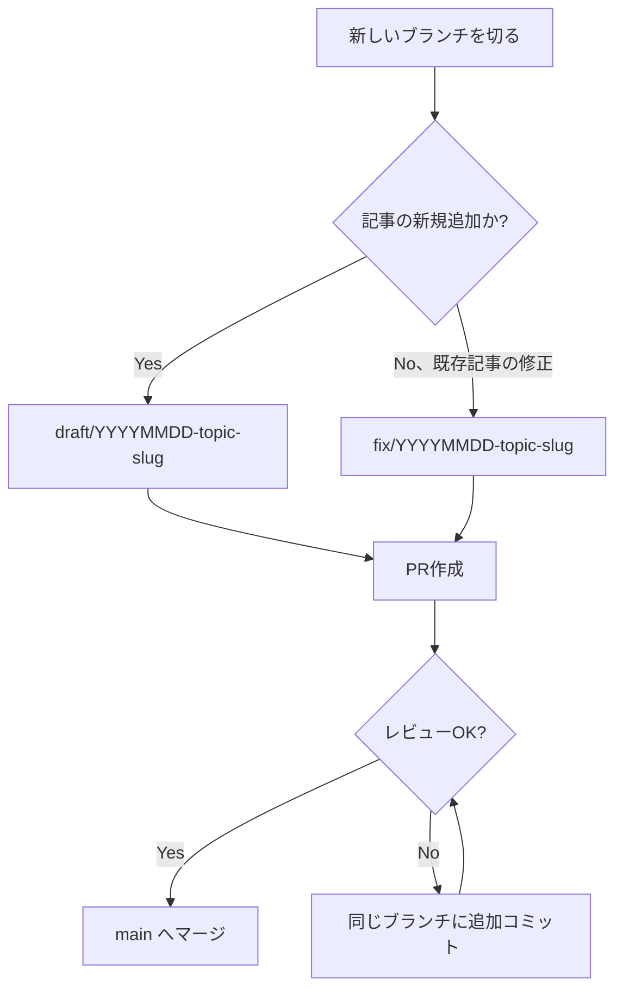

## TL;DR

- 技術記事を投稿している個人開発リポジトリ2本（Qiita用・Zenn用）で、直近10週間（2026/06/06〜2026/08/15）のマージ済みPRを数えたところ、**合計39本**（Qiita 17本／Zenn 22本）だった
- ブランチ名の接頭辞を集計すると、`article/` `articles/`（単数・複数の揺れ）`feature/` `fix/` `draft/` の**5パターン**に割れていた。意味的には「記事追加」「記事修正」の2種類しかないのに、表記が増殖していた
- 原因をコミットログから追おうとしたが、**著者名（`geeknow112` / `myu`）だけでは、そのブランチを人間が手で切ったのか自動化バッチが切ったのかを区別できなかった**。これはログを見て初めて気づいた限界だった
- 対策として、直近のPR（Qiita #24、Zenn #33）から `draft/YYYYMMDD-topic-slug` 形式への統一を始めており、命名規則を後から一本化する際の実務的な移行手順をまとめた

## 背景・課題

技術記事を書いて投稿するためのリポジトリを、Qiita用・Zenn用の2本、GitHub上で別々に運用しています。記事追加や既存記事の修正は、都度ブランチを切って `main` へのPRを作り、レビューしてからマージするフローに統一していました。ただしこの2本のリポジトリは、記事執筆自体を一部自動化しているため、ブランチが「その場の思いつきの名前」で切られる頻度が、通常の開発リポジトリより高くなりがちです。

Qiita/Zennの直近トレンドを見ると「[Claude Code／Codexに中～大規模開発を任せるためのタスク管理](https://qiita.com/Y-Y-dev/items/d526fb7cdbe35a3f9384)」のような、AIエージェントに開発タスクを任せる際の運用ノウハウ系の記事が伸びています（2026/08時点のQiitaいいねランキングで週間1位・122いいね）。この手のタスク管理という観点で自分のリポジトリを振り返ったとき、「ブランチ名」という一番地味な部分を数値で棚卸ししたことがなかったことに気づき、今回実際に集計してみました。

## 具体的な取り組み

### まず実数を数える

`git log` でマージ済みPRのブランチ名を接頭辞ごとに集計しました。使ったコマンドはこれだけです。

```bash
git log origin/main --oneline --grep="Merge pull request" \
  | grep -oP 'from geeknow112/\K[^/]+' \
  | sort | uniq -c | sort -rn
```

結果は次の通りでした。

| リポジトリ | 接頭辞 | 件数 |
|---|---|---|
| Qiita用 | `article/` | 5 |
| Qiita用 | `feature/` | 4 |
| Qiita用 | `articles/` | 4 |
| Qiita用 | `fix/` | 3 |
| Qiita用 | `draft/` | 1 |
| Zenn用 | `fix/` | 5 |
| Zenn用 | `feature/` | 5 |
| Zenn用 | `articles/` | 5 |
| Zenn用 | `article/` | 5 |
| Zenn用 | `draft/` | 2 |

Qiita用は5接頭辞で17本、Zenn用は5接頭辞で22本、合計39本のPRがマージされていました。期間はどちらのリポジトリも初回コミットが2026年6月上旬で、直近マージが2026年8月15日。約10週間の間に、実質2種類の意図（「記事を新規追加する」「既存記事を直す」）しかないのに、表記が5パターンまで増えていたことになります。

### なぜ増殖したのか、ログからは分からなかった

当初は「自動化バッチが切ったブランチと、自分が手で切ったブランチで接頭辞の傾向が違うのでは」という仮説を立てていました。しかし著者情報を見てみると、

```
myu <...@users.noreply.github.com> — Merge pull request #25 ...
geeknow112 <...@gmail.com> — qiita-cli v0.5.0対応: frontmatterに必須フィールドを追加
github-actions[bot] <...> — Updated by qiita-cli
```

のように、PRを作成したのが人間のセッションか自動化バッチのセッションかは、GitHub上の表示名だけでは判別できませんでした（どちらも同一のGitHubアカウント経由でコミット・マージされているため）。「命名がなぜ揺れたか」を後から機械的に特定する手立てを最初から用意していなかった、というのがこの調査でのつまずきです。次にこの種の集計をするなら、コミットメッセージやPR本文に「誰が/どのセッションが作成したか」を残す一手間が要る、という教訓が得られました。

### 命名フローをどう整理したか

今回の棚卸しを踏まえて、今後のブランチ命名は次のフローに統一することにしました。



ポイントは「意図の種類（新規／修正）」と「日付＋内容のスラッグ」だけを組み合わせる形にし、`article` か `articles` かのような表記ゆれが発生する余地を構造的になくしたことです。実際、直近にマージされたQiita側PR（`draft/20260813-routine-cron-permission-design`）とZenn側PR（`draft/20260813-routine-unattended-followup`）は、すでにこの形式に沿っています。

## 代替手段との比較

ブランチ命名規則には複数の流派があります。今回の棚卸しを踏まえて比較すると次の通りでした。

| 方式 | 例 | メリット | デメリット | 今回の相性 |
|---|---|---|---|---|
| 意味別接頭辞（GitHub Flow流） | `feature/xxx` `fix/xxx` | 種類がひと目でわかる | 「記事追加」を`article`/`articles`/`feature`のどれと呼ぶかで揺れる | △（実際に揺れた） |
| Conventional Commits由来の接頭辞 | `feat/xxx` `docs/xxx` | 仕様として定義がありチーム外にも説明しやすい | コミットメッセージの規約であり、ブランチ名の規約としては非公式な借用になる | △ |
| 日付＋スラッグ | `draft/20260818-topic-slug` | 表記ゆれが起きにくい、時系列で並べ替えやすい | 「このブランチが何のPRか」が日付だけでは種類までは分からない | ◎（今回採用） |
| 日付＋種類＋スラッグ | `draft/20260818-fix-topic-slug` | 時系列と種類の両方が一目で分かる | ブランチ名がやや長くなる | 今後試したい候補 |

今回は「新規追加」か「修正」かの2種類しか実質的な意図がなかったため、日付＋スラッグ方式でも実用上困らないと判断しましたが、リポジトリの用途がもっと複雑になった場合は「日付＋種類＋スラッグ」方式への移行も検討の余地があります。

## よくある疑問

**Q. 接頭辞が揺れていても、実害はあったのか？**
A. 今回の調査時点で実害と呼べるものは、「`grep`でPRの種類別に絞り込もうとしたときに、`article`と`articles`の両方を考慮しないと集計が漏れる」という程度でした。ただしCIやツールでブランチ名パターンに依存した自動処理を組む場合は、この種の表記ゆれがそのままバグの原因になり得ます。

**Q. なぜ最初から命名規則を決めておかなかったのか？**
A. リポジトリ立ち上げ当初はPR数本の運用を想定しており、命名規則を先に固めるコストの方が高いと判断していました。39本まで積み上がって初めて「棚卸しした方が早い」規模になった、というのが実態です。少なくとも10本を超えたあたりで一度棚卸しする、というのが今回の実感値です。

**Q. `draft/`形式に統一した後、過去のブランチ名は直すのか？**
A. マージ済みブランチはリモートでは既に削除されているか、削除しても支障がないため、過去分をリネームする作業はしていません。今後作成するブランチのみを新形式に統一する方針にしています。

## 数字の総括

- 対象期間：2026/06/06〜2026/08/15（約10週間）
- マージ済みPR合計：39本（Qiita用17本／Zenn用22本）
- 観測されたブランチ接頭辞：5パターン（`article` `articles` `feature` `fix` `draft`）
- 意図の種類として本来必要だったのはおそらく2〜3パターン（新規追加／修正／下書き）
- 棚卸しにかかった時間：`git log`のワンライナー1本＋集計作業のみ（大掛かりな解析ツールは不要だった）

## 得られた知見・まとめ

- ブランチ命名は「その場では大した問題に見えない」ため後回しにしがちだが、39本というPR数まで来ると、単純接頭辞集計だけで表記ゆれが可視化できるくらいの規模になっていた
- 表記ゆれの原因を後から追跡するには、GitHubの著者情報だけでは不十分だった。人間のセッションか自動化バッチのセッションかを区別したい場合は、コミットメッセージかPR本文に明示的な由来情報を残す一手間が必要
- 「日付＋スラッグ」方式は、意図の種類が少ないリポジトリでは表記ゆれを構造的に防げる有効な選択肢だった。意図の種類が増えたら「日付＋種類＋スラッグ」への拡張も検討する
- 命名規則の棚卸しは、PRが10本を超えたあたりで一度やっておくと、39本まで積み上がってから慌てて集計するより低コストで済みそうだという実感を得た

## 参考リンク

- [GitHub Flow - GitHub Docs](https://docs.github.com/en/get-started/using-github/github-flow)
- [Conventional Commits](https://www.conventionalcommits.org/en/v1.0.0/)
- [increments/qiita-cli - GitHub](https://github.com/increments/qiita-cli)
