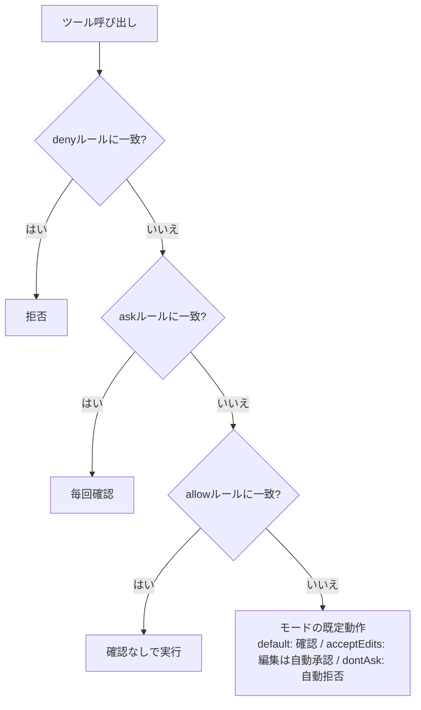

## TL;DR

- 調査系の読み取りコマンド（`grep` / `cat` / `git log` など）を `permissions.allow` に登録して承認の手間を減らした環境で、「記事を書いて、commit、push、PR作成まで」を夜間に無人で回そうとしたところ、`git push` と `gh pr create` の手前で止まった
- 原因は許可リストの書き漏れではなく、**見ているレイヤーが違った**こと。許可リスト（個別コマンドのルール）、パーミッションモード（承認の既定動作）、バイパス（プロンプトをまるごと省く）は別の仕組み
- 公式ドキュメントでは、ルールは **deny → ask → allow の順に評価され、最初に一致したものが結果を決める**。広いdenyは、より狭いallowで例外にできない
- `bypassPermissions`（`--dangerously-skip-permissions`）は、公式が「コンテナやVMのような隔離環境でのみ使うこと」と警告している。日常使いのマシンで無人化のために有効にするのは、リスクの質が違う
- 結論として、無人化は「普段のマシンは許可リストで**読み取り系だけ**を自動化」「書き込みを伴う無人運用は**使い捨ての隔離環境**か、スコープを絞ったRoutine」と分ける

## 背景：読み取り専用の許可リストで、書き込みを伴う無人運用を回そうとした

以前、調査作業の承認疲れを減らすために、`.claude/settings.json` の `permissions.allow` に読み取り専用のコマンドを登録していました。

```json
{
  "permissions": {
    "allow": [
      "Bash(grep *)",
      "Bash(cat *)",
      "Bash(git log *)"
    ]
  }
}
```

この設定をベースに、「ZennとQiitaのトレンドを調べて記事を書き、commitしてpushしてPRを作る」という作業を夜間に無人で回そうとしました。結果は、`git push` や `gh pr create` の手前で止まる。許可リストに追加しても、動いているセッションには反映されないように見える。

後から許可リストを見直すと、`git push`、`git commit`、`gh pr create`、ファイルを新規作成・書き換えするコマンド全般を、**意図的に除外した設計**になっていました。目的は「読み取り専用の調査作業の承認疲れを解消すること」で、書き込みを伴う無人運用は、そもそもその設定のスコープ外だったわけです。

## 3つのレイヤーを分けて理解する

公式ドキュメントを読み直すと、Claude Codeの承認まわりは次の3層に分かれています。

| レイヤー | 何を決めるか | 設定場所 |
|---|---|---|
| 許可ルール（allow / ask / deny） | 個別のツール呼び出しを、確認なしで通す・毎回聞く・拒否する | `settings.json` の `permissions` |
| パーミッションモード | 許可ルールに載っていない操作を、どう扱うか（既定の動作） | `defaultMode` / `--permission-mode` |
| バイパス | 承認プロンプトをまるごと省く | `bypassPermissions` / `--dangerously-skip-permissions` |

自分の `settings.json` は `defaultMode: "acceptEdits"` でした。このモードは、ファイル編集（EditやWrite）と、ワーキングディレクトリ内の `mkdir` / `touch` / `mv` / `cp` などの一般的なファイル操作を自動承認します。裏を返すと、**許可リストにないBashコマンド（`git push` や `gh pr create`）は、`acceptEdits` でも確認が入る**。「acceptEditsにしているのに止まる」の正体は、これでした。

### 判定のフロー

ツール呼び出しが起きたときの流れを、公式の記述に沿って整理すると次の通りです。



この図は、公式の「deny → ask → allow」の評価順と、モード一覧の説明を組み合わせて筆者が整理したものです。`bypassPermissions` は、この流れの中の承認プロンプトを省略するモードとして別に位置づけられていて、バイパス時にdenyルールがどう扱われるかの細部は、公式のPermission modesページで確認してください。

ポイントは3つです。

1. **評価順は deny → ask → allow で、最初に一致したものが結果を決める**。`Bash(aws *)` のような広いdenyは、`Bash(aws s3 ls)` のような狭いallowがあっても、全部ブロックする。allowでdenyの例外は作れない
2. **ルールを強制しているのはClaude Code本体で、モデルではない**。プロンプトや `CLAUDE.md` に「これは許可」と書いても、許可は増えない。許可を変えるには `/permissions`、ルール、モード、PreToolUseフックのいずれかを使う
3. **PreToolUseフックが `allow` を返しても、denyやaskルールは無効にならない**。フックでdenyを迂回することはできない

## パーミッションモードの一覧

公式のモード一覧を、無人運用の観点でまとめ直します。

| モード | 動作 | 無人運用での注意 |
|---|---|---|
| `default`（CLIでは Manual） | 各ツールの初回使用時に確認 | 確認待ちで止まる |
| `acceptEdits` | 編集と一般的なファイル操作を自動承認 | Bashの `git push` などは止まる |
| `plan` | 探索のみ。ソースの編集はしない | 実装はできない |
| `auto` | 通常のプロンプトなしで進み、バックグラウンドの分類器が依頼内容との整合を確認 | 利用可否はプランや環境に依存 |
| `dontAsk` | 確認が必要な呼び出しを自動拒否 | 許可リストにある操作だけが動く |
| `bypassPermissions` | プロンプトを省略（どのモードも自動承認しない操作を除く） | 隔離環境専用 |

`dontAsk` は無人運用と相性のよいモードで、確認待ちで止まる代わりに「許可リストにないものは拒否される」ので、止まり方が予測しやすくなります。許可リストを厳密に設計できる場合は、有力な選択肢です。

## なぜ日常使いのマシンでバイパスを避けるのか

`bypassPermissions` を有効にすると、`.git` や `.claude` のような保護パスへの書き込みも含めて、承認プロンプトが省かれます。公式のWarningには、「Claude Codeが損害を出せない、コンテナやVMのような隔離環境でのみ使うこと」と書かれています。

日常使いのマシンで有効にするリスクは、プロンプトインジェクションです。作業中に読み込んだWebページやリポジトリの中身に悪意ある指示が仕込まれていた場合、承認の関門が外れていると、それがそのまま実行されます。

- 許可リストは、**何を許すかを人間が事前に決める**仕組み
- フルバイパスは、**エージェントの判断を全面的に信頼する**仕組み

同じ「無人化」でも、リスクの質がまったく違います。

### 安全に無人化する考え方

- 使い捨てできる隔離環境（ネットワークとIAM権限を絞ったEC2など）を用意し、**その中だけ**で `bypassPermissions` を使う。壊れても暴走しても、被害範囲が環境内に収まる
- 母艦側（日常使いのマシン）では `bypassPermissions` は使わない。許可リストで読み取り系だけを自動化する
- 組織や自分の設定で禁止したい場合は、`permissions.disableBypassPermissionsMode` を `"disable"` にしておく（managed settingsに置けば上書きされない）

## Q&A

**Q. 許可リストにgit pushを足せば解決するのでは。**
A. 足せば、その操作は確認なしで通ります。ただし「mainへのpushも通る」ことになるので、`git push` を広く許可するか、`Bash(git push origin feature/*)` のように絞るかは設計次第です。なお、Bashルールはコマンド文字列にマッチする仕組みなので、同じ操作を別の形で呼ぶと一致しない場合があります。denyやaskは、セキュリティ境界ではなく「通常の呼び方を止めるガードレール」として扱うのが安全です。

**Q. 許可リストを追加しても、実行中のセッションに反映されないのは仕様か。**
A. 公式では、`/permissions` で追加・削除したルールは、同じターンの次のツール呼び出しから反映されるとあります（v2.1.234以降）。手動で `settings.json` を書き換えた場合の挙動は、バージョンや読み込みタイミングで変わるため、再起動して確かめるのが確実です。

**Q. `acceptEdits` と `dontAsk` は、どう使い分けるか。**
A. 人間が横にいる作業は `acceptEdits`（編集は自動、シェルは確認）。無人で、許可リストに載せた操作だけを通したいなら `dontAsk`（それ以外は自動拒否）が止まり方を予測しやすく向いています。

## まとめ

- 許可リスト・パーミッションモード・バイパスは**別のレイヤー**。「許可リストに足したのに止まる」は、見ているレイヤーが違う可能性が高い
- ルールは deny → ask → allow の順で、最初に一致したものが結果を決める。ルールを強制するのはClaude Code本体で、プロンプトの文言ではない
- `acceptEdits` は編集を自動承認するだけで、許可リストにないBashコマンドの確認は免除しない
- `bypassPermissions` は隔離環境専用。日常マシンでの無人化には、許可リストと `dontAsk`、または用途ごとに権限を絞ったRoutineを使う

自分の `settings.json` の `defaultMode` と `allow` を、いまいちど見直してみてください。

## 参考リンク

- [Claude Code Docs: Configure permissions](https://code.claude.com/docs/en/permissions)
- [Claude Code Docs: Permission modes](https://code.claude.com/docs/en/permission-modes)

## 付録：関連コースについて

許可リスト、Hooks、Routineを使った無人運用の設計は、Udemyコースにまとめています。

- [Claude Code 無人運用マスター講座 ― 承認ゼロで夜間バッチを走らせる](https://www.udemy.com/course/claude-code-v/)
