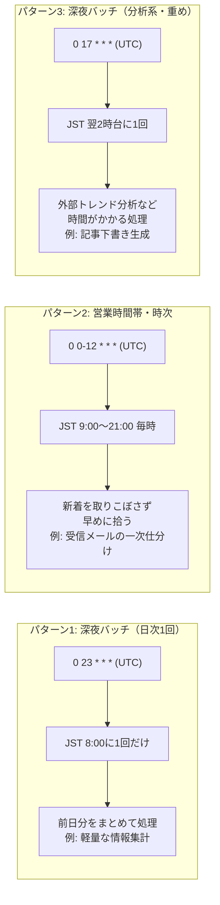

## TL;DR

- 軽量な情報集計、受信メールの一次仕分け（日次＋営業時間帯限定の時次）、記事下書き生成という、用途の異なる4本のバッチをClaude Code Remoteの**Routine**（スケジュールトリガー機能）に移行した
- cronはUTC入力必須。「毎日9時〜21時（JST）は毎時実行」を作ろうとすると `0 0-12 * * *`（UTC）になり、素朴にJSTの数字をそのまま入れると日付・時間帯がズレる
- 「`git push` と `PR作成` はさせるが、`mainへの直接コミット` と `PRの自動マージ` は絶対にさせない」という要件を、`allowed_tools` の絞り込みではなく**プロンプト内の明示的な禁止文言のみ**で担保した。Bashにリポジトリ操作を任せる設計である以上、ツール権限側では両者を分離できなかった
- 4本のうち1本（Zennトレンド取得のAPI直叩き）は、実行環境のネットワークポリシーで通信そのものがブロックされ、代替経路（メールニュースレター）に切り替えて事なきを得た。単一経路のバッチ設計はここで詰む

## 背景・課題

個人開発でGmail/Notion/Slackを繋いだ業務自動化を複数運用していると、「これは毎晩」「これは営業時間中だけ毎時」「これは記事のネタがある夜だけ」のように、バッチごとに求める頻度もリスクの大きさも違ってきます。すべてを1つの巨大スクリプトで無理やり同じスケジュールに乗せるとメンテナンス性が落ちるため、用途ごとに独立したスケジュールタスクとして切り出したい、というのが出発点でした。

Claude Code にはこの用途にちょうど合う **Routine**（プロンプト・対象リポジトリ・connectorをひとまとめにして、cron等のトリガーで自動実行する仕組み）があり、実際に4本を並行稼働させてみた記録です。

## 実際に組んだ4本のRoutine

具体的な業務内容・案件の中身などの機微な情報は伏せ、頻度と権限設計だけを抽出すると以下の通りです。

| 用途 | 頻度（UTC cron） | JST換算 | 主な許可ツール | 書き込み範囲 |
|---|---|---|---|---|
| 軽量な情報の日次集計バッチ | `0 23 * * *` | 毎日8:00 | Gmail検索・Notion検索/作成/更新 | Notion DBへの登録・更新のみ |
| 受信メールの一次仕分け（日次） | `0 23 * * *` | 毎日8:00 | Gmail検索/スレッド操作・Notion検索/作成/更新 | NotionDB登録＋Gmailラベル操作 |
| 受信メールの一次仕分け（営業時間帯） | `0 0-12 * * *` | 毎日9:00〜21:00に毎時 | 同上 | 同上 |
| 記事下書き生成 | `0 17 * * *` | 翌2:05前後 | Bash/Read/Write/Edit/Glob/Grep/WebFetch・Gmail検索・Slack | branch push＋PR作成（mainへの直接コミット・自動マージ不可） |

4本とも同一の実行環境上で動いていますが、`allowed_tools`（何を許可するか）と connector（Gmail/Notion/Slackのどの範囲にアクセスできるか）はRoutineごとに個別に絞られており、あるRoutineの権限が別のRoutineに漏れ出す設計にはなっていません。

## cron設計3パターン

今回運用してみて、用途は結局この3パターンに収束しました。



- **パターン1（日次・深夜）**：「昨日1日分をまとめて処理すればいい」性質のバッチ。軽量な情報集計のように、多少の処理遅延が実害にならないものに向く
- **パターン2（時次・営業時間帯限定）**：新着の受信メールのように「早く拾えるほど価値が高い」ものに向く。24時間毎時にすると深夜のAPIコールが無駄になるため、cron側で `0 0-12 * * *` のように稼働レンジを絞る
- **パターン3（日次・深夜・重め）**：外部サイトのトレンド分析のように、処理に時間がかかり、かつ「深夜のうちに終わっていればいい」もの向け

いずれもcronの入力はUTC基準である点に注意が必要です。「JSTの9時〜21時に毎時動かしたい」をそのままUTCの数字だと錯覚して `9-21` と入力すると、実際にはJST18時〜翌6時に動くバッチになってしまいます。UTC = JST − 9時間で変換してから入力する必要があります。

## 権限設計チェックリスト：「push・PR作成はOK、mainへの直接コミットと自動マージは禁止」をどう作るか

今回、記事下書き生成Routineでは「ブランチへのpushと、そのブランチからのPR作成までは自動でしてよいが、mainへの直接コミットとPRの自動マージは絶対禁止」という要件がありました。

当初は「PR作成そのものも自動化しない」方針で始め、`allowed_tools` にGitHub書き込み系ツールを含めないことでPR作成を技術的にブロックしようとしました。しかしリポジトリ操作を `Bash` に任せる設計にした時点で、`gh pr create` はただのシェルコマンドとして実行できてしまうため、ツールの許可/不許可という粒度ではpushとPR作成を分離できません。結局、境界線をどこに引くかを見直し、「push・PR作成は自動化するが、mainへの直接コミットと自動マージだけは許さない」という要件に落とし直しました。

この要件を実現する手段は、最終的に次の1つしかありません。

- **プロンプトでの明示的な禁止**：「mainブランチへの直接コミット・pushは絶対禁止。変更は必ずPR経由」「PRは作成するが、自分でマージは絶対にしない」という文言を厳守事項として明記する

`Bash` を丸ごと許可した時点で、原理的には `git push origin main` やPRの自動マージすら実行可能な状態にあり、それを止めているのは最終的にはモデルが指示に従うことへの信頼だけです。ツールの絞り込みで防げる範囲には限界があり、渡した権限の使い道はプロンプト側で縛るしかない、というのが実際にやってみて分かったことでした。

チェックリストにすると次の形です。

- [ ] このRoutineが持つ最も強い権限（今回で言えば`Bash`）で、理論上何ができてしまうかを洗い出したか
- [ ] 洗い出した危険な操作のうち、ツール権限だけで物理的に防げるものと、プロンプトの指示に頼るしかないものを切り分けたか
- [ ] プロンプトに頼る部分は、曖昧語（「気をつけて」等）ではなく行為を名指しした禁止文言になっているか
- [ ] 複数Routineを同一環境で動かす場合、connectorのスコープ（Gmail/Notion/Slackのどこまで見えるか）がRoutineごとに必要最小限になっているか

## つまずき：外部APIの直叩きは単一障害点になる

記事下書き生成Routineでは、「Zennのニュースレターが0件だった場合、Zennの公開APIを直接取得してトレンドを見る」という代替経路を用意していました。ところが実際に叩いたところ、実行環境のネットワークポリシーにより通信そのものが拒否されました。

```
EGRESS_BLOCKED: Access to zenn.dev is blocked by the network egress proxy.
```

`curl` で直接叩いても、プロキシのCONNECTトンネルが403で拒否される結果は同じでした。あらかじめ「ニュースレター経由」と「API直叩き」の2経路を用意していたにもかかわらず、後者が環境要因で丸ごと機能しない、というのは設計時に見落としがちなポイントでした。個人開発のバッチで外部サイトに直接依存する処理を組む場合、実行環境（自宅PC／CI／マネージドな実行環境）ごとにネットワークポリシーが異なりうることを前提に、経路を分散させておく必要があります。

## 代替手段との比較：EC2+tmuxで自前構築する場合との違い

無人でリポジトリへの書き込みを伴うバッチを回す方法としては、「EC2などに`tmux`でセッションを常駐させ、その中だけで`--dangerously-skip-permissions`を使う」という自前構築の選択肢もあります。今回のRoutineとの比較は次の通りです。

| 観点 | EC2+tmux＋bypassPermissions（自前） | Claude Code Remote Routine |
|---|---|---|
| 隔離環境の構築・維持 | 自分でネットワーク境界・IAM権限・プロセス監視を設計する必要がある | プラットフォーム側の管理されたクラウド実行環境を利用（自前構築不要） |
| スケジューリング | cron等を自前で用意 | Routine自体にスケジュールトリガーが内蔵 |
| 権限の絞り込み単位 | OS/ネットワークレベルで丸ごと隔離 | Routineごとに`allowed_tools`とconnectorスコープを個別設定 |
| 初期構築コスト | サーバー代・構築工数がかかる | Routine作成のみ（追加インフラ費用なし） |
| 「壊れても被害が閉じる」保証の出し方 | 隔離環境そのものが境界になる | ツール権限の絞り込み＋プロンプト内の明示的禁止の組み合わせに依存 |

「壊れても被害範囲がその環境内に収まる」という強い保証が欲しい場合はEC2案に分があります。一方、「用途ごとに細かく権限を絞った小さなバッチを何本も素早く立てたい」場合は、インフラ構築コストがゼロなRoutineの方が現実的でした。今回は後者の要件が勝ったため、Routineを採用しています。

## よくある疑問

**Q. Routineの `allowed_tools` に `Bash` を含めるのは危険では？**
A. 危険度は上がります。今回はリポジトリ操作（git clone/branch/commit/push/PR作成）をBash経由で行う設計にしたため、`Bash`自体を許可せざるを得ませんでした。ツール側でできる制限には限界があるため、mainへの直接コミットや自動マージのような「本当にさせたくない操作」は、プロンプトで明示的に禁止する以外に手段がありません。「Bashを許可する＝何でもできてよい」ではなく、「Bashで何をさせないかをプロンプト側で厳密に縛る」前提が必須です。

**Q. cronの時刻を間違えて設定したらどう気づく？**
A. Routine作成後に返ってくる `next_run_at` を必ず確認し、意図したJST時刻に変換して合っているか照合するのが確実です。作成直後は特に、UTC/JSTの日付またぎに気づきにくいので注意が必要です。

**Q. 4本のRoutineを同じ環境で動かして処理が衝突しないか？**
A. 今回は対象データ（Gmail検索クエリやNotion DBのID）がRoutineごとに完全に分かれていたため、同時実行による衝突は発生しませんでした。ただし同一のリポジトリやDBに複数のRoutineが同時に書き込みうる設計にする場合は、別途排他制御を検討する必要があります。

## 得られた知見・まとめ

- cronは3パターン（日次深夜・時次営業時間帯・日次深夜重め）に収束した。UTC入力である点を作成のたびに`next_run_at`で必ず確認する運用にした
- 「破壊的操作をさせない」設計は、`Bash` のような強い権限を渡した時点でツール側の絞り込みには限界がある。push・PR作成は許容し、mainへの直接コミットと自動マージだけをプロンプトの明示的禁止で止める、という指示への信頼に依存する形になった
- 外部APIへの直接依存は単一障害点になりうる。実行環境のネットワークポリシー次第で丸ごと止まることを前提に、経路を複数用意しておく
- 隔離環境を自前で構築するコストと、Routineの権限スコープ設計コストはトレードオフの関係にある。今回は「小さいバッチを素早く複数立てる」要件だったためRoutineを選んだ

## 参考リンク

- [Automate work with routines - Claude Code Docs](https://code.claude.com/docs/en/routines)
- [Run prompts on a schedule - Claude Code Docs](https://code.claude.com/docs/en/scheduled-tasks)
- [Claude Code on the web - Overview](https://code.claude.com/docs/en/claude-code-on-the-web)
