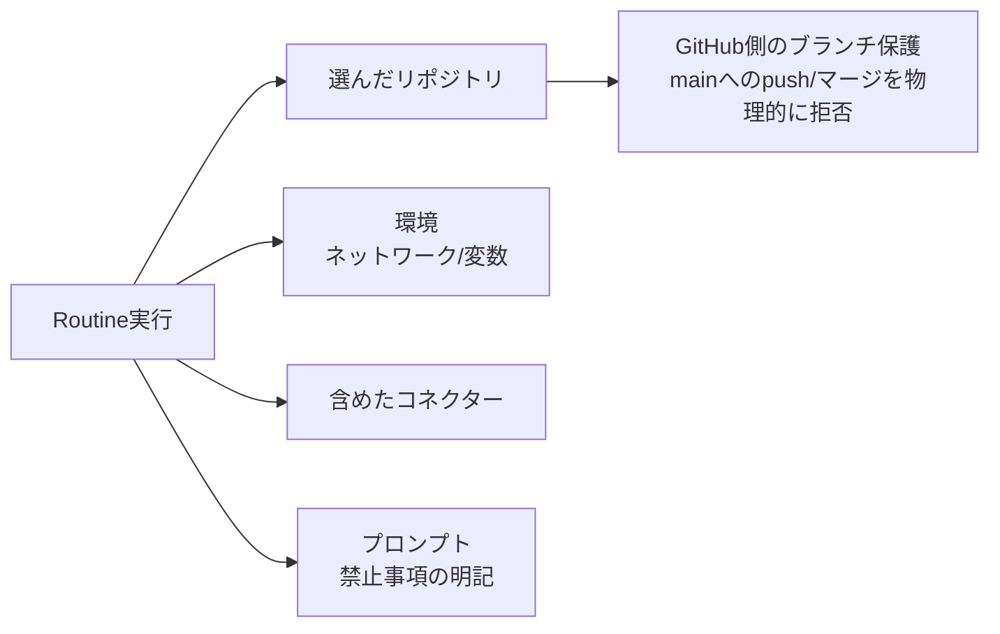

## TL;DR

- 無人で動くClaude Code Routineに「`git push` とPR作成はやらせる。ただし `main` への直接コミットとPRの自動マージは絶対にさせない」という要件を課したとき、**ツール権限だけでは分離できなかった**。リポジトリ操作をBashに任せる以上、`gh pr create` は単なるシェルコマンドだから
- 最初に取った手は、プロンプトに禁止事項を明記すること。ただしこれは「モデルが指示に従う」ことへの信頼で成り立っていて、強制力はない
- 公式ドキュメントには、Routineがpushできるブランチの制御は**GitHubのブランチ保護ルール（またはrulesets）で行う**と書かれている。Routineは既定で `claude/` プレフィックスのブランチにpushする
- ただし落とし穴がある。ルールは「接続したGitHubアクセス」に適用されるため、**そのアクセスがバイパスできるルールは、Routineのpushを止めない**。自分がオーナーのリポジトリでは、バイパス設定の確認が必須
- 結論は「プロンプトの禁止文言（意図の表明）＋ GitHubのブランチ保護（物理的な強制）」の二重化。さらに、コネクターとリポジトリを必要最小限に絞る

## 背景：PR作成まで自動化し、mainだけは守りたい

夜間に記事の下書きを生成し、ブランチをpushしてPRを作るところまでをRoutineに任せる運用を組みました。人間は翌朝、PRをレビューして承認するだけ。ここで譲れない線は2つです。

- `main` への直接commit・pushは、絶対にさせない
- PRの自動マージは、絶対にさせない

最初は「PR作成そのものも自動化しない」方針で、書き込み系ツールを許可しない形にして技術的にブロックしようとしました。ところが、リポジトリ操作をBashに任せる設計にした時点で、`gh pr create` は**ただのシェルコマンド**として実行できてしまいます。「pushとPR作成だけ許可し、mainへのpushとマージは禁止」という切り分けは、ツールの許可/不許可という粒度では表現できませんでした。

## Routineの権限は何で決まるのか

公式ドキュメントによると、Routineは次の特徴を持ちます。

- Anthropic管理のクラウド環境で、**フルのClaude Codeセッションとして自律実行**される
- **パーミッションモードの選択はない**。シェルコマンドの実行、リポジトリにコミットされたスキルの利用、コネクターの呼び出しが、承認待ちなしで行われる
- 到達できる範囲は、**選んだリポジトリ、環境のネットワークアクセスと変数、含めたコネクター**で決まる
- コネクターは**既定ですべて含まれる**。含めたコネクターのツールは、書き込みを含めて確認なしで使える
- 変更は `claude/` プレフィックスのブランチにpushされる。別ブランチへのpushはプロンプトで指示した場合のみ

つまり、人間が張り付いて承認するタイプの権限制御はなく、**「何を持たせるか」を最初に絞るしかない**設計です。



## 禁止文言だけで足りるのか

Bashをまるごと許可した時点で、原理的には `git push origin main` も、PRの自動マージも、実行できる状態にあります。それを止めているのは、最終的には**モデルが指示に従うこと**への信頼だけです。プロンプトには次のように書いていました。

```text
- mainブランチへの直接コミット・pushは絶対禁止。変更は必ずPR経由で行う
- PRは作成するが、自分でマージは絶対にしない
```

これは必要です。ただ、「あいまい語・気をつけて」ではなく、**行為を名指しした禁止文言**にしておくことが前提で、それでも強制力はありません。モデルの判断ミスや、作業中に読み込んだ外部コンテンツ内の指示（プロンプトインジェクション）で破られる可能性は残ります。

## GitHub側で物理的に塞ぐ

公式ドキュメントには、Routineのpush先を制御する方法として次の趣旨が書かれています。

> pushできるブランチの制御には、GitHubのブランチ保護ルールまたはrulesetsを使う

クラウド実行では、GitHubのルールは**接続したGitHubアクセスに対して適用される**とも説明されています。これを踏まえた設定の方針は次の通りです。

| 守りたいこと | GitHub側の設定の方針 |
|---|---|
| mainへの直接push禁止 | mainにブランチ保護（またはruleset）を設定し、「マージ前にPRを必須」にする |
| 自動マージ禁止 | 「承認レビューを必須」にする。リポジトリ設定で自動マージ（Allow auto-merge）をオフにする |
| force pushの禁止 | ブランチ保護で force push を禁止にする |
| 保護のすり抜け防止 | **管理者・バイパス権限者にもルールを適用する設定**にする（下記の落とし穴） |

### 落とし穴：「バイパスできるアクセス」には効かない

公式ドキュメントは、ルールが**接続したGitHubアクセスに適用される**と明記し、「そのアクセスがバイパスできるルールは、Routineのpushを止めない」とも書いています。個人リポジトリでは、自分がオーナー兼管理者のことが多く、ブランチ保護が「管理者はバイパス可」になっていると、**自分の権限で動くRoutineも、保護を素通りできる**可能性があります。

確認項目は次の通りです。

- ブランチ保護で「管理者にも適用する」（バイパスを許可しない）設定になっているか
- rulesetsを使う場合、**バイパスリスト**に自分（あるいは接続しているGitHubアカウント）が入っていないか
- Routineが使うGitHubアカウントが、レビュー承認を自分で出せない構成になっているか（自分で作ったPRを、自分で承認できない設定）

これらは、使っているGitHubのプランやリポジトリの種類で設定画面が異なるため、実際の設定は公式のドキュメントを確認してください。**設定したら、必ず「実際にRoutineからmainへpushさせてみて弾かれるか」を、テスト用ブランチ名やテスト用リポジトリで検証すること**を勧めます。

## Routine側で絞るもの

ブランチ保護と合わせて、Routine自体の権限も最小にします。

- **コネクターは必要なものだけ**。既定ですべて含まれるので、作成フォームで不要なものを外す
- **リポジトリは必要なものだけ**。選んだリポジトリはすべて毎回cloneされる
- **ネットワークは環境の設定で絞る**。既定の「Trusted」は、許可リスト内の通信だけを通す
- **環境変数にシークレットを置かない**。環境変数は、その環境を使う全員から見える。APIキーは、公式の「API credentials」の仕組みで管理する

## 権限設計のチェックリスト

- [ ] このRoutineが持つ、最も強い権限（Bash）で、理論上何ができてしまうかを洗い出したか
- [ ] 洗い出した危険な操作のうち、**GitHubやIAMなどの外部設定で物理的に防げるもの**と、プロンプトの指示に頼るしかないものを切り分けたか
- [ ] プロンプトに頼る部分は、「気をつけて」ではなく、**行為を名指しした禁止文言**になっているか
- [ ] mainのブランチ保護で、**管理者・バイパス権限者にも**ルールが適用されているか
- [ ] コネクターとリポジトリは、このRoutineに必要な分だけか
- [ ] 実際に禁止行為を試して、**弾かれることを確認した**か

## Q&A

**Q. ブランチ保護があれば、プロンプトの禁止文言は不要か。**
A. 不要にはなりません。ブランチ保護が守るのはGitHub上のブランチだけです。Notion・Gmail・Slackなど、コネクター経由の書き込みは守れません。プロンプトは、保護の外側の行為も含めた意図の表明として残します。

**Q. `claude/` プレフィックスのブランチにpushされるなら、mainは安全では。**
A. 既定ではそうなります。ただし、公式の説明では「プロンプトで別のブランチへのpushを指示した場合はその限りではない」となっています。プロンプトの文言が破られた場合の保険が、GitHub側のルールです。

**Q. Routineの実行結果が「成功」なら、禁止行為は起きていないと言えるか。**
A. 言えません。公式でも、実行一覧の緑のステータスは「セッションが開始され、インフラエラーなく終了した」ことを示すだけで、プロンプトのタスクが成功したことを意味しないと説明されています。必ず実行ログ（トランスクリプト）を開いて、実際に何をしたかを確認してください。

## まとめ

- ツール権限だけでは、「pushとPR作成は許可、mainへの直接commitは禁止」を分離できない。Bashに任せると、`gh pr create` もただのシェルコマンドになる
- 物理的な強制は、**GitHubのブランチ保護（またはrulesets）**で行う。ただし、接続アクセスがバイパスできる設定だと効かない
- プロンプトの禁止文言は、行為を名指しして残す。ただし強制力はないので、単独の安全装置にしない
- コネクター・リポジトリ・ネットワークは、Routineごとに必要最小限へ絞る
- 設定したら、禁止行為が実際に弾かれることを試して確認する

自分のリポジトリのmainに、いまどんな保護がかかっているか、バイパス設定とあわせて確認してみてください。

## 参考リンク

- [Claude Code Docs: Automate work with routines](https://code.claude.com/docs/en/routines)
- [Claude Code Docs: Configure permissions](https://code.claude.com/docs/en/permissions)
- [GitHub Docs: About protected branches](https://docs.github.com/en/repositories/configuring-branches-and-merges-in-your-repository/managing-protected-branches/about-protected-branches)

## 付録：関連コースについて

用途ごとに権限を絞るRoutineの設計を、Udemyコースにまとめています。

- [Claude Code 無人運用マスター講座 ― 承認ゼロで夜間バッチを走らせる](https://www.udemy.com/course/claude-code-v/)
