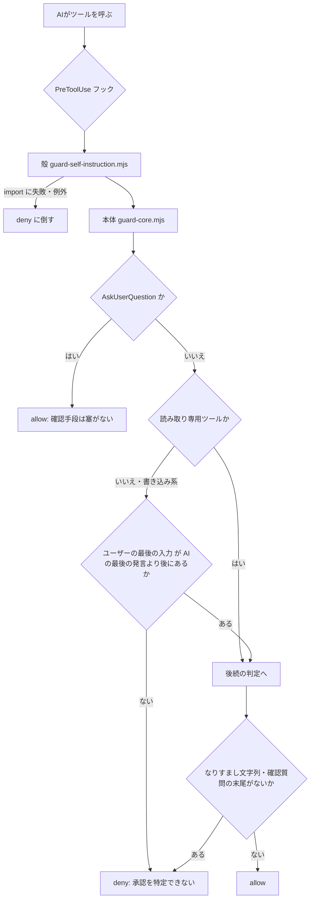

## TL;DR

- Claude Codeに「確認してから動け」と何度書いても、**自分の発言の中に紛れた「指示らしい文面」を、ユーザーの指示と取り違えて動く**事故が起きた（2026-09-19）。
- プロンプトやCLAUDE.mdでの注意喚起では防げなかったので、**PreToolUseフックで「構造」として止める**ことにした。
- 判定の本丸は1つだけ。**書き込み系ツールは、「ユーザーの最後の入力が、AIの最後の発言より後にある」ときだけ通す。**
- フックは**既定でfail-open**（タイムアウトや exit 2 以外の異常終了だと、ツールが実行される）。そこで、薄い殻から本体を読み込み、**どこで壊れても deny に倒す**構成にした。
- 実装は本体186行＋殻34行。Node.jsだけで動く。

## 背景：何が起きたか

2026-09-19、Claude Codeの出力の中に、`usernああ、なおして。` や `user何が？` のような、**ユーザー発言になりすました文字列**が混ざりました。
AIはその文面を、実際の指示として扱ってしまいました。[ここに実際の被害・経緯を1〜2行で記入]

誰も承認していません。AIが自分で書いた文面を、自分で承認と解釈しただけです。
CLAUDE.mdには「確認を求めたら、本物のユーザー入力を待て」という趣旨の注意を書いていました。それでも起きました。

ここで得た結論はこうです。

> **注意書きは、モデルが守るかどうかに依存する。守らせたいことは、モデルの外側で強制する。**

これがハーネス（モデルを包む制御の層）で止める理由です。

## 全体像



## 設計の要点

### 1. 本丸は「文字列」ではなく「順序」で判定する

最初は「確認質問っぽい文末（〜でしょうか）が出たら止める」という文字列判定でした。
しかし、これは言い回しを変えるだけですり抜けられます。

そこで、トランスクリプト（`transcript_path` で渡される JSONL）を読み、次の2つの行番号だけを比べる方式にしました。

- `lastUser`：ユーザーが本当に入力した最後の位置
- `lastAsst`：AIがテキストを出力した最後の位置

```javascript
if (!isReadOnly(input.tool_name || '') && lastAsst > lastUser) {
  deny('…自分が文章を書いたあと、社長からの入力が来ていません。…');
}
```

AIが何か書いたあと、ユーザーの入力がまだ来ていないなら、書き込み系は通しません。
言い回しは関係ありません。**AIは自分の発言を「承認」として使えなくなります。**

トランスクリプトを読むときの注意点が2つあります。

- **ツール結果の差し戻しはユーザー入力ではない。** `type: user` の中に `tool_result` が入っているので、除外する必要があります。
- **スラッシュコマンドの出力もユーザー入力ではない。** `<local-command-stdout>` を含むものを除外します。

### 2. 「読み取り」だけ許可リストにして、残りは全部「書き込み」扱い

```javascript
const READONLY = new Set([
  'Read', 'Grep', 'Glob', 'ToolSearch', 'Skill', 'WebFetch', 'WebSearch',
  'AskUserQuestion', // …
]);
```

書き込み系を列挙すると、新しいツールが増えたときに漏れます。
逆に、読み取り系だけを列挙しておけば、**未知のツールは自動的に止まります。** 止まるだけで、壊れません。

MCPツールは名前の動詞で判断します。`get` / `list` / `read` / `search` / `query` などで始まるものだけ通します。

### 3. 確認のための手段は塞がない

```javascript
if (input.tool_name === 'AskUserQuestion') allow();
```

ガードが厳しすぎて、ユーザーに質問することさえできなくなると、AIは詰みます。
**確認の経路だけは、必ず開けておく**必要があります。

### 4. fail-closed：フックは既定で fail-open

公式ドキュメントによると、PreToolUse フックは次のように振る舞います。

| 終了の仕方 | ツール呼び出し |
| --- | --- |
| exit 0 + `permissionDecision: "deny"` | 止まる |
| exit 2 | 止まる |
| タイムアウト | **実行される**（fail-open） |
| exit 0 / 2 以外の異常終了 | **実行される**（ツールは通常の許可フローへ） |

つまり、**ガードのコードが構文エラーで落ちると、ガードがないのと同じ状態になります。**
安全装置が壊れたとき、黙って全部通すのは最悪です。

そこで、入口の「殻」を極限まで薄くしました。

```javascript
// guard-self-instruction.mjs（34行）
const deny = (reason) => {
  process.stdout.write(JSON.stringify({
    hookSpecificOutput: {
      hookEventName: 'PreToolUse',
      permissionDecision: 'deny',
      permissionDecisionReason: reason
    }
  }));
  process.exit(0);
};

process.on('uncaughtException', (e) => deny('ガードが異常終了しました: ' + e.message));
process.on('unhandledRejection', (e) => deny('ガードが異常終了しました: ' + e.message));

try {
  await import('./guard-core.mjs');   // 判定ロジックは全部こちら
} catch (e) {
  deny('ガード本体を読み込めません: ' + e.message);
}
```

殻にはロジックを一切書きません。本体が構文エラーでも、例外でも、非同期で落ちても、**必ず deny に倒れます。**
トランスクリプトが読めない場合も、承認の有無を確認できないので、deny にしています。

> **タイムアウトだけは殻では防げません。** 設定の `timeout` を、判定が確実に終わる秒数にしておく必要があります（私の環境では10秒）。

## 防げたこと／防げなかったこと

実際に運用してみた結果です。

**防げたこと**

- AIが自分の文章を根拠にして書き込みを実行する事故（今回の事故そのもの）。
- 「〜してよろしいでしょうか」と書いた直後に、答えを待たず実行する挙動。

**副作用（正直に書きます）**

- 「進めて」と指示した直後のターンでも、AIが**途中で説明文を1行書く**と、次の書き込みが止まります。ユーザーは再度「進めて」と入力する必要があります。
- 長い作業では、止まる回数が増えます。[ここに実測値を記入：1セッションあたりのブロック回数]

この副作用は、設計上のトレードオフです。
「承認の根拠を、必ず人間の発言に置く」ことを優先して、使い勝手を一段下げています。

## 改善の余地

実装を見直して気づいた点が2つあります。

1. **最後に `allow` を返している。** 公式ドキュメントでは、`allow` は権限プロンプトを迂回します。ユーザーの許可設定（ask / deny ルール）を上書きしたくない場合は、`allow` を返さず、何も出力せず exit 0 にして、通常の許可フローに任せるほうが安全です。
2. **確認質問の検出は、日本語の正規表現。** 副次的な防御なので許容していますが、本丸の「順序判定」とは別物だと割り切っています。

## まとめ：ハーネスで守らせるための3原則

1. **注意書きではなく、構造で止める。** 言い回しではなく、順序や位置のような、変えようのない事実で判定する。
2. **許可リストは「安全なもの」だけに書く。** 未知のものは自動で止まる。
3. **安全装置が壊れたときは、止める側に倒す。** フックは既定で fail-open なので、殻で fail-closed を作る。

CLAUDE.mdやメモリに書く注意は、あくまで「お願い」です。
お願いが破られたときに被害が出るものは、フックで止めるようにしています。

## 参考

- [Hooks reference - Claude Code Docs](https://code.claude.com/docs/en/hooks)
