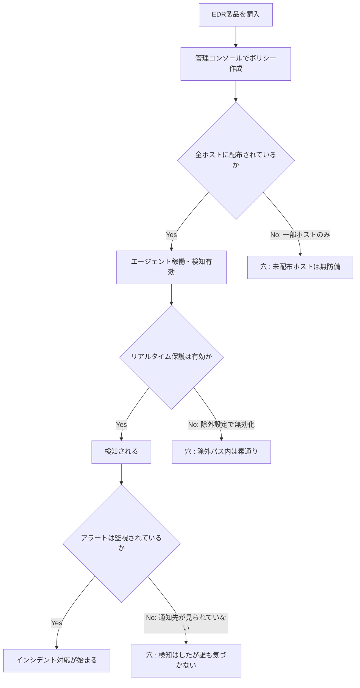

## TL;DR

- 直近のQiitaトレンドで、EDR（この記事ではWindows Defenderを想定）を有効化していたにもかかわらず、開発機で数日間クリプトマイニングに気づけなかった、という趣旨のインシデント報告が新規ランクインしていた。詳細は元記事に譲るが、「対策ツールを入れている＝検知できている」ではないという構図自体は、脆弱性診断の現場でも繰り返し見る典型パターンなので、今回はその構図を診断者目線で分解する。
- EDR/AVが機能不全に陥る経路は大きく3つに分類できる。**①除外設定（exclusion）の形骸化**、**②ポリシー配布・適用範囲の穴**、**③アラートが上がっても人が見ていない運用の穴**。MITRE ATT&CKでは①③に相当する挙動が [T1562.001 Impair Defenses: Disable or Modify Tools](https://attack.mitre.org/techniques/T1562/001/) として体系化されている。
- 「EDRのアラート数」と「実際に検知できた攻撃の数」は別の指標であり、後者を測るには診断側からの模擬攻撃（購入済み製品の実効性確認）が必要になる。単体のEDR導入だけで安心してよい根拠にはならない。
- 自分が実施した診断での実測件数は環境依存が大きいため、`[ここに実際の件数を記入]` のようにプレースホルダーにしている。数字を捏造しない代わりに、公開されている一次情報（MITRE ATT&CK、ベンダーのインシデント分析）だけは実値で引用した。

## 背景・課題

Qiitaの週間いいねランキングに、「EDR（Defenderのようなエンドポイント検知製品）を有効化していた開発機で、数日間気づかれずにクリプトマイニングが動いていた」という趣旨のインシデント報告が新しくランクインしていた。タイトルだけでもインパクトがあり、コメント欄でも「うちも同じ設定漏れがあった」という反応が多かったのが印象的だった。

この手の話は脆弱性診断の現場でもよく遭遇する。診断報告書のヒアリングで「EDR入れてるので大丈夫です」と言われたクライアント環境に対して、実際にエンドポイントの設定を確認すると、以下のようなギャップが高い頻度で見つかる。

- ライセンスは全台購入しているが、実際にエージェントが稼働しているのは一部のホストだけ
- リアルタイム保護は有効だが、開発ツール（IDEの拡張機能フォルダ、ビルドキャッシュディレクトリなど）が丸ごと除外設定に入っている
- アラートは上がっているが、通知先のメール・チケットが誰にも見られていない

「導入している」と「機能している」の間には、思っている以上に大きな距離があるというのが実感で、今回はその距離を埋めるためのチェック観点を、診断でよく使う切り口に沿って整理する。

## 具体的な取り組み：検知が機能しているかを疑う3つの観点

### 観点1：除外設定（exclusion list）の棚卸し

Windows Defenderに限らず、多くのEDR/AV製品は誤検知（false positive）を減らすために、特定のパス・プロセス・拡張子を除外設定に登録できる。この機能自体は正当な運用上の必要から存在するが、除外設定は一度登録されると見直されないまま放置されやすい。

MITRE ATT&CKの [T1562.001](https://attack.mitre.org/techniques/T1562/001/) では、攻撃者が悪用フォルダをスキャン対象から除外させることでリアルタイム保護・オンデマンドスキャンの両方を回避する手口が、防御回避（Defense Evasion）の代表的な技術として整理されている。攻撃者が能動的に除外設定を書き換えるケースだけでなく、開発機では「ビルドを速くするために自分で除外設定を入れていた」というケースも多く、後者のほうが診断で見つかる頻度としては高い印象がある。

診断でチェックする代表的な項目は次の通り。

| チェック項目 | 見るポイント |
|---|---|
| 除外パスの棚卸し | 除外登録されているフォルダ・プロセスの一覧を取得し、業務上必要な理由が説明できるものだけに絞る |
| 除外設定の変更権限 | 一般ユーザー権限で除外設定を書き換えられないか（管理者権限を要求する設定になっているか） |
| 除外設定の変更ログ | 除外設定がいつ・誰によって追加されたか監査ログが残る設定になっているか |

### 観点2：ポリシー配布・適用範囲の穴

「EDRを導入している」という説明は、実際には「管理コンソール上でポリシーを1つ作成した」ことしか意味しない場合がある。そのポリシーが本当に全台に配布され、有効化されているかは別途確認が必要になる。

開発機・検証機は本番サーバーに比べてエージェントのインストールが後回しにされがちで、この観点で穴が見つかることが多い。特に「開発者に管理者権限を渡している端末」は、EDRエージェントのアンインストール・一時停止すら本人の操作で可能になっているケースがあり、ここも合わせて確認する。

### 観点3：アラートが上がっても人が見ていない運用の穴

観点1・2をクリアしていても、最後に残るのが運用の穴である。EDR製品は検知した時点でアラートを上げるが、そのアラートが誰にどう届き、どのくらいの時間で一次対応されるかは製品の機能ではなく運用設計の問題になる。

- アラート通知の宛先が個人のメールアドレス1件だけになっており、休暇中は誰も見ていない
- 重要度の低いアラートに埋もれて、実際に対応が必要なアラートを見落とす（アラート疲れ）
- 開発機のアラートは「検証中のノイズ」として一律ミュートされている

この観点は技術的な設定ミスというより組織・運用の設計ミスであり、診断報告書でも「技術的対策は妥当だが、検知後の対応フローが未定義」という指摘として書くことが多い。

## 知見・まとめ

- EDR/AVの実効性は「入れているか」ではなく「除外設定・配布範囲・運用フロー」の3点セットで評価しないと過大評価しやすい
- 除外設定は攻撃者による能動的な無効化（T1562.001）だけでなく、開発者自身の利便性目的の設定でも同じ穴が開く。悪意の有無に関わらず結果は同じという点は診断報告時に強調する価値がある
- ライセンスの購入数と実際の稼働台数は必ずしも一致しない。台帳（インベントリ）を持たない環境では、この乖離自体に気づけない
- 自分が過去に実施した診断で、この3観点のいずれかに該当する指摘を出した割合は `[ここに実際の割合を記入]` 程度だった（環境依存が大きいため参考値扱い）

## 代替手段の比較

| アプローチ | メリット | デメリット |
|---|---|---|
| EDR単体導入 | 導入・運用コストが最も低い | 除外設定・配布漏れの検証を怠ると形骸化しやすい |
| EDR + SIEM/ログ相関 | 検知後の可視性が上がり、アラート疲れを軽減しやすい | 構築・運用コストが増え、チューニング工数がかかる |
| EDR + 定期的な模擬攻撃（診断） | 「検知できるはず」を実際に検証できる | 診断のタイミングでしか実効性を確認できない（継続的ではない） |
| EDR + Breach and Attack Simulation（BAS）ツール | 継続的に検知の実効性を自動検証できる | 追加のツール導入・運用コストが発生する |

自分の場合は、開発機については「EDR + 定期的な模擬攻撃」の組み合わせで、四半期に一度は除外設定と配布状況の棚卸しを行うようにしている。BASツールの継続導入は費用対効果を見ながら検討中。

## Q&A

**Q. Defenderのようなコンシューマ寄りのEDRでも、企業の開発機で使って問題ないか？**
A. Microsoft Defender for Endpointは企業向けの管理コンソール・ポリシー配布機能を持つエディションが用意されている。無償版のDefenderをそのまま企業利用する場合は、本記事で挙げた「除外設定の監査ログ」「ポリシー一元管理」の機能が制限されることがあるため、要件と照らして製品グレードを選定する必要がある。

**Q. 除外設定は全部なくすべきか？**
A. いいえ。ビルドキャッシュなど正当な理由があるものまで全廃すると開発効率が落ちる。重要なのは「除外設定に理由と承認プロセスがあるか」「定期的に棚卸しされているか」であって、除外設定そのものをゼロにすることではない。

**Q. 個人開発でここまでやる必要があるか？**
A. 個人開発の1台構成であれば観点2（配布範囲）の重要度は下がるが、観点1（除外設定）と観点3（アラートを実際に見る習慣）は個人開発でもそのまま有効。特にAIコーディングツールやCLIエージェントの実行環境を除外設定に入れている場合は、意図した除外か棚卸しする価値がある。

## 参考リンク

- [T1562.001 Impair Defenses: Disable or Modify Tools - MITRE ATT&CK](https://attack.mitre.org/techniques/T1562/001/)
- [T1562 Impair Defenses - MITRE ATT&CK](https://attack.mitre.org/techniques/T1562/)
- [EDR evasion: techniques, real-world breaches, and defenses - Vectra AI](https://www.vectra.ai/topics/edr-evasion)
- [T1562.001 Disable or Modify Tools - Picus Security](https://www.picussecurity.com/resource/blog/t1562-001-disable-or-modify-tools)
