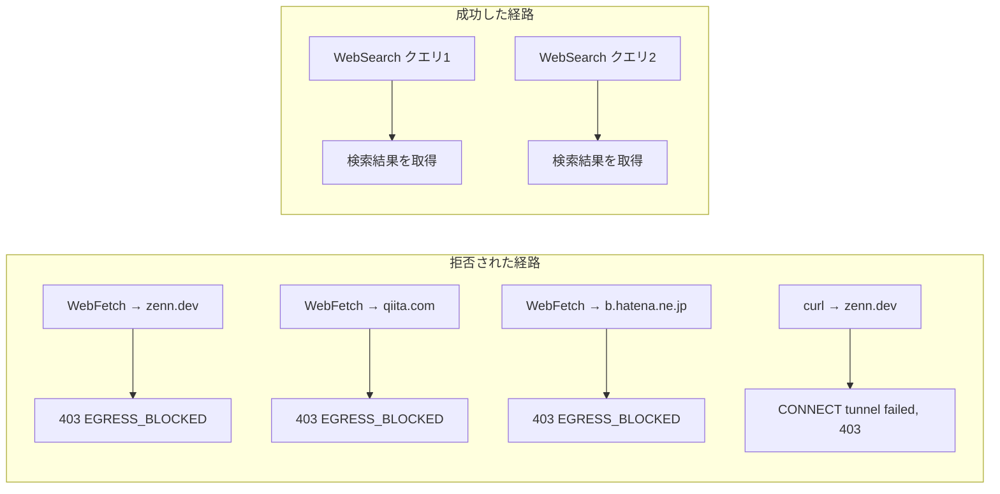

## TL;DR

- トレンド記事を自動生成するRoutine（夜間無人実行のバッチ）が、ニュースレターだけでは情報が足りず「対象サイトのAPIを直接取得する」フォールバックに切り替えたところ、`zenn.dev` への通信が拒否された
- 気になって同じ夜に `qiita.com`・`b.hatena.ne.jp` にも同じ経路でアクセスしてみたところ、**3ドメイン中3ドメインが拒否**（WebFetchツール経由・`curl`直叩きの両方で再現）
- 一方、検索ツール（WebSearch）経由の情報取得は**2戦2勝**。同じ「外部情報を取りに行く」処理でも、経路によって結果が割れた
- プロキシの状態確認エンドポイントと公式ドキュメントを突き合わせたところ、原因は実行環境の既定ネットワークアクセスレベルが`Trusted`（許可リストに載ったドメインのみ）だったことだと特定できた。バグでも認証切れでもなく、**仕様通りの拒否**だった

## 背景・課題

Qiita/Zennのトレンドを見て記事の下書きを作るRoutineを運用しています。情報源は主にGmail経由のニュースレターですが、片方のプラットフォームからニュースレターが届かない夜のために、「公開APIを直接叩く」フォールバックを用意していました。

今回、実際にそのフォールバックが必要になる場面が来て、`https://zenn.dev/api/articles?order=daily&count=30` にWebFetchでアクセスしたところ、想定と違う形で止まりました。せっかくなので「たまたま`zenn.dev`だけがダメだったのか、それとも似た性質のサイト全般がダメなのか」を切り分けるため、その場で3ドメイン・2つの経路（ツール経由・`curl`直叩き）・検索ツールの計測を行いました。以下はそのログと原因調査の記録です。

## 検証手順と結果

### 経路1：WebFetchツールで直接アクセス

3つのドメインに対して、順番にWebFetchでアクセスを試みました。

| 対象 | 結果 |
|---|---|
| `https://zenn.dev/api/articles` | `EGRESS_BLOCKED: Access to zenn.dev is blocked by the network egress proxy.` |
| `https://qiita.com/tags/aws` | `EGRESS_BLOCKED: Access to qiita.com is blocked by the network egress proxy.` |
| `https://b.hatena.ne.jp/q/Zenn` | `EGRESS_BLOCKED: Access to b.hatena.ne.jp is blocked by the network egress proxy.` |

3/3が同じ`EGRESS_BLOCKED`エラーで拒否されました。

### 経路2：シェルから`curl`で直接アクセス

ツール側固有の制限を疑い、Bash経由で`curl`から同じホストに接続してみました。

```
$ curl -sS -m 15 "https://zenn.dev/api/articles?order=daily&count=30" -w "HTTP_CODE:%{http_code}\n"
curl: (56) CONNECT tunnel failed, response 403
HTTP_CODE:000
```

`curl`はHTTPSプロキシに対して`CONNECT`メソッドでトンネルを要求した段階で403を返されています。これはHTTPレスポンスコードではなく、プロキシ自体がトンネル確立そのものを拒否したことを意味します。ツールの実装差ではなく、より手前の共通レイヤーで止まっていることがここで分かりました。

### 経路3：検索ツール（WebSearch）経由

同じ情報（Zenn/Qiitaで話題のテーマ）を、直接アクセスではなく検索ツール経由で取得したところ、2回のクエリとも正常に結果が返ってきました。



集計すると次の通りです。

| 経路 | 試行数 | 成功 | 失敗 |
|---|---|---|---|
| WebFetch（任意ドメイン直接指定） | 3 | 0 | 3 |
| curl（Bash経由・直接指定） | 1 | 0 | 1 |
| WebSearch（検索ツール） | 2 | 2 | 0 |

同じ「外部の情報を取りに行く」という目的でも、**指定したドメインへ直接接続する経路は全滅し、検索ツールを介した経路は全勝**という結果になりました。

## 原因調査：プロキシの状態確認エンドポイントを叩く

このRoutineの実行環境には、プロキシの状態を確認できるエンドポイントが用意されていました。叩いてみると、直近の拒否ログが記録されていました。

```json
{
  "enabled": true,
  "recentRelayFailures": [
    {
      "kind": "connect_rejected",
      "detail": "gateway answered 403 to CONNECT (policy denial or upstream failure)",
      "host": "zenn.dev:443"
    }
  ]
}
```

`policy denial`、つまり組織・環境側のポリシーによる意図的な拒否だと明記されています。ここで初めて「バグではなく仕様」だと確信が持てました。

## 公式ドキュメントで裏取りする

推測のまま終わらせず、Claude Codeのクラウド実行環境の公式ドキュメントでネットワークアクセスの仕様を確認しました。要点は次の通りです。

- ネットワークアクセスには **None / Trusted / Full / Custom** の4段階があり、既定は **Trusted**
- Trustedで許可されるのは「パッケージレジストリ・GitHub・クラウドSDK等」の許可リストに載ったドメインのみ。`zenn.dev`や`qiita.com`はこのリストに含まれない
- GitHub操作（`git push`やPR作成）は別系統の専用プロキシを通るため、このネットワークアクセスレベルの影響を受けない
- Gmail/Notion/SlackなどのMCPコネクタ経由の通信も、セッションのネットワークではなくAnthropic側のサーバーを経由するため、このプロキシの対象外

これで今回の結果がすべて説明できます。Routineの主目的（Gmail検索・記事のpush・PR作成・Slack通知）はTrustedのままで問題なく動いていた一方、「任意の外部サイトへの直接アクセス」だけがピンポイントで止まっていた、という状況の理由が分かりました。

## 代替手段の比較：この制約にどう向き合うか

| 方針 | 具体的な対応 | 向いているケース |
|---|---|---|
| **Custom設定でドメインを個別許可** | 環境設定で`zenn.dev`等を許可リストに追加する | そのAPIの生データが厳密に必要な場合 |
| **Full（全許可）に変更する** | ネットワークアクセスレベル自体を緩める | 検証用途など、通信先を限定する必要がない場合。夜間無人実行のRoutineには非推奨 |
| **フォールバック経路を変える（今回の選択）** | API直叩きをやめ、WebSearchツールや別のニュースレターに寄せる | 欲しいのが生データではなく「傾向」で十分な場合 |

無人実行のRoutineという性質上、「動かないなら許可リストを緩めて通す」のではなく「そもそも直接アクセスが必須か」を先に見直す方針にしました。今回は検索ツールの要約で目的（トレンドの傾向把握）を十分に達成できたため、許可リストは広げていません。

## よくある疑問

**Q. 3ドメインとも拒否だったが、これはドメインの中身（コンテンツ）を見て判定している？**
A. いいえ。状態確認エンドポイントのログにある通り、TCP接続を張る前段階（プロキシのCONNECTトンネル）で拒否されており、リクエストの中身やレスポンスの内容は一切関係ありません。ホスト名だけで判定される、シンプルな許可リスト方式です。

**Q. `curl`でTLS検証を無効化すれば通るのでは？**
A. 通りません。今回の403はTLS証明書の検証エラーではなく、プロキシがCONNECTトンネルの確立自体を拒否しているため、TLS設定をどう変えても影響しません（そもそもこの種の拒否に対してTLS検証を無効化するのは、原因を取り違えた誤った対処です）。

**Q. WebSearchはなぜ拒否されなかった？**
A. WebSearchは指定したドメインに直接接続するのではなく、検索処理自体がプロキシの対象になる経路を経由していないためです。「任意のURLに直接アクセスする」ことと「検索結果を要約させる」ことは、実行環境から見ると別の通信経路として扱われます。

## 得られた知見・まとめ

- WebFetch・curlによる任意ドメインへの直接アクセスは、今回試した3ドメインすべてで拒否（3/3）。WebSearch経由の情報取得は2/2で成功。同じ目的でも経路によって結果が変わることを実測で確認した
- 原因は実行環境の既定ネットワークアクセスレベルが`Trusted`（許可リスト方式）だったこと。プロキシの状態確認エンドポイントの`policy denial`ログと公式ドキュメントの両方で裏が取れた
- 単一の外部APIエンドポイントに直接依存するフォールバック設計は、実行環境のネットワークポリシー次第で丸ごと機能しなくなるリスクがある。無人実行のバッチほど、代替経路（検索ツール・別ニュースレター等）を複数用意しておく価値がある
- 「動かないから許可リストを緩める」のではなく「そもそも直接アクセスが必須か」を先に検討する方が、無人実行のRoutineでは安全側に倒せる

## 参考リンク

- [Configure cloud environments - Claude Code Docs](https://code.claude.com/docs/en/cloud-environments)
- [Use Claude Code on the web - Claude Code Docs](https://code.claude.com/docs/en/claude-code-on-the-web)
- [Automate work with routines - Claude Code Docs](https://code.claude.com/docs/en/routines)
