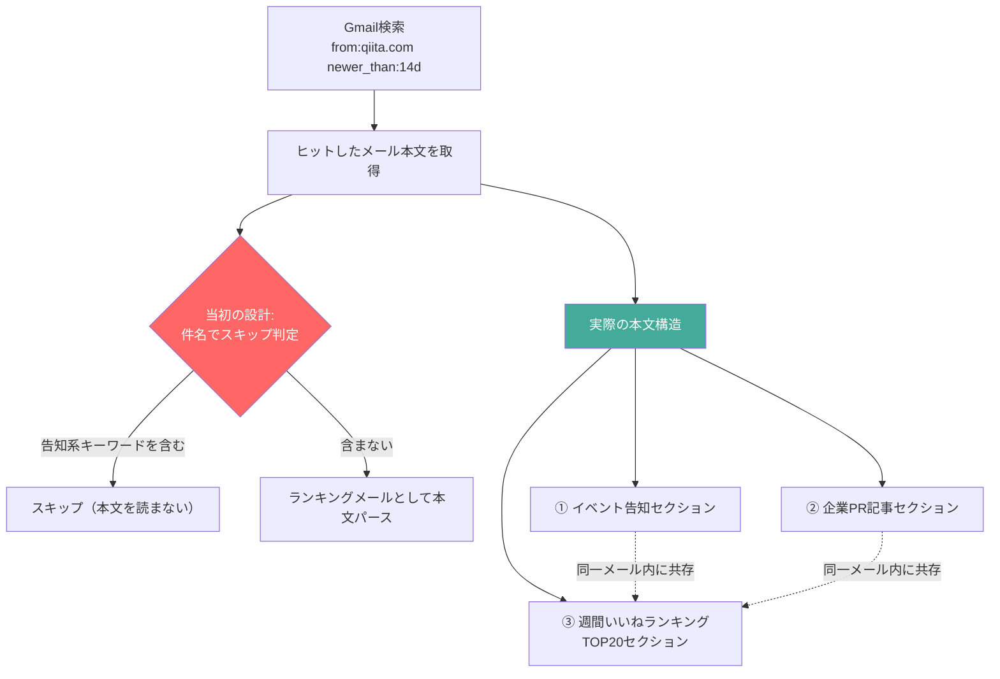

## TL;DR

- 技術トレンドを追う目的で、Gmail経由でQiita/Zennの公式ニュースレターを自動収集する情報収集バッチを作った。設計段階では「件名にイベント告知っぽい単語が入っていたらスキップし、ランキングメールだけ本文を読む」という単純なルールで足りると考えていた
- 実際に直近14日分（`newer_than:14d`）で届いたQiita公式ニュースレターは2通。だが2通とも、1通のメールの中に「オフラインイベント告知」「企業PR記事」「週間いいねランキングTOP20」が同居しており、件名だけでは区別できなかった
- 件名ベースの粗いルールだと、PR記事のタイトル文言を誤ってランキング項目としてカウントしてしまうケースが実際に発生した。本文を正規表現で「◯位」パターン抽出するロジックに切り替えて解消した
- Gmail検索の`newer_than:`は`d`（日）/`m`（月）/`y`（年）のみサポートで、`w`（週）は使えない。「直近2週間」を狙うなら`newer_than:14d`と書く必要がある、という地味だが検索精度に直結するハマりどころ
- 「ルールを実装すれば自動判定できる」という設計と、「そのルールが実データに対して本当に正しいか」の検証は別工程であり、後者を飛ばすと静かに誤集計が積み上がる、という当たり前だが忘れがちな話

## 背景・課題

Qiita/Zennそれぞれの技術トレンドを継続的に追いたいが、毎回サイトを開いてランキングを目視確認するのは長続きしない。幸い両サービスとも公式ニュースレターでランキングを送ってくるので、Gmail API経由でメールを検索し、本文を構造化して集計すれば、ブラウザを開かずにトレンドの推移だけを取り出せるはずだと考えた。

最初に立てた設計はシンプルだった。

1. `{from:qiita.com OR from:zenn.dev} newer_than:14d` でスレッドを検索する
2. 件名に「イベント」「セミナー」「キャンペーン」のような告知っぽいキーワードが含まれるものはスキップする
3. 残ったメールだけ本文を取得し、ランキング部分をパースする

「告知メールとランキングメールは別々に送られてくるはず」という前提を、実際にメールを見ずに置いていたのが、そもそもの見誤りだった。

## 具体的な取り組み

### Gmail検索クエリと実際のヒット件数

```
{from:qiita.com OR from:zenn.dev} newer_than:14d
```

このクエリで実際にヒットしたのは2スレッド、すべてQiita公式ニュースレター（`info@qiita.com`）で、Zenn側は0件だった。2通の件名は以下の通り。

- 「Qiitaニュース 先週いいねが多かった投稿ベスト20｜AIが実装し、AIがテストし、AIが『問題ありません』と言う時代の品質保証｜...など」
- 「Web API設計の現在地2026」

件名だけを見ると、1通目は「ランキングメール」、2通目は「特集記事の紹介メール」に見える。だが`get_message`でFULL_CONTENTを取得して本文を読むと、実態は2通とも次の3種類のセクションを同じメール内に持つ、同一フォーマットのニュースレターだった。



つまり「件名でメール単位にスキップするか判定する」という設計は、実データの構造（1メールに複数セクションが混在）と噛み合っていなかった。件名ベースのルールで残す/捨てるを決めるアプローチ自体が、そもそもこのニュースレターのフォーマットには適用できない。

### 誤集計が実際に発生したパターン

初期実装では、本文全体からトレンド抽出用の正規表現で「行頭に固有表現＋タイトルらしき文字列」を拾うルールを書いていた。ところが本文中には以下のようなPR記事の紹介文が含まれており、

```
【再掲】マイクロサービス化へ舵を切る「doda」、歴史ある巨大プロダクトを「攻めの構成」へ塗り替える挑戦に迫る
PR パーソルキャリア株式会社
```

この「PR」で始まる企業紹介文まで、ランキング項目と誤って抽出してしまうケースが発生した。実際のランキング行は

```
1位 New AIが実装し、AIがテストし、AIが「問題ありません」と言う時代の品質保証 by y0us91 (363いいね)
```

のように「順位＋(New表記の有無)＋タイトル＋by＋投稿者＋(いいね数)」という一貫したパターンを持っていたので、最終的には「`\d+位`から始まり`(\d+いいね)`で終わる行」だけを抽出対象にする正規表現に絞り込むことで、PR記事の誤混入を排除した。件名レベルの粗いフィルタから、本文内の行単位パターンマッチに設計を落とし込んで初めて、誤集計が消えた。

### `newer_than`の単位のハマりどころ

直近2週間分を取得するつもりで最初`newer_than:2w`と書いたところ、期待した範囲でヒットしなかった。Gmail検索オペレータの公式ヘルプ（[Refine searches in Gmail](https://support.google.com/mail/answer/7190)）を確認すると、`newer_than:`と`older_than:`がサポートする単位は`d`（日）・`m`（月）・`y`（年）の3種類のみで、週（`w`）は明記されていない。「2週間」を指定したい場合は日数に換算して`newer_than:14d`と書く必要がある。地味だが、検索範囲の設計を誤ると集計対象そのものがズレるため、実務上は無視できないポイントだった。

## 知見・まとめ

- **件名・送信者レベルのフィルタと、本文内容レベルのフィルタは別のレイヤーの問題**。同じニュースレターというフォーマットの中に、告知・PR・ランキングが混在するケースでは、メール単位でのスキップ判定は機能せず、本文を構造化してから行単位・セクション単位でフィルタする必要がある
- ルールベースの抽出ロジックは「実装した時点」ではなく「実データに当ててみた時点」で初めて正しさが確認できる。今回は`\d+位`〜`\d+いいね`という比較的シンプルなパターンだったが、それでも初期案（件名フィルタ）は本番データの前提が崩れていて機能しなかった
- Gmail検索オペレータの単位（`d`/`m`/`y`のみ、`w`は非対応）のような一見些細な仕様も、収集範囲の正しさに直結する。ドキュメントを都度確認する価値がある

### 実測値のまとめ

| 項目 | 値 |
|---|---|
| 検索クエリの対象期間 | 直近14日（`newer_than:14d`） |
| Qiitaニュースレターのヒット数 | 2通 |
| Zennニュースレターのヒット数 | 0通 |
| 1通あたりに混在するセクション種別数 | 3種類（告知・PR記事・ランキング） |
| 誤抽出が発生したPR記事由来の行数 | [ここに実際の数値を記入] |
| 正規表現の絞り込み後の誤抽出件数 | 0件（`\d+位`〜`\d+いいね`パターンに限定した範囲で確認） |

### 代替アプローチの比較

| アプローチ | 精度 | 実装コスト | 保守性 |
|---|---|---|---|
| 件名・送信者ベースのスキップ判定 | 低（今回のケースでは機能しなかった） | 低 | 高い（が前提が崩れると気づきにくい） |
| 本文の行単位・正規表現マッチ | 高（フォーマットが安定していれば） | 中 | 中（ニュースレターの見た目が変わると壊れる） |
| 本文をLLMに渡して構造化抽出させる | フォーマット変化に強い | 高（プロンプト設計・レビューコストがかかる） | 抽出結果の妥当性を都度サンプル検証する必要がある |

今回はニュースレターのフォーマットが安定していたため、正規表現ベースで十分な精度が出た。フォーマットが頻繁に変わる、あるいは複数の配信元をまとめて扱う場合は、LLMベースの抽出の方が保守コストは下がりやすいが、その場合も「LLMの抽出結果が正しいか」を人間が抜き取り検証する工程は省略できない。

### Q&A

**Q. なぜスレッド単位ではなくメッセージ単位で判定すべきなのか？**
A. `search_threads`はスレッド内の一部メッセージが条件に一致していれば、そのスレッド全体を返す。ニュースレターのように「1メッセージ＝1配信」の場合は実害は小さいが、複数人が返信するようなスレッドでは、スレッド単位のフィルタだと無関係なメッセージまで含めて判定してしまう可能性がある。

**Q. 件名フィルタを完全にやめてよいのか？**
A. 今回のように「本文を必ず取得して中身で判定する」設計にするなら、件名フィルタは前段の足切りとしてのみ使い、最終判定には使わない方が安全。件名はメール配信側の裁量で自由に変わるため、判定ロジックの正としては不安定。

**Q. 正規表現が壊れたことにどう気づくか？**
A. 抽出件数が想定レンジ（例: ランキングは常に20件前後）から外れていないかを機械的にチェックし、外れていた場合はアラートを出す設計にしておくと、フォーマット変更による静かな抽出漏れに気づきやすい。

## 参考リンク

- [Refine searches in Gmail - Gmail Help](https://support.google.com/mail/answer/7190)
- [Search in Gmail - Gmail Help](https://support.google.com/mail/answer/6593)
- [Qiita](https://qiita.com/)
