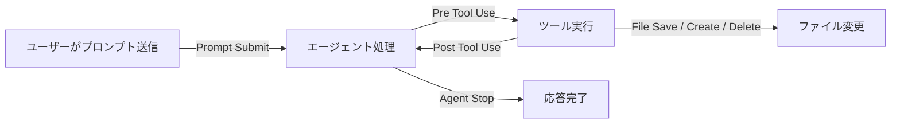

## TL;DR

- Kiro Hooksの解説記事でよく見る `when` / `then` / `fileEdited` / `runCommand` / `askAgent` は**旧書式**で、現行の公式ドキュメントは `trigger` / `matcher` / `action` を使う構造化書式（`version: "v1"`）に変わっている
- 旧書式のイベント名と現行のトリガー名は、名前も粒度も1対1では対応しない。たとえば `fileEdited` に近いのは現行の **File Save**（`PostFileSave`）
- 現行のトリガーは12種類ある。Pre Tool Use / Post Tool Use / File系には**matcher**（ツール名やファイルパターン）が使え、Prompt Submit / Agent Stop / Session Start などには使えない
- この記事では、旧書式でよく紹介される「保存時lint」「push前のテスト確認」「作業完了時レポート」「危険コマンドの抑止」の4本を、現行書式に置き換える際の考え方を整理する
- 書式は更新される。**手元にコピペする前に、必ず公式の Hook Triggers ページで現行のトリガー名を確認すること**

## 背景：同じ名前で書いたのにHookが動かない

KiroのHooksは「ファイルを保存したらlintを走らせる」「エージェントの作業が終わったら報告させる」といった自動処理を、`.kiro/hooks/` 配下のJSONで宣言する機能です。Steering（AIへの常時指示）と組み合わせると、確認なしで開発を回す「完全オート」運用の土台になります。

ところが、解説記事や動画教材の多くは、IDE 0.x世代の書式を前提にしています。

```json
{
  "name": "lint-on-save",
  "version": "1.0.0",
  "when": { "type": "fileEdited", "patterns": ["*.ts", "*.tsx"] },
  "then": { "type": "runCommand", "command": "npm run lint:fix" }
}
```

この書式を現行の公式ドキュメントと突き合わせると、フィールド名もイベント名も違います。公式側にも「旧書式は構造化されたトリガー/アクションの仕組みに置き換わった」という趣旨の注記があります。古い記事のJSONをそのまま `.kiro/hooks/` に置いて「動かない」となったら、まず書式の世代を疑うのが近道です。

## 現行v1書式の骨格

公式ドキュメントによると、Hookは `.kiro/hooks/` 直下に置く単体のJSONファイルで、主なフィールドは次の通りです。

| フィールド | 役割 |
|---|---|
| `version` | スキーマのバージョン（現行は `"v1"`） |
| `name` | 人間が読む名前 |
| `trigger` | Hookを起動するイベント（PascalCase） |
| `matcher` | 起動条件を絞る任意の正規表現 |
| `action` | 実行する処理。シェルコマンド、またはエージェントへのプロンプト注入 |
| `timeout` | commandアクションの最大実行時間（既定60秒） |
| `enabled` | 削除せずに有効/無効を切り替える |

公式の例は「TypeScriptファイルを保存したらESLintを走らせる」で、次の形です。

```json
{
  "version": "v1",
  "hooks": [{
    "name": "Lint on save",
    "trigger": "PostFileSave",
    "matcher": "\\.(ts|tsx)$",
    "action": { "type": "command", "command": "npx eslint --fix" }
  }]
}
```

旧書式と見比べると、変わった点は次の通りです。

- `when.type`（イベント）→ `trigger`
- `when.patterns`（globの配列）→ `matcher`（**正規表現**。`*.ts` ではなく `\\.ts$`）
- `then.type: runCommand` → `action.type: command`
- Hook1本を1ファイルに書く形から、`hooks` 配列に複数を並べる形へ

とくに見落としやすいのが `patterns`（glob）から `matcher`（正規表現）への変化です。`*.ts` をそのまま `matcher` に入れると、正規表現として解釈されて意図と違うマッチになります。

## トリガー12種類の整理

公式のHook Triggersページに載っているトリガーを、matcherの有無とあわせて整理します。

| トリガー | 起動タイミング | matcher |
|---|---|---|
| Prompt Submit | ユーザーがプロンプトを送信したとき | 不可 |
| Agent Stop | エージェントが応答を終えたあと | 不可 |
| Session Start | IDE/CLI V3で新しいチャットを始めたとき | 不可 |
| Pre Tool Use | エージェントがツールを呼ぶ直前 | 可（ツール名・カテゴリ） |
| Post Tool Use | ツール呼び出しの直後（結果を参照可） | 可（ツール名・カテゴリ） |
| File Create | エージェントがファイルを作成したとき | 可（ファイルパターン） |
| File Save | エージェントがファイルを保存・変更したとき | 可（ファイルパターン） |
| File Delete | エージェントがファイルを削除したとき | 可（ファイルパターン） |
| Pre Task Execution | specのタスク開始前 | 不可 |
| Post Task Execution | specのタスク完了後 | 不可 |
| Session End | セッション終了時（CLI V3のみ） | 不可 |
| Manual | 手動実行（Web/CLI V3） | 不可 |

ツール系のmatcherで使えるカテゴリは `read` / `write` / `shell` / `web` / `spec` / `*` です。MCPや組み込みツールは `@mcp`、`@powers`、`@builtin` といった接頭辞でも指定できます。



ここで気をつけたいのは、**File系のトリガーが「エージェントがファイルを保存したとき」である**点です。旧書式の `fileEdited` は「ファイルが編集されたとき」と読めましたが、現行の説明は「agent saves or modifies」と、エージェントによる変更を指す文言になっています。人間がエディタで手書き保存したときにも動くかは、使うバージョンで挙動を確かめてください。

## 旧テンプレート4本を、現行書式に置き換える考え方

旧書式で定番だった4本を、現行のトリガーに対応づけると次の表になります。

| 旧テンプレート | 目的 | 現行での対応トリガー | 処理の種類 |
|---|---|---|---|
| lint-on-save | 保存時にlint | File Save（matcherで拡張子を絞る） | command |
| test-before-pr | push/PR前にテスト確認を促す | Pre Tool Use（matcher: `shell`） | エージェントへのプロンプト |
| verify-on-complete | 作業完了時に変更一覧・テスト結果・次の一手を報告 | Agent Stop | エージェントへのプロンプト |
| safety-check | `rm -rf` や `git push -f` などを止める | Pre Tool Use（matcher: `shell`） | エージェントへのプロンプト |

1本目（lint）は公式の例そのままで書けます。2〜4本目は「エージェントへのプロンプト」型のアクションを使いますが、このアクションのフィールド名は公式のHook Triggersページや、IDEの Agent Hooks パネルで生成させた実ファイルで確認してください。**確認せずに旧書式の `askAgent` / `prompt` を持ち込むのが、いちばん多い失敗パターン**です。

### 安全装置をHookだけに頼らない

4本目の「危険コマンドの抑止」は、プロンプトで「`rm -rf` を実行しようとしたら中止して」と頼む作りになりがちです。ただし、これは**モデルが指示に従うことへの信頼**で成り立っていて、ツール側の強制ではありません。確実に止めたい操作は、Kiro側の信頼済みコマンド設定（allow/denyの設計）や、実行環境の権限（IAM・ブランチ保護）で物理的に塞ぐのが前提です。Hookはその上に重ねる二重化の位置づけにしておくと安全です。

## 大規模調査でHookが効く場面

完全オート運用でHookが特に役立つのは、リポジトリ調査のような「確認なしで長く走らせる」タスクです。ファイル探索は読み取りだけなので、いちいち承認を求められても意味がありません。一方で、100ファイル以上を読み続けるあいだ進捗が見えないと不安になります。

そこで、Post Tool Use（matcher: `read`）に「10ファイル以上読み込んだら進捗を簡潔に報告して」という趣旨のプロンプトを仕込んでおくと、止まらずに進みつつ、途中経過も拾えます。ここでも、アクションの書式は現行のものに合わせてください。

## 移行チェックリスト

古い記事・教材のHookを現行Kiroで使うときの確認項目です。

- [ ] `version: "v1"` と `hooks` 配列の構造になっているか
- [ ] `when` / `then` を使っていないか（旧書式）
- [ ] `fileEdited` / `fileCreated` / `fileDeleted` を、File Save / File Create / File Delete に直したか
- [ ] `patterns`（glob）を `matcher`（正規表現）に直したか。`*.ts` のままになっていないか
- [ ] `runCommand` を `command` アクションに直したか
- [ ] `askAgent` 相当の処理を、現行のエージェントプロンプト型アクションに直したか（書式は公式で確認）
- [ ] `timeout`（既定60秒）で足りるコマンドか
- [ ] Hook単体で安全を担保しようとしていないか

## Q&A

**Q. 旧書式のHookは、いまのKiroでも動くのか。**
A. 公式によると、IDEは0.x世代で作ったHookとの後方互換を維持していて、旧Hookは「legacy」ラベル付きで表示され、再生ボタンなどで手動実行できます。ただし、新しく作るものは現行書式で書く前提です。

**Q. `userTriggered`（手動トリガー）は、現行ではどうなるのか。**
A. 公式の説明では、IDE 0.xの `userTriggered` に相当するv1の書式はなく、現行は Manual トリガー（Web/CLI V3向け）が別にあります。手動で使い回したい指示は、Steeringファイルとして手動インクルードする運用が案内されています。

**Q. matcherを間違えたらどうなるか。**
A. 条件に合わないだけで、エラーなく「何も起きない」状態になりがちです。まずは `matcher` を空または広めにして動作を確認してから絞ると、原因の切り分けが楽です。

## まとめ

- Kiro Hooksは、旧書式（`when`/`then`）から、`trigger`/`matcher`/`action` の構造化書式（`version: "v1"`）に変わっている
- 変換で最も事故りやすいのは、`patterns`（glob）→ `matcher`（正規表現）の読み替えと、プロンプト型アクションの書式
- トリガーは12種類。matcherはPre/Post Tool UseとFile系にだけ使える
- 危険コマンドの抑止のような安全装置は、Hookのプロンプトだけに頼らず、権限設計で物理的に塞ぐ

自分の手元のHookが旧書式のままになっていないか、`.kiro/hooks/` をまず見直してみてください。

## 参考リンク

- [Kiro Docs: Hooks](https://kiro.dev/docs/hooks/)
- [Kiro Docs: Hook Triggers](https://kiro.dev/docs/hooks/types/)
- [Kiro Docs: Hook Management](https://kiro.dev/docs/hooks/management/)

## 付録：関連コースについて

SteeringとHooksを組み合わせた「完全オート」の進め方は、Udemyコースにまとめています。

- [Kiro入門｜AIエージェント型IDEで学ぶAI駆動開発・自動化の実践講座](https://www.udemy.com/course/kiro-ai10/)
