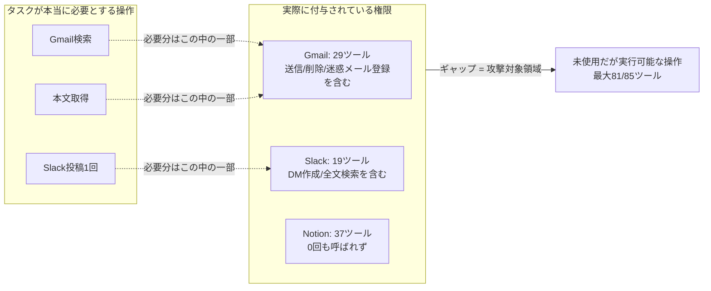

## TL;DR

- 個人で運用している「Qiita/Zennニュースレターを読んでトレンド分析→記事下書きを作る」夜間バッチ用Routineの、実際に定義されているMCPコネクタのツール一覧を数えた
- Gmail連携だけで**29個**のツールが定義されていたが、このタスクが実際に呼び出したのは`search_threads`（スレッド検索）と`get_message`（本文取得）の**2個だけ**（利用率6.9%）。残り27個には送信・全削除・迷惑メール登録・ラベル操作まで含まれていた
- Slack連携は19個中、実際に使ったのは最大2個（送信＋チャンネル検索）。Notion連携に至っては**37個中0個**、そもそも今回のタスクでは一度も呼ばれなかった
- Gmail/Slack/Notionそれぞれの公式ドキュメントが定める「OAuthスコープ／capabilities」という粒度と、MCPサーバーが実際にAIエージェントへ渡す「ツール一覧」という粒度は別物で、後者の方が粗い（＝広い）ケースがあるという、権限設計上のギャップを実測した

## 背景・課題

セキュリティ診断の仕事をしていると、「このAPIキーは何ができるか」を洗い出す作業が日常的にあります。個人開発でGmail・Slack・Notionを繋いだ自動化を複数運用するようになってから、同じ問いを自分の環境に向けてみたことがありませんでした。

きっかけは単純で、夜間に動くRoutine（Claude Code Remoteのスケジュールトリガー機能）の一つが「Qiita/Zennのニュースレターを検索して読み、良い切り口があれば記事下書きを作ってSlackに報告する」というタスクしか行わないのに、接続先のGmail/Slack/Notionそれぞれに対してどこまでの操作が"技術的には"可能な状態になっているのか、一度も確認していなかったことに気づいたことでした。

タスクの要件（Gmailを検索して読む・Slackに1通投稿する）と、実際に付与されている権限の間にどれくらいギャップがあるのかを、推測ではなく実際のツール定義を数えて確認しました。

## 具体的な取り組み：ツールを数える

### 手順

1. 対象RoutineのセッションでMCPサーバー（Gmail/Slack/Notion）が公開しているツール一覧を取得する
2. タスクの実行ログから、実際に呼び出したツール名を抽出する
3. 「定義されている数」と「実際に呼んだ数」を突き合わせる

これだけです。特別なスキャナーは使わず、セッション自身が持っているツール定義を数えるだけで棚卸しができました。

### 結果

| コネクタ | 定義されているツール数 | 今回のタスクで実際に使った数 | 利用率 |
|---|---|---|---|
| Gmail | 29 | 2（`search_threads` / `get_message`） | 6.9% |
| Slack | 19 | 最大2（`slack_send_message` / `slack_search_channels`） | 10.5% |
| Notion | 37 | 0 | 0% |
| 合計 | 85 | 最大4 | 4.7% |

Gmailの残り27個のうち、特に気になったのは次の系統です。

- **送信・返信系**：`send_message` / `reply` / `forward` / `create_draft` — ユーザーになりすまして任意の宛先にメールを送れる
- **破壊系**：`trash_message` / `trash_thread` / `mark_message_spam` / `mark_thread_spam` — 受信箱を荒らせる
- **ラベル操作系**：`label_message` / `unlabel_message` / `apply_sensitive_message_label` など — フィルタ回避や証跡隠しに使える操作

タスクの要件は「検索して読む」だけなので、本来必要なのは`search_threads`と`get_message`（あるいは`get_thread`）の2〜3個で足りるはずです。にもかかわらず、送信・破壊系を含む29個がまとめて同じセッションに渡っていました。

Slackも同様に、`slack_send_message`以外に`slack_create_conversation`（任意ユーザーとのDM/グループDM作成）や`slack_search_public_and_private`（プライベートチャンネルの検索）まで技術的には呼べる状態でした。今回はチャンネルIDの事前確認のために`slack_search_channels`を1回使いましたが、それ以外の17個は一度も使っていません。

Notionは今回のタスクに一切登場しませんが、37個のツール（ページ作成・DB作成・他セッションの起動`spawn-session`まで含む）がセッションに紐づいた状態でした。

## OAuthスコープ・capabilitiesの粒度と比較する

Gmail・Slack・Notionはいずれも公式に「最小権限で連携する」ための粒度を用意しています。

- Gmail APIには`gmail.readonly` / `gmail.modify` / `gmail.metadata`のように、読み取り専用スコープと書き込み系スコープが分離されており、Googleは「機能に必要な最小のスコープを要求すること」を要件として明記しています。さらに`gmail.modify`のような制限付きスコープは、本番利用にあたってGoogle側のセキュリティ審査（restricted scope verification）が必要です（[Restricted Scopes - Google Cloud Platform Console Help](https://support.google.com/cloud/answer/13464325)）
- Slackのスコープは「対象リソース + 操作クラス（read/write/history）」の組み合わせで表現され、例えば`channels:read`と`chat:write`は明確に別スコープです（[Scopes - Slack Developer Docs](https://api.slack.com/scopes)）
- Notionは接続（integration）ごとに「Read content」「Update content」「Insert content」などのcapabilityを個別に組み合わせられ、かつページ単位の同意モデル（ユーザーが共有するページ/DBを個別選択）を採っています（[Connection capabilities - Notion Docs](https://developers.notion.com/reference/capabilities)）

つまり3社とも、**アプリ開発者がOAuth連携を組む時点では**かなり細かい粒度で権限を絞れる設計になっています。今回問題になったのは、その先の層です。MCPサーバーが内部的にどのスコープでOAuthを取得しているとしても、AIエージェントに渡す「ツール一覧」という単位では、"このセッションで呼べる関数"としてまとめて公開されてしまっており、タスク単位でツールを絞り込む機構がありませんでした。`send_message`のようなツールが呼べるということは、少なくとも送信系スコープを含む形で連携が行われている可能性が高いと考えられます（連携設定そのものは確認しておらず、あくまでツールの存在から推測できる範囲です）。

## 代替手段との比較：この粒度のギャップにどう対処するか

| アプローチ | 効果 | 今回できたか |
|---|---|---|
| コネクタ側のOAuthスコープを絞る（read-onlyスコープのみで連携し直す） | 最も確実。技術的に送信・削除が不可能になる | 未実施。連携設定はユーザー側の管理下にあり、今回のセッションからは変更できない |
| Routineの`allowed_tools`でツール名を個別に絞る（例: Gmailは`search_threads`と`get_message`のみ許可） | ツール一覧に現れなくなるため呼び出し自体ができなくなる。ただし設定漏れがあれば効果なし | 未実施だが、次回の設計変更候補にした |
| プロンプト内で「使ってよい操作」を明記する | 呼び出し自体は技術的に可能なままなので、モデルの指示追従に依存する | 今回の運用はこの状態だった |

「プロンプトで明示的に禁止する」というやり方は、以前このパイプラインで`Bash`権限のガードレール（mainへの直接pushや自動マージの禁止）を設計した際にも採用した手段でしたが、今回のようにツールの呼び出し自体を塞げる`allowed_tools`側の絞り込みが可能な場面では、そちらを優先する方が確実だと分かりました。

## よくある疑問

**Q. ツールが29個あるからといって、実際に悪用されるリスクはどれくらいあるのか？**
A. リスクの大きさは「モデルが指示に従わない確率」と「プロンプトインジェクションのような外部入力で誤動作させられる確率」に依存するため、この記事だけでは定量化できません（`[ここに実際のインシデント件数や誤動作率のデータがあれば記入]`）。ただし「技術的に実行可能な操作の集合」が「タスクに必要な操作の集合」より大きいこと自体は、攻撃対象領域（アタックサーフェス）が不必要に広い状態であり、最小権限の原則には反します。

**Q. MCPサーバー側でツール数を減らせないのか？**
A. 減らせる場合もありますが、汎用のGmail/Slack/Notion MCPサーバーは「様々なタスクで使い回す」前提で作られていることが多く、1タスク専用にツールを絞ったサーバーを都度用意するのは現実的ではありません。今回のように、呼び出し側（Routineの`allowed_tools`）でタスクごとに絞り込む方が現実的でした。

**Q. Notionは今回0回しか使っていないなら、そもそも連携を外せばよいのでは？**
A. その通りで、これが最も簡単な対処です。このタスクの直近の実行では一度もNotionツールを呼んでいないため、次回以降はこのRoutineからNotion connectorの割り当てそのものを外す想定です。

## 数値の総括

- 3コネクタ合計85ツールのうち、実際に使ったのは最大4（4.7%）
- Gmailだけで見ると27個の未使用ツールに送信・破壊・迷惑メール登録が含まれていた
- Notionは37ツール中0ツール、connector自体が不要だった可能性が高い

「最小権限」は概念としては知っていても、自分の個人開発環境で実際に数えたのは今回が初めてでした。数えてみて初めて、タスクの要件と権限のギャップが定量的に見える形になりました。

## 参考リンク

- [Restricted Scopes - Google Cloud Platform Console Help](https://support.google.com/cloud/answer/13464325)
- [Scopes - Slack Developer Docs](https://api.slack.com/scopes)
- [Connection capabilities - Notion Docs](https://developers.notion.com/reference/capabilities)
- [Automate work with routines - Claude Code Docs](https://code.claude.com/docs/en/routines)
