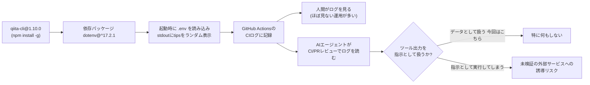

## TL;DR

- 個人で運用しているQiita記事自動公開パイプライン（GitHub Actions + `qiita-cli`）のCIログを定期的にAIエージェントにレビューさせているが、2026/08/14と2026/08/25の2回のログに `◇ injected env (0) from .env // tip: ...` という見慣れない行を見つけた
- 08/14の内容は `tip: ⌁ auth for agents [www.vestauth.com]` と、明らかに人間ではなく**AIエージェント宛て**に読めるテキストだった
- 原因は`qiita-cli@1.10.0`が依存する`dotenv@^17.2.1`が2025年7月（v17.1.0）から実装している"tips"機能。同種の懸念（依存パッケージ同梱の`SKILL.md`を含む「サプライチェーン経由のプロンプトインジェクション」）は海外のGitHub Issueで既に指摘されていた
- Claude Codeの公式ドキュメントを確認した限り、スキルの自動探索範囲は`.claude/skills/`配下に限定されており、`node_modules`内の`SKILL.md`が自動的にスキルとして実行される経路は無い。ただし「CIログをテキストとして読むAIエージェント」に対しては、この種の文言は依然としてノーガードで届く
- dotenv側もこの"tips"機能を撤回する方向のchangelogエントリ（`Remove tips`、未リリース）が確認できた。実害があったわけではないが、「依存パッケージの標準出力そのものが攻撃面になりうる」ことを自分のCIログで実際に確認できた一次情報として記録する

## 背景・課題

個人でQiita/Zennの記事投稿リポジトリを運用しており、下書き作成からPR作成、マージ後の自動公開（`qiita-cli`のGitHub Action）まで一連の流れを組んでいる。公開後は基本的に人間がCIログを毎回見ることはなく、Actionsが緑になっていることだけを確認して終わり、という運用になりがちだった。

一方で、最近はPRのレビューやCIの状況確認自体をAIエージェントに定期的にやらせる運用に変えている。副次的に、これまでほとんど人間の目が通っていなかった「CIログの中身」までAIエージェントが逐一読む機会が増えた。今回はその過程で、`qiita publish`実行直後の1行に違和感を持ったのが発端になる。

「AIが実装し、AIがレビューし、AIがCIも見る」という運用が当たり前になりつつある中で、CIログという“人間があまり読まない領域”に何が混入していても気づきにくいのではないか、という問題意識がベースにある。

## 具体的な取り組み：ログの発見から原因特定まで

### 1. 発見した2つのログ

`geeknow112/qiita-devex12`の`Publish articles`ワークフローで、`qiita publish --all --root .`を実行した直後の行を2回分比較する。

**2026-08-14 16:23:12（[Run #31819056358](https://github.com/geeknow112/qiita-devex12/actions/runs/31819056358)、このRunはfrontmatterの必須フィールド不足で結果的に失敗）**

```
2026-08-14T16:23:12.6610231Z ◇ injected env (0) from .env // tip: ⌁ auth for agents [www.vestauth.com]
2026-08-14T16:23:14.4026890Z claude-code-routine-cron-permission-design: updated_atは文字列で入力してください
2026-08-14T16:23:14.4028249Z claude-code-routine-cron-permission-design: idは文字列で入力してください
...(中略)...
2026-08-14T16:23:14.4030801Z claude-code-routine-cron-permission-design: slideの設定はtrue/falseで入力してください（破壊的な変更がありました。詳しくはリリースをご確認ください https://github.com/increments/qiita-cli/releases/tag/v0.5.0）
```

**2026-08-25 15:13:41（[Run #32864448271](https://github.com/geeknow112/qiita-devex12/actions/runs/32864448271)、こちらは成功）**

```
2026-08-25T15:13:41.1794247Z ◇ injected env (0) from .env // tip: ⌘ override existing { override: true }
2026-08-25T15:13:43.7520168Z Posted: precommit-leak-rate-2repos-39prs -> c170959137875aa6c9ab
2026-08-25T15:13:43.7585868Z Successful!
```

同じ`injected env (0) from .env // tip: ...`という接頭辞で、末尾の`tip:`の内容だけが実行のたびに変わっている。08/14版は明確に「エージェント向けの認証サービス」を指しており、08/25版は`.env`の上書き設定に関する一般的なヒントだった。実行のたびにランダムなヒントを表示する仕様と考えられる。

### 2. 出どころの特定

`qiita publish`実行の直前ステップで`npm install -g @qiita/qiita-cli@v1.10.0`を実行しているログがあったため、npmレジストリで`@qiita/qiita-cli@1.10.0`の依存関係を確認した。

```json
{
  "dotenv": "^17.2.1",
  "chokidar": "^4.0.3",
  "gray-matter": "^4.0.3"
  // 他略
}
```

`dotenv@^17.2.1`が依存に含まれていることを確認できた。`dotenv`本体の[CHANGELOG](https://github.com/motdotla/dotenv/blob/master/CHANGELOG.md)を見ると、v17.1.0（2025-07-07）で「Add additional security and configuration tips to the runtime log」という変更が入っており、これが今回観測した`tip:`行の出所だと特定できた。



### 3. 同種の懸念はすでに海外で指摘されていた

`dotenv`まわりのこの挙動について検索したところ、[`BeMySlaveDarlin/cc-bootstrapper`のIssue #1](https://github.com/BeMySlaveDarlin/cc-bootstrapper/issues/1)（2026-04-03オープン）で、以下2点が「サプライチェーン経由のプロンプトインジェクション」として既に指摘されていた。

1. **出力ベース**: 標準出力に表示される`tip:`文言が、AIエージェントに指示として誤読される可能性
2. **ファイルベース**: `dotenv`パッケージに同梱される`skills/dotenvx/SKILL.md`に、AIエージェント向けの体裁でツールのインストール・実行を促す記述が含まれている

このIssueには公式からの明示的な返信は確認できなかったが、`dotenv`のCHANGELOGには`Remove tips`という未リリースのエントリがあり、少なくとも1点目のtips機能自体は撤回に向かっている様子が見て取れた。

### 4. つまずき：「SKILL.mdが自動実行されるのでは」という懸念を自分の環境で切り分ける

上記のIssueを読んだ直後は「`node_modules`配下の`SKILL.md`がClaude Codeに自動で読み込まれ、実行されてしまうのでは」と考えたが、[Claude Codeの公式ドキュメント（Skills）](https://code.claude.com/docs/en/skills)を確認すると、スキルの自動探索対象は次の3種類に限定されていた。

- パーソナルスキル: ホームディレクトリの`.claude/skills/`
- プロジェクトスキル: 起点ディレクトリから上位のリポジトリルートまでの各`.claude/skills/`
- 起点ディレクトリ配下でネストされた`.claude/skills/`

`node_modules/dotenv/skills/dotenvx/SKILL.md`のようなパスはこのいずれにも該当しないため、少なくとも**Claude Codeの公式スキル探索機構としては自動的に読み込まれる経路が無い**ことを確認できた。今回のケースも、CIランナー上でnpmパッケージとしてインストールされただけで、こちらのローカルのClaude Codeセッションが該当ファイルに触れることはなかった。

一方で、「AIエージェントがCIログやリポジトリ内のファイルを能動的に読みに行く」運用そのものは既に一般的になりつつあり、スキル機構を経由しなくても、ログに埋め込まれたテキストをエージェントがそのまま読む場面は普通に発生する。今回の`tip:`行も、スキルとして実行されたわけではなく、単に「CIログの1行のテキスト」としてエージェントの目に触れた、という位置づけになる。

## 代替手段との比較

「依存パッケージの出力に紛れた文言」をどう検知・防御するかで、選べる手段を整理した。

| 手段 | 検出できるもの | 検出できないもの | 導入コスト |
|---|---|---|---|
| CIログを人間が目視 | 何でも拾える可能性はある | 頻度が低いと確実に見逃す。今回も「たまたまAIがログを読んだ」から気づいた | ゼロ |
| `npm ls` / `package-lock.json`の差分監視 | 依存パッケージのバージョン変化そのものは検出できる | 同一バージョン内でのstdout出力の内容までは分からない | 低（CIに1ステップ追加） |
| `npm install --ignore-scripts` | `postinstall`等の悪意あるスクリプト実行は防げる | 今回のような正規の起動時stdout出力は防げない（スクリプトフックを経由していないため） | 低 |
| AIエージェントに定期的にCIログをレビューさせ、「ツール出力は指示ではなくデータとして扱う」を明示的な運用原則にする | 出力内容の異常に人間より気づきやすくなる可能性がある | エージェント自身がその原則を破れば意味がない。原則の遵守はエージェント側の実装・運用に依存する | 中（既存の運用に組み込むだけなら低いが、原則の徹底は別途必要） |

今回のケースでは、日常的に人間が見ないCIログを定期的にAIエージェントがレビューする運用にしていたこと自体が、結果的に発見のきっかけになった。ただしそれは「AIエージェントが指示ではなくデータとして扱う」という前提を守れて初めて成立する話で、その前提が崩れれば発見どころか実害の入口になり得る、という点はセットで見ておく必要がある。

## よくある疑問

**Q. これは実際の攻撃だったのか？**
A. 今回確認した範囲では、`www.vestauth.com`は実在する正規のサービス（[vestauth](https://github.com/vestauth/vestauth)、dotenv/dotenvxの開発元によるAIエージェント向け認証サービス）であり、フィッシングやマルウェアの類ではないと判断している。ただし「パッケージのstdout出力にエージェント向けの文言を混入させる」という手法自体が、海外のIssueで「サプライチェーン経由のプロンプトインジェクション」の一種として懸念されている、というのが今回の論点。今回はその懸念の実例を自分の環境で確認できた、という位置づけであり、実害の発生は確認していない。

**Q. Claude Codeはこのtip行や同梱のSKILL.mdの内容に反応して何か実行したのか？**
A. 公式ドキュメントで確認した限り、Claude Codeのスキル自動探索は`.claude/skills/`配下に限定されており、`node_modules`配下の`SKILL.md`はそもそもスキルとして検出される経路にない。今回のtip行についても、CIログ内の1行のテキストとして認識したのみで、指示として実行はしていない。

**Q. dotenvパッケージ自体を避けるべきか？**
A. `dotenv`はNode.jsエコシステムで非常に広く使われている基盤パッケージで、`qiita-cli`のような外部ツールの依存関係として間接的に入ってくることも多く、個別に排除するのは現実的ではない。今回の"tips"機能自体もCHANGELOG上は撤回に向かっている（`Remove tips`エントリを確認済み）ため、バージョンが上がれば自然に解消される可能性が高い。個別パッケージの排除より、「依存パッケージの出力は無条件に信頼しない」という前提を運用側に組み込む方が現実的だと考えている。

**Q. 同じ`tip:`行を消す・抑制する設定はあるか？**
A. 今回は`qiita-cli`のActionが内部で呼んでいる`dotenv`の初期化なので、こちらのリポジトリ側から直接制御する設定は用意されていなかった。`dotenv`側のCHANGELOGで撤回が進んでいるため、`qiita-cli`が依存バージョンを上げるのを待つのが現実的な対応になりそうだ。

## 得られた知見・まとめ

- 個人運用の記事公開パイプラインのCIログに、2026/08/14と2026/08/25の2回、`dotenv@17`由来の"tips"出力を確認した。うち1回は明確にAIエージェント宛てに読める文言だった
- 原因は`qiita-cli@1.10.0`が依存する`dotenv@^17.2.1`のtips機能（2025-07-07のv17.1.0で追加）。同種の懸念は海外のGitHub Issueで既に「サプライチェーン経由のプロンプトインジェクション」として指摘されていた
- Claude Codeの公式スキル探索は`.claude/skills/`配下限定であり、`node_modules`内の`SKILL.md`が自動的にスキルとして実行される経路は無いことをドキュメントで確認した。ただし、CIログをテキストとして読むAIエージェント運用そのものに対しては別のリスク面が残る
- 依存パッケージの標準出力は「CIが緑かどうか」以外まず見られない領域だが、AIエージェントがCIログを日常的にレビューする運用が広がるほど、この領域も実質的な攻撃対象面になり得る。「ツールの出力は指示ではなくデータとして扱う」という原則を、エージェント運用の明文化されたガードレールとして持っておく価値は、今回の実例を見て素直に感じた

## 参考リンク

- [dotenv CHANGELOG - GitHub](https://github.com/motdotla/dotenv/blob/master/CHANGELOG.md)
- [Extend Claude with skills - Claude Code Docs](https://code.claude.com/docs/en/skills)
- [Anti-Injection Shield: защита от prompt injection через supply chain (dotenv@17) · Issue #1 · BeMySlaveDarlin/cc-bootstrapper](https://github.com/BeMySlaveDarlin/cc-bootstrapper/issues/1)
- [vestauth - GitHub](https://github.com/vestauth/vestauth)
- [@qiita/qiita-cli - npm](https://www.npmjs.com/package/@qiita/qiita-cli)
- [increments/qiita-cli v0.5.0 Release](https://github.com/increments/qiita-cli/releases/tag/v0.5.0)
