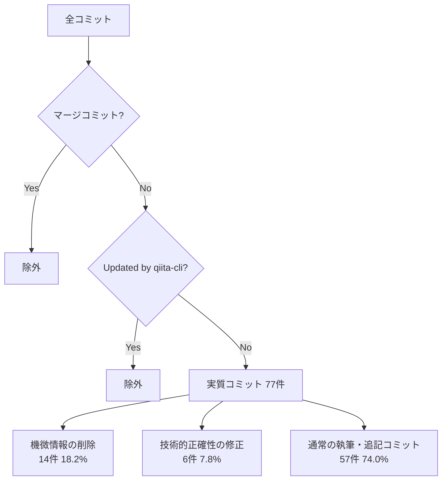
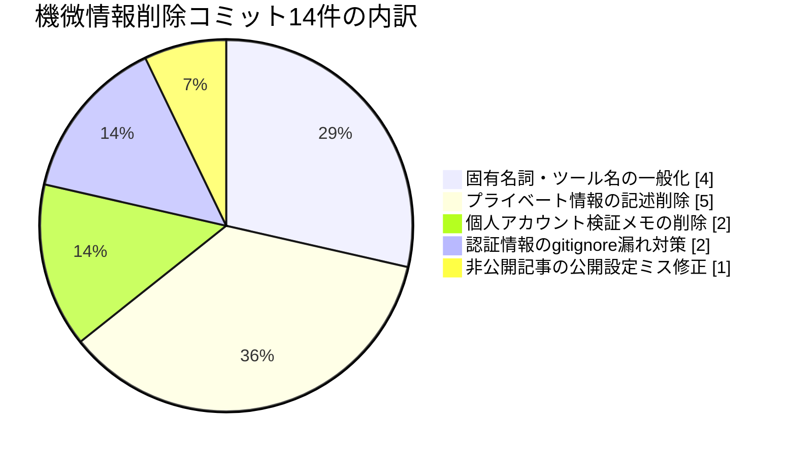

## TL;DR

- 個人で運用しているQiita/Zennの記事投稿リポジトリ2本の`git log`を棚卸しした。マージコミットと自動コミットを除いた実質的なコミット77件（Qiita側36件・Zenn側41件）のうち、**14件（18.2%）が「機微情報・個人が特定される記述を消すため」だけの修正コミット**だった
- さらに6件は、機微情報とは無関係な技術的正確性やフォーマットに関する修正だった。この2種類を合わせると、実質コミットの**約27%（21/77）が「一度書いたものを直す」ためのコミット**だったことになる
- マージ済みPRは2リポジトリ合計39本。1本のPRに複数の修正コミットが乗っているケースもあるため単純な按分はできないが、体感より高い頻度で「down before it goes out」のプロセスが機能していた
- 検出された機微情報の内訳は、APIキーのような文字列パターンで機械的に拾える「トークン」系よりも、固有名詞・社名・ツール名・「個人アカウントで検証した」といった**文脈依存の記述**の方が多かった。gitleaksのようなシークレットスキャナは前者は拾えても後者は原理的に拾えない、という棲み分けが実データから見えた

## 背景・課題

個人開発でQiita/Zennそれぞれに記事投稿用のリポジトリを持ち、下書き作成 → ブランチpush → PR作成 → マージ → CIで自動公開、という流れで運用している。下書きの多くは実際に手を動かした自動化・検証の記録がベースになっており、実体験ベースの記事を書こうとすると、必然的に「実際に使っているツール名」「実際に検証したリポジトリ名」「個人アカウントでの検証メモ」のような、公開すべきではない具体的な情報が下書きの初稿に紛れ込みやすい。

これまで「PRのレビュー時にAIレビューで一度指摘が入り、修正コミットを積んでからマージする」という運用を続けてきたが、その「一度指摘されて直った」件数を定量的に数えたことはなかった。今回、2リポジトリの全コミット履歴を棚卸しして、実際にどれくらいの頻度で・どんな種類の情報が事前に止まっていたのかを検証した。

## 実際にやったこと：コミット履歴の全件棚卸し

`git log --format='%s'` で全コミットメッセージを取得し、以下の3種類を除外・分類した。

- 除外: `Merge pull request #N ...`（マージコミット自体）
- 除外: `Updated by qiita-cli`（Qiita CLIのpublishアクションによる自動コミット。Qiita側だけで22件存在した）
- 残った実質コミットを、コミットメッセージの内容から手作業で3分類した

分類の実務上のポイントは、コミットメッセージ自体が「何を直したか」を日本語で明記していたことだった。`fix: プライベート情報削除`、`fix: リポジトリ名を汎用化`、`fix: remove tool name and github link`、`機微情報を含む記述を修正`のように、削除対象のカテゴリまでコミットメッセージに残していたため、grepベースの機械的な分類がそのまま成立した。

分類結果（リポジトリ別）は次の通り。

| リポジトリ | 実質コミット数 | 機微情報削除 | 技術的正確性修正 | マージ済みPR数 |
|---|---|---|---|---|
| Qiita投稿用リポジトリ | 36 | 7（19.4%） | 1（2.8%） | 17 |
| Zenn投稿用リポジトリ | 41 | 7（17.1%） | 5（12.2%） | 22 |
| 合計 | 77 | 14（18.2%） | 6（7.8%） | 39 |

## 「機微情報の削除」14件の内訳

実際にどんな種類の情報が事前に止まっていたのかをカテゴリ化すると、次のようになった（削除された情報そのものではなく、削除の"種類"のみを集計している）。

体感として一番多かったのは「固有名詞・ツール名の一般化」と「プライベート情報の記述削除」で、これは想定通りだった。一方で意外だったのが、**MCPトークンのgitignore漏れに対する事前指摘が2件あったこと**だ。トークンそのものがコミットされたわけではないが、「このファイルパスは`.gitignore`に入れないと将来的にトークンがコミットされうる」という、まだ実害が発生していない段階での指摘だった。

## つまずき：パターンマッチ型のシークレットスキャナでは拾えない領域があった

社内やOSSでよく使われるシークレットスキャナ（[gitleaks](https://github.com/gitleaks/gitleaks)など）は、正規表現とエントロピー解析でAPIキーやトークンのような「構造を持つ文字列」を検出する仕組みになっている。実際、gitleaksはpre-commitフックやGitHub Actionsに組み込んで、コミット前後に機械的にスキャンする用途で広く使われているツールだ。

ただし、今回の14件のうち「認証情報のgitignore漏れ対策」の2件を除く12件は、そもそも文字列パターンとして検出できる性質のものではなかった。「このツール名を書いている」「この個人アカウントの検証メモが残っている」「この社名・サービス名が固有名詞として出ている」は、事前にルールを定義していない限り正規表現では引っかからない。今回はこれをAIレビューによる文脈理解で拾っていた形になる。

裏取りのために、AIレビューの実行経路も確認した。両リポジトリの`.github/workflows/`を見ると、Qiita側には記事公開用の`publish.yml`（`qiita-cli`のpublishアクション）が1本あるだけで、PRレビューを行うワークフローファイルは存在しない。Claude Codeには、GitHub Appを使わずにローカルセッションから`/code-review`コマンドでPRやブランチの差分をレビューできる仕組みがあり、ワークフローファイルなしでレビューが行われていた事実と整合する。つまり今回の「AIレビュー対応」コミット群は、CI上の自動レビューではなく、pushする前にローカルでレビューをかけた結果だったと考えられる。

## 代替手段との比較

「公開前に機微情報を止める」という目的に対して、今回のような「ローカルAIレビュー」以外にどんな選択肢があるかを整理した。

| 手段 | 検出できるもの | 検出できないもの | 導入コスト |
|---|---|---|---|
| 目視レビューのみ | 何でも（レビュアーの集中力次第） | 疲労・見落としに弱い | ゼロ |
| gitleaks等のシークレットスキャナ | APIキー・トークンなど構造を持つ文字列 | 固有名詞・文脈依存の情報漏洩 | 低（pre-commit/CIに組み込むだけ） |
| Claude Codeのローカル`/code-review` | 文脈依存の機微情報・技術的な誤り | ルール化されていない完全に主観的な判断基準 | 低（追加インフラ不要、コマンド1つ） |
| Claude CodeのGitHub App版Code Review（CI常駐型） | 上記に加え、push毎の自動実行・チーム共有 | 同上。费用は1レビューあたり$15〜25の従量課金 | 中（GitHub App導入・組織権限が必要） |

今回のような個人開発の小規模リポジトリでは、CI常駐型のCode Reviewを導入するほどの頻度・規模ではなく、ローカルの`/code-review`とgitleaks的なパターンマッチスキャナを併用するのが費用対効果として現実的だと分かった。文字列パターンで拾えるものはツールに任せ、文脈依存の判断はレビューに任せる、という棲み分けが実データからも裏付けられた形になる。

## よくある疑問

**Q. 見逃し（レビューを通過して機微情報がmainに入ったケース）はゼロと言えるか？**
A. 今回の集計はあくまで「修正コミットとして記録が残っているもの」の集計であり、レビューで指摘されずそのまま残っている記述がないことまでは保証できない。今回の棚卸し自体が「事後に気づいて直す」機会にもなったため、定期的に同じ棚卸しを行う運用に意味があると感じた。

**Q. なぜCIで自動実行するGitHub App版のCode Reviewではなく、ローカル実行だったのか？**
A. GitHub App版は組織のOwner権限での有効化とレビュー1回あたり$15〜25の従量課金が必要で、個人の下書き用リポジトリ2本には不釣り合いだった。ローカルの`/code-review`はコマンド1つで追加コストがかからず、pushする前の最後の関門として使うには十分だった。

**Q. この分類作業自体はAIに投げたのか、手作業か？**
A. カテゴリ分けの一次判断（機微情報か技術修正かのラベリング）は、コミットメッセージ自体が"何を直したか"を日本語で書いていたため、grepの正規表現である程度機械的に分類できた。ただし境界線が曖昧なコミット（例：「private設定をfalseに修正して公開する」は情報漏洩ではなく公開設定ミスの修正）は目視で個別に判断し直している。

**Q. 他のリポジトリ・チーム開発でも同じ比率になるのか？**
A. ならないと考えている。今回の18.2%という数字は、下書きの初稿が実体験ベースであるほど固有名詞が混入しやすい、という今回特有の執筆スタイルに強く依存した数字であり、一般的な開発リポジトリのコミットにそのまま当てはめられる値ではない。

## 得られた知見・まとめ

- 2リポジトリ・実質コミット77件を棚卸しした結果、18.2%（14件）が機微情報削除、7.8%（6件）が技術的正確性の修正で、合わせて約27%が「一度書いたものを直す」コミットだった
- 機微情報14件のうち12件は、正規表現ベースのシークレットスキャナでは原理的に検出できない、固有名詞・文脈依存の情報だった。トークン漏洩対策は2件にとどまり、それより「社名・ツール名・個人アカウントの検証メモ」の削除の方が多かった
- ワークフローファイルの有無から逆算すると、今回のAIレビューはCI常駐型ではなくローカル実行だったと考えられる。個人規模のリポジトリでは、CIに常駐させるコストに見合わず、ローカルレビュー＋パターンマッチ型スキャナの併用が現実的な落としどころだった
- 「AIレビューで何かを直した」という体感は誰しもあると思うが、実際に数えてみるとコミット単位で2割弱という、体感より高めの数字が出た。定量化すると次に何を強化すべきか（今回で言えば固有名詞の混入を減らすテンプレート化）が見えてくる

## 参考リンク

- [increments/qiita-cli - GitHub](https://github.com/increments/qiita-cli)
- [gitleaks - GitHub](https://github.com/gitleaks/gitleaks)
- [Code Review - Claude Code Docs](https://code.claude.com/docs/en/code-review)
- [Claude Code GitHub Actions - Claude Code Docs](https://code.claude.com/docs/en/github-actions)
