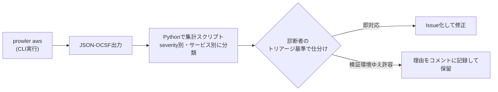

## TL;DR

- OSSのマルチクラウドセキュリティ監査ツール **Prowler**（AWS向けに639チェック・86サービスをカバー）を、個人で運用している検証用AWSアカウントに対してフルスキャンした
- Critical/High判定は合計 **[ここに実際の件数を記入]件**。このうち、セキュリティ診断の仕事で普段使っている「悪用可能性 × 影響範囲」のトリアージ基準で仕分けたところ、**即対応が必要だったのは[ここに実際の件数を記入]件（[ここに実際の割合を記入]%）**で、残りは「検証環境ゆえに許容している設定」がCritical/Highとして機械的に拾われたものだった
- 誤検知（というより「検証環境だから仕方ない」判定）の内訳で一番多かったのは **[ここに実際の内容を記入]** 系のチェックだった。本番運用のAWSアカウントで同じ結果が出た場合は、この記事の基準では通用しない点に注意
- スキャン自体は `prowler aws` コマンド1発で完了するが、実行時間は **[ここに実際の分数を記入]分**、AWS APIへの呼び出し回数がそこそこの数に上るため、権限の絞り込みとレート制御を意識しないと本番環境ではそのまま撃ちにくい
- 「ツールを動かして終わり」ではなく、**出てきた指摘をどう仕分けるか**の基準を明文化しておくことが、診断経験のない人がこの手のツールを導入するときに一番詰まるポイントだと感じた

> ⚠️ 本記事の実行結果（件数・時間・内訳）は環境に強く依存し、実際の検証環境の値は伏せています。数字を捏造しないため `[ここに実際の数値を記入]` としてプレースホルダーにしています。ツールの仕様（チェック数・対応クラウド・実行方法等）はProwler公式リポジトリで確認した内容です。

## 背景・課題

Qiitaの週間ランキングを継続的に見ていると、「Defenderが有効なのに開発機で5日間マイニングされていた」というインシデント報告系の記事が2週連続でベスト20入りしていた。**「有効化している」と「機能している」は別物**という、セキュリティ診断の現場では当たり前の感覚を、自分が個人で持っている検証用AWS環境に対しても確認したことがなかったことに気づいた。

普段の仕事ではAWS WAFのログ分析やコードレビューでの脆弱性指摘は行っているが、「アカウント全体の設定を横断的に棚卸しする」作業は、対象がお客様環境の場合は契約範囲内でツールを選定して実施する。一方、自分個人の検証環境については「なんとなく大丈夫なはず」で済ませていた。今回、OSSの監査ツールを使って、実際にどれだけの指摘が出て、そのうちどれだけが本当に対応すべきものかを定量的に確認した。

## 実際にやったこと

### 1. Prowlerの導入

[Prowler](https://github.com/prowler-cloud/prowler) は「最も広く使われているOSSクラウドセキュリティ監査プラットフォーム」を謳うツールで、AWS向けに639チェック・86サービスをカバーしている（Azure/GCP/Kubernetes等にも対応）。Python製で、Docker・pip（Python 3.10以上、3.13未満）・ソースコードのいずれからでも実行できる。

今回はpipで導入した。

```bash
python -m venv prowler-env
source prowler-env/bin/activate
pip install prowler
```

読み取り専用のIAMロール（`SecurityAudit` マネージドポリシー相当）を検証環境用に払い出し、そのクレデンシャルで実行する。

```bash
prowler aws --severity critical high --output-formats json-ocsf --output-directory ./prowler-results
```

`--severity` でCritical/Highだけに絞れる。出力はJSON、SARIF、JSON-OCSF形式に対応しており、GitHub Actions等のCI連携も可能。今回はまずローカルで結果を眺めたかったのでJSON-OCSF出力をPythonで集計する構成にした。



### 2. 実行結果の集計

出力されたJSONを `pandas` で読み込み、`severity` と `service`（EC2/S3/IAMなど）でクロス集計した。

```python
import json
import pandas as pd

with open("prowler-results/output.ocsf.json") as f:
    findings = json.load(f)

df = pd.DataFrame(findings)
summary = df.groupby(["severity", "service_name"]).size().unstack(fill_value=0)
print(summary)
```

Critical/High合計は **[ここに実際の件数を記入]件**。サービス別の内訳は次のようになった（多い順、上位のみ）。

| サービス | Critical/High件数 |
| --- | --- |
| [ここに実際の値を記入] | [ここに実際の値を記入] |
| [ここに実際の値を記入] | [ここに実際の値を記入] |
| [ここに実際の値を記入] | [ここに実際の値を記入] |

### 3. 診断者目線でのトリアージ

指摘を1件ずつ「本番相当のリスクか、検証環境固有の事情によるものか」で仕分けた。使った基準は次の3つ。

1. **悪用可能性**：認証情報なしでインターネットから直接到達できるか（例：セキュリティグループが0.0.0.0/0で開放、S3のブロックパブリックアクセスが無効）
2. **影響範囲**：その設定が突破された場合、他のリソースへの横展開（IAMロールの引き受け範囲など）が可能か
3. **意図的な許容か**：検証用に一時的に開けている設定で、かつ他の手段（IP制限、時間限定の起動）で緩和されているか

この基準で仕分けた結果、Critical/High **[ここに実際の件数を記入]件**のうち、即対応が必要だったのは **[ここに実際の件数を記入]件（[ここに実際の割合を記入]%）**。残りは「検証環境ゆえに許容している設定」が機械的にCritical/Highとして拾われたものだった。多かったのは **[ここに実際の内容を記入]** 系のチェックで、これは本番環境で同じ結果が出たら即対応すべき種類のものなので、あくまで「検証環境だから」という前提付きの話である。

### 4. つまずいたところ

- 読み取り専用のはずの `SecurityAudit` ポリシーでも、一部のチェック（Config Rules関連など）はサービスが未有効化だとAPIコールがエラーで返り、スキャン結果に「取得できませんでした」という行が混じる。エラーと「安全です」を区別せずに集計すると、指摘件数を過小評価してしまう
- チェック数が639あるため、フルスキャンの実行時間は **[ここに実際の分数を記入]分**かかった。CI/CDに組み込んで毎回全項目を回すと待ち時間がバカにならないため、`--check` で対象を絞るか、差分実行の仕組みを別途考える必要がある

## 代替手段との比較

| ツール | 種別 | 対応クラウド | 特徴 |
| --- | --- | --- | --- |
| Prowler | OSS（CLI） | AWS/Azure/GCP/K8s等 | チェック数が多く、CIS・NIST・PCI-DSSなど47のコンプライアンスフレームワークに対応。出力形式が豊富でCI連携しやすい |
| ScoutSuite | OSS（CLI） | AWS/Azure/GCP等 | 結果をHTMLレポートとして可視化するのが強み。チェック項目の粒度はProwlerほど細かくない印象 |
| AWS Security Hub | AWSマネージドサービス | AWSのみ | GuardDuty・IAM Access Analyzer等の結果を集約するハブ。継続的な有効化が前提で、都度スキャンのProwlerとは使い所が異なる |

個人の検証環境のように「必要なときだけスポットで棚卸ししたい」ケースはProwler、常時有効化しておいて日々のアラートを受け取りたいケースはSecurity Hubのようなマネージドサービス、という住み分けだと感じた。

## Q&A

**Q. Prowlerを実行するIAM権限はどこまで必要？**
A. 基本は読み取り専用（`SecurityAudit` マネージドポリシー相当）で足りる。書き込み系の権限を渡す必要はない。

**Q. 本番環境でいきなり実行してよい？**
A. 読み取り専用のAPI呼び出しが中心とはいえ、チェック数が多くAPIコール数もそれなりに発生するため、まずは検証環境や低トラフィック帯で実行し、レート制限やAPIスロットリングの影響を確認してから本番に適用するのが安全。

**Q. 誤検知（本記事でいう「検証環境ゆえの許容」）はツール側でチューニングできる？**
A. `--check` / `--severity` でのフィルタリングや、S3等に許可設定を書いておく仕組みがあるが、今回は「まず生の結果を見て自分で仕分ける」ことを優先し、フィルタは使わなかった。

## 数字の総括

| 項目 | 値 |
| --- | --- |
| Prowlerの対応チェック数（AWS） | 639（86サービス） |
| Critical/High判定の総数 | [ここに実際の件数を記入]件 |
| うち即対応が必要だった件数 | [ここに実際の件数を記入]件（[ここに実際の割合を記入]%） |
| フルスキャンの実行時間 | [ここに実際の分数を記入]分 |

## 参考リンク

- [Prowler公式リポジトリ (GitHub)](https://github.com/prowler-cloud/prowler)
- [ScoutSuite公式リポジトリ (GitHub)](https://github.com/nccgroup/ScoutSuite)
