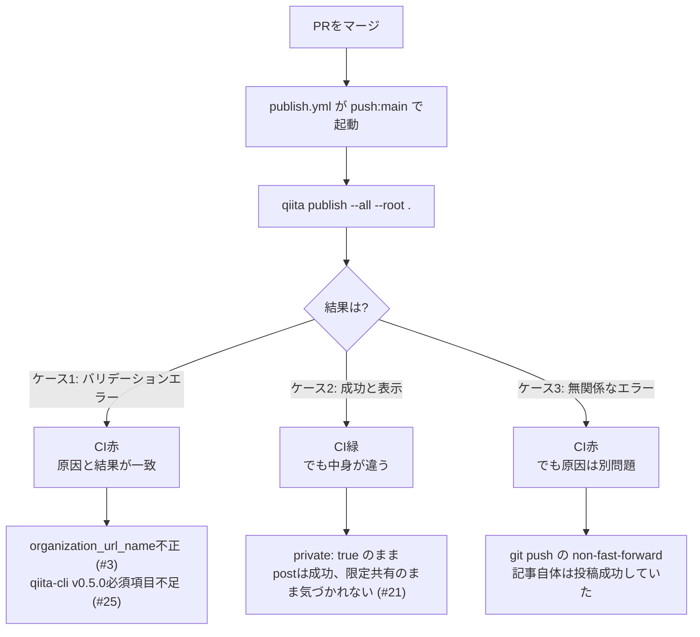

## TL;DR

- Qiita記事を書き溜めている個人リポジトリで、2026/06/07〜08/25の間にマージされた21件のPRのうち、**3件(14.3%)は「前のPRのfrontmatterを直すためだけ」の後追いfixPR**だった
- 3件の内訳は「無効な`organization_url_name`」「`private: true`のまま公開扱いになっていた」「qiita-cliの必須フィールド不足」で、いずれも実際のCIログとエラーメッセージが残っている
- このうち1件（`private: true`）は**CIが失敗した理由と、実際に隠れていた不具合が別物**だった。CIは無関係な`git push`の競合で落ちていて、記事は裏で「限定共有」のまま正常にpost成功していた
- 30回のワークフロー実行のうち失敗は5回（16.7%）。ただし公開の正しさを本当に脅かしていたのはCIの成否ではなく、**マージ前に誰もfrontmatterの中身を検証していない**という構造だった
- 「AIが実装し、AIがテストし、AIが『問題ありません』と言う」を、実際のCIログ付きで検証した記録

## 背景・課題

Qiitaの週間ランキングを見ていると、「AIが実装し、AIがテストし、AIが『問題ありません』と言う時代の品質保証」というタイトルの記事が2週連続でランキング上位（1週目363いいね、2週目も162いいねで3位維持）に入っていました。同じ週には「エラーを3秒でAIに丸投げする若手を見て、AIから答えを取り上げることにした」（357いいね）のような、AIに判断を委ねすぎることへの危機感を扱った記事も上位に来ています。

自分の場合、Qiitaの記事下書きをRoutine（スケジュール実行されるClaude Codeのタスク）に書かせ、ブランチへのpushとPR作成まで任せる運用を続けています。「PRが緑（CIが通っている）」「レビューして違和感がなければマージする」という運用フローそのものは、まさに上記の記事群が問いかけている「AIが作ってAIがテストして『問題ありません』と言う」構図そのものです。

今回、実際にこのリポジトリで何回「問題ありません」が嘘だったかを、GitHub Actionsの実行ログを遡って数えてみました。

## 具体的な取り組み

### 全体像：21件のマージのうち3件がfixだけのPR

```bash
git log --merges --oneline | grep -oP 'from geeknow112/\K[a-z]+' | sort | uniq -c
```

```
      5 article
      4 articles
      5 draft
      4 feature
      3 fix
```

マージされた21件のPRのブランチ名を見出しで分類すると、`fix/`から始まるブランチが3件ありました。中身を見ると、いずれも「新しい記事を追加するPR」ではなく、**直前のPRで公開された記事のfrontmatterが壊れていたのを直すためだけ**のPRです。

| PR | ブランチ | マージ日 | 何を直したか |
|---|---|---|---|
| #3 | `fix/organization-url-name` | 2026-06-13 | 存在しない組織スラッグ`organization_url_name: devex12`を`null`に |
| #21 | `fix/qiita-private-flag` | 2026-08-02 | `private: true`のまま公開されていた記事を`false`に |
| #25 | `fix/qiita-cli-v050-frontmatter` | 2026-08-15 | qiita-cli必須フィールド5つの不足を追加 |

3件とも「記事の内容」ではなく「frontmatterのメタデータ」だけが原因です。しかも約2ヶ月の間に3回、毎回違う種類のメタデータ不備で発生しています。

### GitHub Actionsの実行履歴で見る実際の失敗

このリポジトリの公開フローは、mainにpushされたタイミングで`increments/qiita-cli/actions/publish@v1`が`qiita publish --all --root .`を実行する、という素朴な構成です。

```yaml
# .github/workflows/publish.yml (抜粋)
on:
  push:
    branches:
      - main
      - master
  workflow_dispatch:

jobs:
  publish_articles:
    steps:
      - uses: actions/checkout@v4
      - uses: increments/qiita-cli/actions/publish@v1
        with:
          qiita-token: ${{ secrets.QIITA_TOKEN }}
          root: "."
```

`list_workflow_runs`でこのワークフローの実行履歴を全件（30回）取得すると、失敗は5回（16.7%）でした。うち2回は初回セットアップ直後（2026-06-07、トークン未設定など環境起因）のもので今回のテーマとは無関係のため除外すると、**残り3回の失敗が上記の3件のfixPRと1対1で対応**します。



#### ケース1: 存在しない組織スラッグ（2026-06-13、PR #3の直前）

```
QiitaNotFoundError: {"message":"Not found","type":"not_found"}
記事が見つかりませんでした
  Qiita上で記事が削除されていないかご確認ください
```

`organization_url_name: devex12`という、実在しない組織スラッグを指定していたのが原因でした。エラーメッセージは「記事が見つかりません」で、実際の原因（組織が見つからない）とは違う文面になっており、ログだけでは原因の見当がつきにくい失敗でした。

#### ケース2: CIは緑、でも記事は限定共有のまま（2026-08-01〜02、PR #21）

この回はさらにやっかいで、ログを最後まで追うと以下のようになっていました。

```
Posted: claude-code-custom-theme-reverse-engineering -> bcf4868a86644b6fd243
Successful!
...
[main 85564b8] Updated by qiita-cli
 1 file changed, 4 insertions(+), 2 deletions(-)
 ! [rejected]        main -> main (non-fast-forward)
error: failed to push some refs to 'https://github.com/geeknow112/qiita-devex12'
```

`qiita publish`自体は成功（`Successful!`）していますが、その後にqiita-cliが自動生成した`id`/`updated_at`の書き戻しコミットをpushする段階で、mainが別のコミットで先に進んでいて`non-fast-forward`エラーになり、ジョブ全体としては失敗（赤）表示になっていました。

一方、この回に本当に直すべきだった不具合——記事のfrontmatターに残っていた`private: true`——は、この失敗とは無関係に**投稿自体は成功**していました。つまり「CIが赤だったから何かおかしい」という感覚で見ると、目に入るのは無関係な`git push`の競合で、本当の不具合（限定共有のまま公開されていなかったこと）はCIのログの主役にすらなっていません。これに気づいて`fix/qiita-private-flag`のPRが立ったのは、CIログではなく実際にQiita上の記事を確認したタイミングでした。

#### ケース3: qiita-cli必須フィールドの不足（2026-08-14、PR #25の直前）

```
claude-code-routine-cron-permission-design: updated_atは文字列で入力してください
claude-code-routine-cron-permission-design: idは文字列で入力してください
claude-code-routine-cron-permission-design: organization_url_nameは文字列で入力してください
claude-code-routine-cron-permission-design: slideの設定はtrue/falseで入力してください（破壊的な変更がありました。詳しくはリリースをご確認ください https://github.com/increments/qiita-cli/releases/tag/v0.5.0）
```

この回のfrontmatterは`title`・`tags`・`private`しか書かれておらず、`updated_at`/`id`/`organization_url_name`/`slide`/`ignorePublish`の5つが丸ごと欠けていました。エラーメッセージが案内している`qiita-cli`のv0.5.0リリースノートを確認すると、実際に明記されている破壊的変更は「`slide`フィールドの必須化」（2023年7月19日リリース）だけで、`updated_at`・`id`・`organization_url_name`の型チェック（文字列必須）についてはリリースノートに記載がありませんでした。つまり、**ドキュメント化されている破壊的変更は1個だけなのに、実際に動いているCLIはそれ以外の3項目もチェックしている**ことを、このエラーで初めて知った形になります。

### なぜ同じ「メタデータ起因」の事故が3回起きたか

3件それぞれ原因のフィールドは違いますが、共通しているのは**「PRの時点でfrontmatterの中身を機械的に検証するステップが存在しない」**ことです。`publish.yml`は`push: main`でしか起動しないため、記事ドラフトの内容チェックはレビュアーの目視だけに委ねられており、しかもfrontmatterのYAML自体は「読めばパースできてしまう」ため、レビュー時に見落としやすい部類の不備でした。

## 代替手段との比較

| 手段 | 検知タイミング | 追加コスト | カバーできる範囲 |
|---|---|---|---|
| 現状（`publish.yml`のみ、push:mainで起動） | マージ後・本番投稿時 | ゼロ | qiita-cli自身が投げるエラーのみ。`private: true`のような「エラーにならない」不備は素通り |
| PR時点でfrontmatterのlintを追加（`pull_request`トリガーのワークフローを新設） | マージ前 | ワークフロー1本＋簡単なスキーマ検証スクリプト | 必須フィールドの欠落・型不一致はマージ前に弾ける。ただし`organization_url_name`の実在確認のようにQiita API側に問い合わせないと分からない不備は検知できない |
| `qiita preview`をローカルまたはCIで都度実行 | 執筆時・PR時点 | 手間はほぼゼロ（既存コマンド） | 表示崩れなど見た目の不備には強いが、frontmatterの型やAPI側の実在確認までは保証しない |

3つとも一長一短ですが、今回の3件はいずれも「型が合っているか」「必須フィールドが揃っているか」という機械的にチェック可能な種類の不備だったため、まずは2番目（PRの時点でのfrontmatter lint）を追加するのが費用対効果が高そうです。この検証ワークフローの追加は今回のリポジトリではまだ実施しておらず、次にやることとして残っています。

## よくある疑問

**Q. `private: true`が原因の事故は、なぜCIで検知できなかったのか？**
A. `private: true`はqiita-cliにとって「正しい入力」の一つ（限定共有記事として投稿する設定）であり、型やスキーマの観点では何もおかしくありません。CLIからすると「指示通りに限定共有で投稿した」だけなので、エラーは発生しません。人間側が「今回は公開したかったのに、正しく公開設定になっているか」を意図と照らし合わせて確認する以外に検知手段がありませんでした。

**Q. 3件とも同じ`fix/`カテゴリなのに、なぜ毎回違うフィールドで再発したのか？**
A. #3は組織スラッグの実在確認、#21は公開設定の意図確認、#25はqiita-cli自体のバージョンアップに伴う必須フィールドの追加、と原因のレイヤーがバラバラです。1つの不備を直しても、それは同じフィールドの再発を防ぐだけで、「frontmatter全体を機械的に検証する仕組み」を用意しない限り、次は別のフィールドで同じ種類の事故が起きる構造でした。

**Q. これはqiita-cliを使っている他のリポジトリでも起こり得るか？**
A. 起こり得ます。特に`slide`必須化のような古い破壊的変更（2023年7月19日リリース）は、CIの`increments/qiita-cli/actions/publish@v1`が特定バージョン指定なしで最新のqiita-cliをインストールする構成だと、リポジトリ側のfrontmatterテンプレートが更新されない限りいつか踏むことになります。

## 得られた知見・まとめ

- 21件のマージのうち3件（14.3%）が、記事内容ではなく frontmatter のメタデータ不備を直すためだけの後追いPRだった
- 3件のうち1件は「CIが失敗した理由」と「本当に隠れていた不具合」が一致しておらず、CIの色（緑/赤）だけを見て安心するのは危険だと分かった
- ドキュメント化されている破壊的変更（`slide`必須化、2023-07-19）以外にも、実際に動いているCLIの挙動には未文書化のバリデーションが存在した。公式ドキュメントと実際の挙動は必ずしも一致しない
- `publish.yml`が`push: main`でしか起動しない構成である以上、マージ前にfrontmatterの中身を機械的に検証する仕組みがない限り、同種の事故は今後も違うフィールドで再発しうる
- 「AIが実装し、AIがテストし、AIが『問題ありません』と言う」を鵜呑みにするのではなく、「テストの結果（CIの色）が本当に見たかったものを検証しているか」を分けて考える必要がある、というのが今回の一番の収穫

## 参考リンク

- [increments/qiita-cli - GitHub](https://github.com/increments/qiita-cli)
- [qiita-cli v0.5.0 リリースノート](https://github.com/increments/qiita-cli/releases/tag/v0.5.0)
- [qiita-cli/actions/publish - GitHub](https://github.com/increments/qiita-cli/blob/main/actions/publish/action.yml)
- [Events that trigger workflows - GitHub Actions Docs](https://docs.github.com/en/actions/using-workflows/events-that-trigger-workflows#push)
