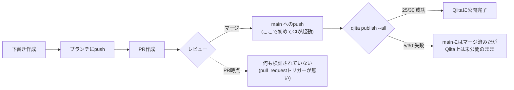
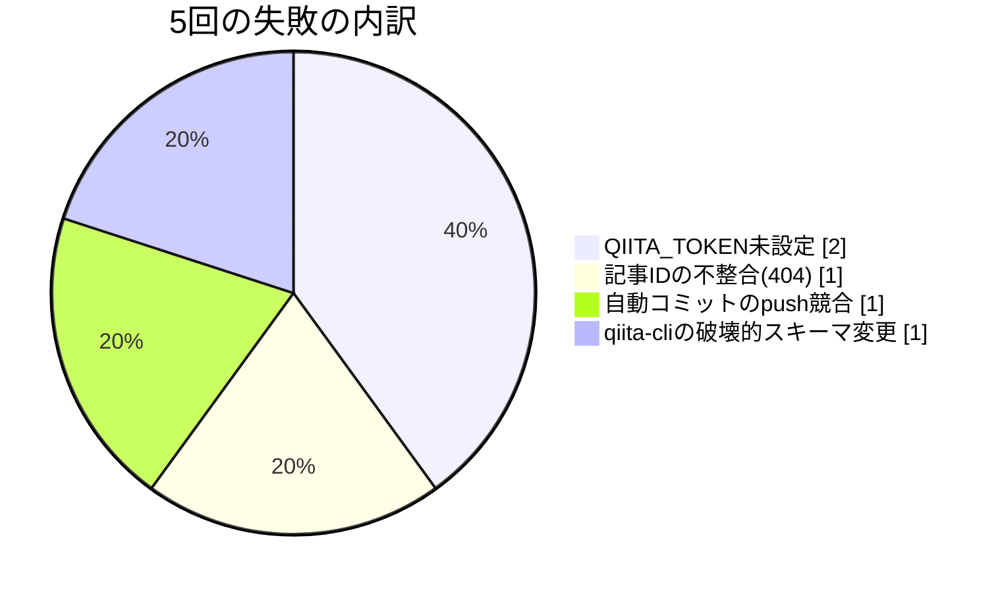

## TL;DR

- 個人のQiita記事投稿リポジトリで、直近30回分のGitHub Actions実行（`publish.yml`）を全件棚卸しした。**5回（16.7%）がfailureで終わっていた**
- この`publish.yml`は`on: push: branches: [main, master]`のみで起動する設計で、`pull_request`トリガーが存在しない。つまりPRの時点では何も検証されておらず、失敗が判明するのは常に**マージした後**
- 「原因はどうせ全部frontmatterのスキーマ違反だろう」という予想を立てて5回分の実行ログを実際に読んだところ、外れた。内訳は**QIITA_TOKEN未設定（2回）／記事IDの不整合による404（1回）／自動コミットのpush競合（1回）／qiita-cliの破壊的スキーマ変更（1回）**の4パターンで、同じ原因は一度もなかった
- 5回のうち4回は、失敗の直後に入った1本のfixコミット・PRだけで即解消していた。唯一のスキーマ変更起因（v0.5.0の`slide`必須化）だけは、CLIのエラーメッセージ自体が該当リリースノートのURLを直接吐き出しており、原因特定に一切迷わなかった

## 背景・課題

個人でQiitaに記事を投稿するリポジトリを、下書き作成 → ブランチpush → PR作成 → マージ → CIで自動公開、という流れで運用している。「CI」という言葉には「マージ前に何かを検証してブロックしてくれる」というイメージがあるが、実際にこのリポジトリの`.github/workflows/publish.yml`を読むと、トリガーは`push`（`main`/`master`ブランチへの直接push）と`workflow_dispatch`しかなく、`pull_request`トリガーは存在しない。

```yaml
on:
  push:
    branches:
      - main
      - master
  workflow_dispatch:
```

つまりこのリポジトリの「CI」は、PRをマージする前の品質ゲートではなく、**マージされた後に1回だけ実行される公開処理**でしかない。この構造上、「マージはできたが実際には公開に失敗している」状態が起こりうる。実際にどれくらいの頻度でそれが起きていたのかを、GitHub Actionsの実行履歴から検証した。

## 実際にやったこと：30回分のActions実行を全件棚卸し

GitHub Actions APIで`publish.yml`の実行履歴を`run_number`の若い順に30件（＝リポジトリ作成からこの棚卸しを行った時点までの全件）取得し、`conclusion`を集計した。

| conclusion | 件数 | 割合 |
|---|---|---|
| success | 25 | 83.3% |
| failure | 5 | 16.7% |
| **合計** | **30** | **100%** |



「PRがマージできた」ことと「記事が実際にQiitaに公開された」ことの間に、検証なしの1ステップが挟まっている。5回の失敗はすべて、このステップで初めて表面化していた。

## 5回の失敗、原因は5パターンぜんぶ違った

「マージ後に落ちるなら、どうせ理由は`frontmatter`のスキーマ違反だろう」と当たりをつけて5回分のジョブログを実際に読んだ。結果は次の通りで、予想は半分しか当たらなかった。



### 失敗1・2：リポジトリ作成直後、`QIITA_TOKEN`が未設定だった（2026-06-07）

リポジトリを作成した直後の2回の実行が、どちらも同じエラーで落ちていた。

```
Error: ENOENT: no such file or directory, open '/home/runner/.config/qiita-cli/credentials.json'
```

`publish.yml`自体は初回コミットの時点で`qiita-token: ${{ secrets.QIITA_TOKEN }}`を正しく指定しており、ワークフローファイルにバグはなかった。原因は単純で、リポジトリの`Settings > Secrets`に`QIITA_TOKEN`をまだ登録していなかったため、`secrets.QIITA_TOKEN`が空文字列のままCLIに渡り、認証情報ファイルを作れずに落ちていた。ワークフローファイルの1行目に`# Please set 'QIITA_TOKEN' secret to your repository`というコメントが最初から書かれており、そのコメント通りの手順を後回しにした結果だった。3回目の実行（`Add: AWS DLT article`）でシークレットを登録し終えており、以降このパターンの失敗は一度も再発していない。

### 失敗3：記事IDが指している投稿がQiita側に存在せず404（2026-06-13）

```
QiitaNotFoundError: {"message":"Not found","type":"not_found"}
記事が見つかりませんでした
  Qiita上で記事が削除されていないかご確認ください
```

`qiita publish`は、frontmatterの`id`が入っている記事を「既存記事の更新」として扱い、そのIDに対して更新APIを叩く。このときAPI側から404が返っていた。直後に入ったfixコミットのタイトルが`Fix: remove invalid organization_url_name`だったことから、`organization_url_name`（Organization配下の記事として扱うための識別子）に不正な値が入った状態でIDを解決しようとし、参照先が見つからなかったのが原因だと分かる。個人アカウント用の記事なのにOrganization向けのフィールドが紛れ込んでいた、という状態に近い。

### 失敗4：`qiita publish`自体は成功していたのに、その後のpushが競合していた（2026-08-01）

これは5件の中で唯一、**qiita-cliのpublishコマンド自体は成功していた**ケースだった。ログを最後まで読むまで、他の4件と同じ「publishが落ちた」失敗だと勘違いしていた。

```
Posted: claude-code-custom-theme-reverse-engineering -> bcf4868a86644b6fd243
Successful!
...
[main 85564b8] Updated by qiita-cli
 ! [rejected]        main -> main (non-fast-forward)
error: failed to push some refs to 'https://github.com/geeknow112/qiita-devex12'
hint: Updates were rejected because the tip of your current branch is behind
hint: its remote counterpart.
```

`qiita-cli/actions/publish`は、公開後に採番された`id`や`updated_at`をfrontmatterに書き戻すため、最後に`git commit && git push`を自前で実行する。このジョブが動いている間に別のpushで`main`が先に進んでしまい、非fast-forwardでpushが拒否されていた。つまり記事自体はQiita上に公開済みなのに、その事実を書き戻すコミットだけが失敗してリポジトリ側の記録とズレる、という状態が発生していた。ワークフロー自体に`concurrency`設定（`cancel-in-progress: false`）はあるものの、これは同一ワークフロー内の多重実行を防ぐものであり、人間が直接pushするような外部要因までは防げない。

### 失敗5：qiita-cli v0.5.0の破壊的変更で、frontmatterのスキーマ検証に複数同時に引っかかった（2026-08-14）

5件の中で唯一、想定通り「frontmatterのスキーマ違反」だった回。しかもエラーメッセージ自体が該当リリースノートのURLを教えてくれていた。

```
claude-code-routine-cron-permission-design: updated_atは文字列で入力してください
claude-code-routine-cron-permission-design: idは文字列で入力してください
claude-code-routine-cron-permission-design: organization_url_nameは文字列で入力してください
claude-code-routine-cron-permission-design: slideの設定はtrue/falseで入力してください（破壊的な変更がありました。詳しくはリリースをご確認ください https://github.com/increments/qiita-cli/releases/tag/v0.5.0）
```

実際に[qiita-cli v0.5.0のリリースノート](https://github.com/increments/qiita-cli/releases/tag/v0.5.0)を確認すると、このバージョンから`slide`フィールドが必須化されており、「既存記事は`pull --force`で更新できる」という移行手順が明記されている。今回のケースでは、新しく書いた下書きのfrontmatterに`slide`フィールド自体が含まれておらず、それに連動して`updated_at`・`id`・`organization_url_name`の型検証にも一緒に引っかかっていた。翌日中にfrontmatterへ8つの必須フィールド（`title`/`tags`/`private`/`updated_at`/`id`/`organization_url_name`/`slide`/`ignorePublish`）を揃えるfixが入り、以降は同じ理由での失敗は起きていない。

## つまずき：直したはずのスキーマが、実はもう一段先に進んでいた

失敗5の修正から数週間後の最新記事のfrontmatterを見ると、`posting_campaign_uuid: null`と`agreed_posting_campaign_term: false`という、失敗5の時点では存在しなかった2つのフィールドが追加されていた。qiita-cliのリリース履歴を確認すると、[v1.9.0](https://github.com/increments/qiita-cli/releases/tag/v1.9.0)で「記事投稿キャンペーン」機能が追加されており、このタイミングでfrontmatterにさらに項目が増えていたことが分かる。しかもv1.9.0自体、「旧形式のfrontmatterのまま更新するとキャンペーン登録が解除される不具合」が報告され、Qiita側が一時的に該当バージョンからの更新をブロックするという事態も起きていた（v1.9.1で修正）。

「必須フィールドを8つ揃えたから、もうこのパイプラインのfrontmatter問題は解決した」と思っていたが、CLI側のスキーマは個人の記事投稿とは無関係に進化し続けている。frontmatterまわりの失敗は、1回直して終わりという類のものではなく、CLIのバージョンアップに合わせて継続的に監視すべき項目だと分かった。

## 代替手段の比較：マージ前にこの5パターンを検知する方法はあったか

現状は「マージ後、pushトリガーの`publish.yml`が失敗して初めて気づく」運用になっている。これをマージ前に前倒しできる手段を比較した。

| 手段 | 検知できる範囲 | 検知できない範囲 | 導入コスト |
|---|---|---|---|
| 現状（pushのみ、事後検知） | 何も事前検知しない | 全パターン | ゼロ |
| `pull_request`トリガーを追加し`qiita publish --dry-run`相当を実行 | frontmatterのスキーマ違反（失敗5のパターン） | QIITA_TOKEN未設定（Secretsの設定漏れ自体は変わらない）、記事IDの404（Qiita側の実データに依存するため要APIアクセス）、push競合（PR時点では発生しない事象） | 低〜中（`qiita-cli`にdry-run相当のオプションがあるか要確認。無ければpreviewビルドで代用） |
| pre-commitフックでfrontmatterのJSON Schema検証 | スキーマ違反（型・必須フィールド） | 同上、かつローカルで実行し忘れると素通りする | 低（スキーマファイルの整備のみ） |
| 自動コミットの`git push`をリトライ付きにする | push競合（失敗4のパターン） | それ以外全部 | 低（`publish.yml`側の変更のみで対応可能） |

frontmatterのスキーマ違反（5件中1件）はPR時点のローカル検証で防げる可能性が高い一方、QIITA_TOKEN未設定や記事IDの404、push競合はいずれも「マージのタイミング」や「Qiita側の実データ」に依存するため、PRの差分だけを見る検証では原理的に防ぎきれない。5パターンのうち4パターンは、frontmatterだけを見るチェックでは防げない、というのが実際に比較して分かったことだった。

## よくある疑問

**Q. `pull_request`トリガーを追加しない理由は？**
A. `QIITA_TOKEN`のようなリポジトリSecretsは、fork元からのPRには渡されない設計になっている（GitHubの仕様）。同一リポジトリ内のブランチからのPRであれば渡せるが、今回のような個人運用の小規模リポジトリでは、「マージ後にpublish.ymlが1回落ちたら気づいて直す」運用コストの方が、`pull_request`トリガー用の別ワークフローを増やして二重に保守するコストより低いと判断し、現状は追加していない。

**Q. 5回の失敗で、実際にQiita読者への公開が長時間遅れたことはあったか？**
A. 5回とも、失敗に気づいてからfixのコミット・PRをマージし直すまでは早ければ同日、遅くとも翌日中には解消していた。ただし「気づく」ためには誰かがActionsのタブを能動的に見に行く必要があり、通知を設定していなければ数日単位で気づかない可能性もある構造だった。

**Q. 30回という母数は多いと言えるのか？**
A. 約2.5ヶ月間・記事20本強の個人運用での実行回数であり、統計的に一般化できる数ではない。ただし「CIが1つしか無く、しかもマージ後にしか動かない」という構造自体は、個人でqiita-cliとGitHub Actionsを組み合わせている運用であれば同じように起こりうる。

## 得られた知見・まとめ

- 30回の`publish.yml`実行のうち5回（16.7%）が失敗していた。この「CI」はマージ前の品質ゲートではなく、マージ後に1回だけ動く公開処理であり、PR時点では何も検証されていない
- 5回の失敗原因は「QIITA_TOKEN未設定（2回）」「記事IDの不整合による404（1回）」「自動コミットのpush競合（1回）」「qiita-cli v0.5.0の破壊的スキーマ変更（1回）」の4パターンに分かれており、「原因はどうせ全部frontmatterだろう」という予想は半分しか当たらなかった。ログを実際に読むまでは、失敗4の「publish自体は成功していたのに書き戻しのpushだけ競合していた」というケースには気づけなかった
- frontmatterのスキーマ違反はPR時点のローカル検証で防げる可能性があるが、トークン未設定・記事IDの404・push競合はマージのタイミングやQiita側の実データに依存するため、PRの差分だけを見る検証では原理的に防ぎきれない
- qiita-cliのfrontmatterスキーマは今回の修正（v0.5.0対応）で終わりではなく、その後のv1.9.0でさらにフィールドが増えていた。「一度直したから終わり」ではなく、CLIのバージョンアップごとに継続的な確認が必要な項目だと分かった

## 参考リンク

- [increments/qiita-cli - GitHub](https://github.com/increments/qiita-cli)
- [qiita-cli README（frontmatterの記法）](https://github.com/increments/qiita-cli/blob/main/README.md)
- [Release v0.5.0 · increments/qiita-cli](https://github.com/increments/qiita-cli/releases/tag/v0.5.0)
- [Release v1.9.0 · increments/qiita-cli](https://github.com/increments/qiita-cli/releases/tag/v1.9.0)
- [Events that trigger workflows - GitHub Docs](https://docs.github.com/actions/using-workflows/events-that-trigger-workflows)
- [Using secrets in GitHub Actions - GitHub Docs](https://docs.github.com/actions/security-guides/using-secrets-in-github-actions)
