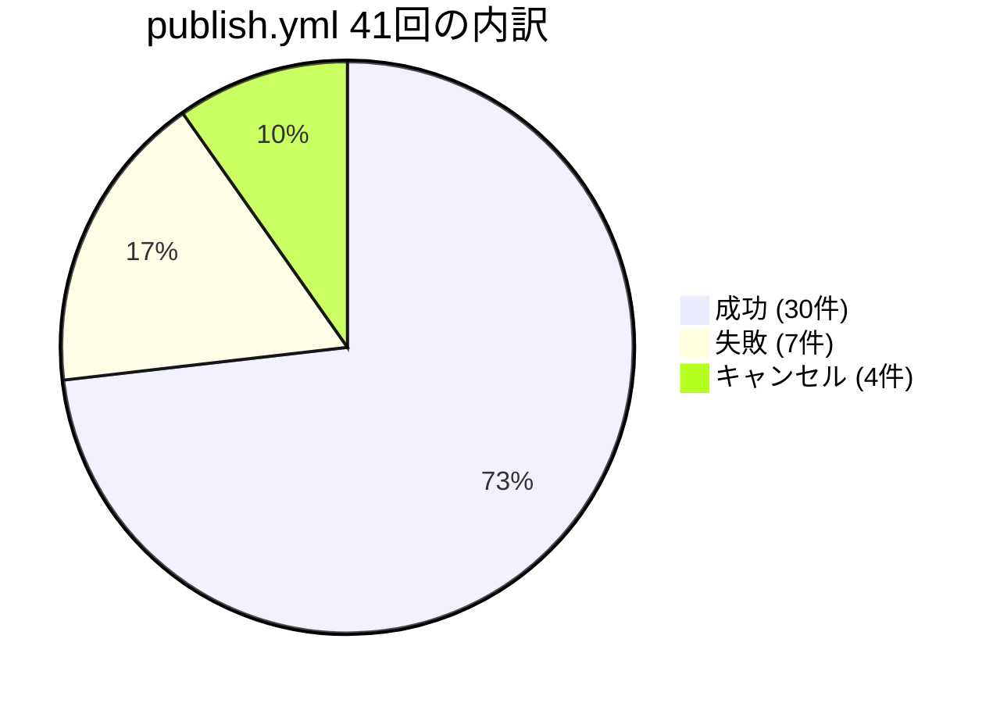
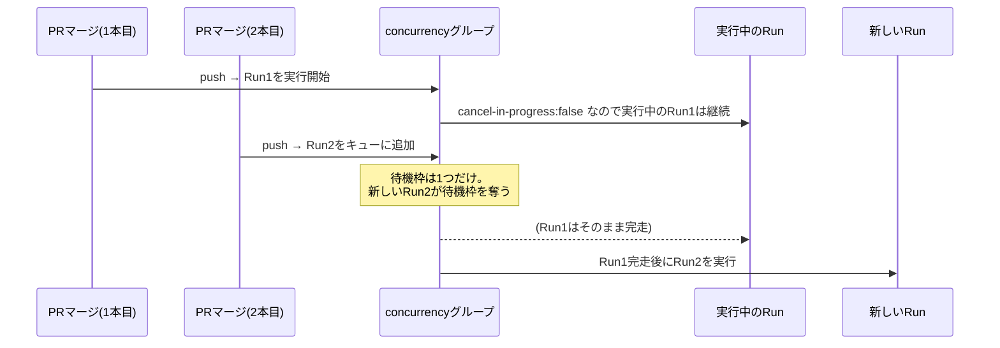

## TL;DR

- 個人でQiita記事をqiita-cli + GitHub Actionsで自動publishする運用を続け、`publish.yml`が41回実行された時点のログを全件棚卸しした
- **成功30件(73.2%)、失敗7件(17.1%)、キャンセル4件(9.8%)**
- 失敗7件をログから1件ずつ分類したところ、原因は5パターンに分かれた。体感で一番印象に残っていた「frontmatterの必須フィールド不足」は実は7件中1件（14.3%）に過ぎず、**最多はgit pushの競合（2件、28.6%）**だった
- キャンセル4件は全部同じ原因で、`concurrency`の`cancel-in-progress: false`は「実行中のジョブを守る」設定であって「積んだジョブを全部実行する」設定ではない、という仕様を実運用で踏み抜いた記録
- 実測値は「1週間・1リポジトリの観測結果」なので統計的な一般化はできない。あくまで自分の運用ログを全部読んだ結果の分類と再発防止策の共有

## 背景・課題

QiitaにはCLIツール（qiita-cli）とGitHub Actionsを組み合わせて、Markdownファイルをmainブランチにpushすると自動でQiitaに反映される仕組みがある。自分もこの構成で記事を管理していて、`.github/workflows/publish.yml`から`increments/qiita-cli/actions/publish@v1`を呼ぶ、ごく標準的な構成にしている。

```yaml
name: Publish articles

on:
  push:
    branches:
      - main
      - master
  workflow_dispatch:

permissions:
  contents: write

concurrency:
  group: ${{ github.workflow }}-${{ github.ref }}
  cancel-in-progress: false

jobs:
  publish_articles:
    runs-on: ubuntu-latest
    timeout-minutes: 5
    steps:
      - uses: actions/checkout@v4
        with:
          fetch-depth: 0
      - uses: increments/qiita-cli/actions/publish@v1
        with:
          qiita-token: ${{ secrets.QIITA_TOKEN }}
          root: "."
```

運用を続けるうちに、たまにCIが赤くなることがあった。そのたびに「あ、また例のfrontmatterのやつか」と流していたのだが、実際にどのパターンがどれだけの頻度で起きているのかを一度も数えたことがなかった。セキュリティ診断の仕事では「体感」ではなくログを1件ずつ確認して原因を特定する癖がついているので、同じやり方を自分のCI運用にも適用し、GitHub Actionsの実行履歴を全件洗い出してみた。

## 具体的な取り組み

### 1. 全実行履歴の取得

GitHub APIで`publish.yml`のワークフロー実行を全件取得した。累計41回分が対象になった。



- 成功: 30件（73.2%）
- 失敗: 7件（17.1%）
- キャンセル: 4件（9.8%）

### 2. 失敗7件をログから分類する

失敗した7件それぞれについて、ジョブログを取得して原因を特定した（2件は実行から90日以上経過しておりログが410 Goneで取得不能だった）。

| # | 原因カテゴリ | 件数 | 割合 |
|---|---|---|---|
| 1 | git push競合（fast-forward失敗） | 2件 | 28.6% |
| 2 | ログ保持期限切れで原因不明 | 2件 | 28.6% |
| 3 | frontmatter必須フィールド不足（qiita-cli v0.5.0対応） | 1件 | 14.3% |
| 4 | コンテンツ更新競合（ローカルがQiita側より古い） | 1件 | 14.3% |
| 5 | QiitaNotFoundError | 1件 | 14.3% |

それぞれの実際のログを見ていく。

**① git push競合（2件）**

qiita-cliのpublishアクションは「Qiitaに投稿→フロントマターの`id`/`updated_at`をローカルファイルに書き戻してcommit&push」という2段階の処理をする。この2段目のpushで、他の変更が先にmainへ入っているとfast-forwardできずに失敗する。

```
To https://github.com/xxxx/xxxx
 ! [rejected]        main -> main (fetch first)
error: failed to push some refs to 'https://github.com/xxxx/xxxx'
hint: Updates were rejected because the remote contains work that you do not
hint: have locally.
```

Qiitaへの投稿自体（`qiita publish`のAPI呼び出し）は成功しているのに、書き戻しのpushだけが失敗する。つまり**記事は公開されているのにCIは赤くなる**という、実害と表示が一致しないパターン。

**② ログ保持期限切れ（2件）**

GitHub Actionsのログはデフォルトで90日で失効し、`get_job_logs`のようなAPIから取得しようとすると`410 Gone`が返る。今回はリポジトリ立ち上げ初期（運用1〜2回目）の失敗がこれに該当し、原因の特定を諦めた。

**③ frontmatter必須フィールド不足（1件）**

これが最初に「トレンドとの接点」として調べていた話。qiita-cli v0.5.0でスライドモード対応のため`slide`フィールドが必須化され、それに伴い`updated_at`/`id`/`organization_url_name`も明示的に文字列または`null`を入れることが必須になった（[公式リリースノート](https://github.com/increments/qiita-cli/releases/tag/v0.5.0)より）。実際のエラーはこう出る。

```
xxxx: updated_atは文字列で入力してください
xxxx: idは文字列で入力してください
xxxx: organization_url_nameは文字列で入力してください
xxxx: slideの設定はtrue/falseで入力してください（破壊的な変更がありました。詳しくはリリースをご確認ください https://github.com/increments/qiita-cli/releases/tag/v0.5.0）
```

これは新規記事を追加した際、テンプレートが更新前のバージョンのままだったために起きた1回限りの失敗で、テンプレート側を修正してからは再発していない。

**④ コンテンツ更新競合（1件）**

```
xxxx: 内容がQiita上の記事より古い可能性があります
```

Qiita側で先に更新があった（例えばWeb UIで手直しした、または別のCI実行が先に反映していた）場合に、ローカルの内容で上書きしようとするとこのエラーになる。`qiita pull --force`でQiita側の内容をローカルに同期してから再度作業する必要がある。

**⑤ QiitaNotFoundError（1件）**

```
QiitaNotFoundError: {"message":"Not found","type":"not_found"}
記事が見つかりませんでした
  Qiita上で記事が削除されていないかご確認ください
```

frontmatterに`id`が残ったままQiita側で記事が削除されている（あるいは別アカウントに紐づいている）と、更新しようとして404になる。

### 3. キャンセル4件は「仕様通り」だった

失敗とは別に、4件のキャンセルも起きていた。これは短時間に複数のPRを連続でmainにマージした際に発生していて、`concurrency`設定の挙動をそのまま体現していた。



`cancel-in-progress: false`は「今実行中のジョブを中断しない」という設定であって、「キューに積んだジョブを全部実行する」設定ではない。同じconcurrencyグループに新しいpushが来ると、**まだ実行が始まっていない待機中のジョブは無条件で新しいジョブに差し替えられる**（[GitHub Actions公式ドキュメント](https://docs.github.com/actions/writing-workflows/choosing-what-your-workflow-does/control-the-concurrency-of-workflows-and-jobs)、および実例を報告している[コミュニティディスカッション](https://github.com/orgs/community/discussions/53506)を参照）。今回のケースでは、キャンセルされたPRの内容も最終的に後続のRunでまとめて`qiita publish --all`によって公開されるため、記事自体が消えることはなかった。

## 代替手段との比較

| 対策 | メリット | デメリット |
|---|---|---|
| 現状維持（`cancel-in-progress: false`、PRを都度マージ） | 設定変更不要。キャンセルされても後続Runで結局公開される | 連続マージ時にCIのステータスバッジだけ赤/キャンセルになり紛らわしい |
| `cancel-in-progress: true`に変更 | 待機ジョブの扱いが明確になる | 実行中のpublishジョブ自体を中断してしまうリスクがあり、pushの途中でQiita APIへの投稿が中断される方が実害が大きい |
| PRを1本ずつマージしてCI完走を待つ運用ルールにする | キャンセル・push競合をほぼゼロにできる | 記事を複数まとめて出したい時に手間が増える |
| frontmatterの必須フィールドをpre-commitやCIの別ジョブで事前検証する | publish前に静的にエラーを検知できる | 検証ロジックをqiita-cliのバージョンアップに追従して自前でメンテする必要がある |

自分の運用では「複数記事を立て続けにマージすることがある」ため、`cancel-in-progress`はfalseのまま維持し、frontmatterの必須フィールドだけは新規記事のテンプレートに固定値として入れておく方針にした。

## よくある疑問

**Q. 一番実害が大きかった失敗はどれ？**
A. 実害の大小で言うと、キャンセル4件は後続のRunで記事自体は結局公開されるため実害はほぼない。一方でgit push競合の2件は、Qiitaへの投稿自体は成功しているのにfrontmatterへの`id`/`updated_at`の書き戻しだけが失敗するため、再実行するまでローカルのfrontmatterがQiita側の実体とズレたままになる。表示上の赤色と実害の大きさが一致しない典型例だった。

**Q. ログが取れなかった2件はどうすればいい？**
A. GitHub Actionsのログはデフォルト90日で失効する。同じような事後分析を将来やりたいなら、ログをS3などの外部ストレージに転送するか、リポジトリ設定でログ保持期間を延ばしておく必要がある、というのが今回得た運用上の学び。

**Q. frontmatterの必須フィールド不足は今後も起きる？**
A. qiita-cliが将来また破壊的変更を入れれば同じことは起きうる。今回は新規記事作成用のテンプレートを更新前のまま使ってしまったのが原因だったので、テンプレート自体を最新のフィールド構成に固定しておけば、少なくとも「テンプレートが古い」ことによる再発は防げる。

## 得られた知見・まとめ

- 41回の実行のうち成功は73.2%で、体感していたよりは失敗率は低かった（17.1%）
- 失敗の内訳は「frontmatter不足」が最多という思い込みは外れていて、実際は**git push競合が最多（28.6%）**、frontmatter不足は7件中1件（14.3%）にとどまった
- キャンセル4件は不具合ではなく`concurrency: cancel-in-progress: false`の仕様通りの挙動で、「実行中のジョブを守る」設定は「キューを守る」設定ではないという点を実データで確認できた
- CIが赤くなったときに「多分いつものアレだろう」で済ませず、ログを1件ずつ読んで分類すると、対策すべき優先順位が体感と入れ替わることがある

## 参考リンク

- [qiita-cli v0.5.0 Release Notes](https://github.com/increments/qiita-cli/releases/tag/v0.5.0)
- [increments/qiita-cli README](https://github.com/increments/qiita-cli/blob/main/README.md)
- [Control the concurrency of workflows and jobs - GitHub Docs](https://docs.github.com/actions/writing-workflows/choosing-what-your-workflow-does/control-the-concurrency-of-workflows-and-jobs)
- [BUG: concurrency with "cancel-in-progress: false" still cancels the next jobs instead of waiting · community discussion #53506](https://github.com/orgs/community/discussions/53506)
