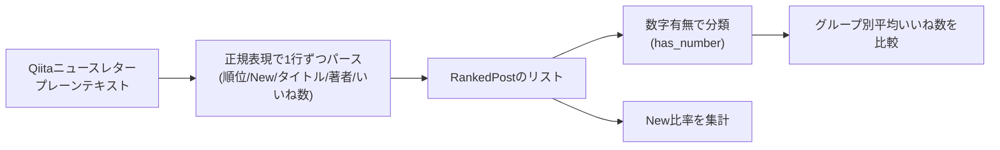

## TL;DR

- Qiita公式ニュースレター「先週いいねが多かった投稿ベスト20」（集計期間: 2026/07/27〜08/02、1通・20件）をPythonで構造化データに変換し、タイトルの傾向を数えた
- **タイトルに具体的な数字が入っている記事（8/20件）の平均いいねは66.0、入っていない記事（12/20件）は51.2。差は+28.9%**
- 同じ週のランキングの**75%（15/20件）が「New」表記（前週未ランクイン）**で、週替わりの入れ替わりがかなり激しい
- ふだんメールの一次仕分けや情報収集をPythonバッチで回している身として、「メール本文をどこまで正規表現で構造化できるか」を実データで検証した記録も兼ねる
- サンプルは1週間・N=20のみなので統計的な結論というより「観測事実＋計測方法」の共有です

## 背景・課題

Qiitaの週間ランキングメールを眺めていると、上位に来るタイトルにはなんとなく「◯◯選」「全◯問」のような数字入りが多い気がする、という感覚がありました。ただし「なんとなく」のままだと再現性がないので、実際に受信したメールをテキストとして構造化し、数字で確認してみることにしました。

普段からGmail経由で届く通知メールを一次仕分けするPythonバッチを回しており、その延長で「メールニュースレターという半構造化テキストを、どこまで機械的にパースできるか」という技術的な関心もありました。今回はそのミニケーススタディです。

## 実際の取り組み

### 1. 対象データ

2026/08/05にQiitaから届いた「先週いいねが多かった投稿ベスト20」（集計期間: 2026/07/27〜08/02）の1通のみを対象にしました。他に直近2週間で届いたQiitaメールは「Qiita AI Summit」等のイベント告知やアップデートのお知らせで、ランキング形式のデータを含んでいなかったため対象外にしています。

### 2. パースの設計

メール本文（プレーンテキスト）は以下のような行の繰り返しでした。

```
1位 セキュリティの勉強になるサイト138選(2026年版) (https://...) by Nakanishi_RareTECH (126いいね)
2位 New Mac mini（M4 Pro / 48GB）で「完全ローカル」のLLM + RAG環境を構築してみた (https://...) by y-okayama-tb (109いいね)
```

順位・New表記の有無・タイトル・著者・いいね数が1行に混在しているため、以下の正規表現で1行ずつ分解しました。

```python
import re
from dataclasses import dataclass

LINE_PATTERN = re.compile(
    r"^(?P<rank>\d+)位\s+"
    r"(?P<is_new>New\s+)?"
    r"(?P<title>.+?)\s+"
    r"\(https?://\S+\)\s+"
    r"by\s+(?P<author>\S+)\s+"
    r"\((?P<likes>\d+)いいね\)"
)

@dataclass
class RankedPost:
    rank: int
    is_new: bool
    title: str
    author: str
    likes: int

def parse_newsletter(text: str) -> list[RankedPost]:
    posts = []
    for line in text.splitlines():
        m = LINE_PATTERN.match(line.strip())
        if not m:
            continue
        posts.append(RankedPost(
            rank=int(m.group("rank")),
            is_new=bool(m.group("is_new")),
            title=m.group("title"),
            author=m.group("author"),
            likes=int(m.group("likes")),
        ))
    return posts
```

同順位（17位・19位が2件ずつ）はそのまま別レコードとして扱い、20件のリストになりました。

### 3. 集計

```python
import statistics

def has_number(title: str) -> bool:
    # 全角/半角の算用数字、または「◯選」「全◯問」のような助数詞つき数量表現を数字ありと判定
    return bool(re.search(r"[0-9０-９]", title))

def summarize(posts: list[RankedPost]) -> dict:
    numbered = [p.likes for p in posts if has_number(p.title)]
    plain = [p.likes for p in posts if not has_number(p.title)]
    new_ratio = sum(p.is_new for p in posts) / len(posts)
    return {
        "n_total": len(posts),
        "n_numbered": len(numbered),
        "avg_likes_numbered": statistics.mean(numbered),
        "avg_likes_plain": statistics.mean(plain),
        "new_ratio": new_ratio,
    }
```



### 4. 結果

| 指標 | 値 |
|---|---|
| 対象件数 | 20件 |
| タイトルに数字あり | 8件（40%） |
| タイトルに数字なし | 12件（60%） |
| 数字ありグループの平均いいね | 66.0 |
| 数字なしグループの平均いいね | 51.2 |
| 差分 | +14.8（+28.9%） |
| New表記の割合 | 75%（15/20件） |

数字ありグループの内訳は「セキュリティの勉強になるサイト138選」（126いいね、1位）、「CLAUDE.md設計パターン集7つのテンプレート」（96いいね、3位）、「1日数人の個人サイトが1か月で33万回攻撃されていた」（36いいね）など。1位の記事が数字ありグループの平均を押し上げている面はあり、中央値でも確認すると、数字ありグループの中央値は44.5、数字なしグループの中央値は50.0で、こちらは逆に数字なしの方がわずかに高くなりました。**平均では数字ありが優勢、中央値では逆転**という結果で、「タイトルに数字を入れれば伸びる」と単純化するには材料不足、というのが正直な結論です。

New比率75%は、1回の週間ランキング内で前週から居残っているのが5件しかない、つまり「いいね」の蓄積が早い記事は初動の1週間でランクインし、翌週には別の記事に入れ替わるサイクルが速いことを示しています。

## 代替手段との比較

同じ集計をやる方法はメール解析以外にもあります。

| 手段 | メリット | デメリット |
|---|---|---|
| ニュースレターのメール本文をパース（今回採用） | Qiita公式が「直近1週間で伸びた記事」を既に選別してくれている。取得コストが低い | 過去分を遡れない（受信済みメールしか対象にできない）。フォーマット変更に弱い正規表現ベース |
| Qiita API v2（`GET /api/v2/items`）を直接叩く | `likes_count`を含む記事データを任意の条件で取得できる | 「直近1週間で伸びた記事だけを集める」という公式ランキングと同じ絞り込みは自前で再実装する必要がある。日付範囲とlikes_countの組み合わせクエリだけでは同じ母集団を再現しにくい |
| Qiitaのトレンドページを都度スクレイピング | 好きなタイミングで取得できる | HTML構造変更に弱く、利用規約・robots.txtの確認が必要。今回はメールで完結する方を優先した |

今回は「すでに定期的に届いているメールを活用する」のが最も低コストだったため、ニュースレター解析を選びました。

## よくある疑問

**Q. N=20、1週間分だけで結論と言えるのか？**
A. 言えません。今回はあくまで「1週間分の観測結果とその計測方法」の共有です。継続してデータを蓄積すれば傾向としての確からしさは上がりますが、今回のスコープでは「タイトルに数字＝いいねが伸びる」と断定できる根拠にはなっていません。

**Q. 「数字あり」の判定はどう決めた？**
A. タイトル中に半角/全角の算用数字が1つでも含まれていれば「あり」としました。「三日坊主」のように数字の概念を含む単語（三＝3）は算用数字ではないため「なし」に分類しています。判定基準を変えると結果も変わる点は留意が必要です。

**Q. この解析、Zennにも使えるか？**
A. Zennは今回、直近14日間のメールニュースレターが0件で、`zenn.dev`の公開APIも実行環境のネットワークポリシー上アクセスできなかったため、同条件のデータが取得できませんでした。データソースが確保でき次第、同じ手法で比較したいところです。

## 得られた知見・まとめ

- 今回の1週間サンプルでは、タイトルに数字が入った記事の平均いいねは66.0、入っていない記事は51.2で+28.9%の差があった。ただし中央値では逆転しており、平均値だけを見て結論づけるのは危険
- 同一週内のランキングの75%が「New」表記で、上位定着より新規参入の回転が速い
- メールニュースレターは「すでに公式が絞り込んだ母集団」を再利用できる分、API直接取得より前処理コストが低い。一方で過去に遡れない・フォーマット変更に弱いというトレードオフがある
- 正規表現ベースのパースは、順位・New表記・著者名・いいね数が1行に混在する形式でも、アンカーになる固定文字列（`位`, `by`, `いいね`）を軸にすれば崩れにくい

## 参考リンク

- [Qiita](https://qiita.com/)
- [Qiita API v2ドキュメント](https://qiita.com/api/v2/docs)
- [re --- 正規表現操作 - Python 公式ドキュメント](https://docs.python.org/ja/3/library/re.html)
- [Gmail API Overview - Google for Developers](https://developers.google.com/gmail/api/guides)
