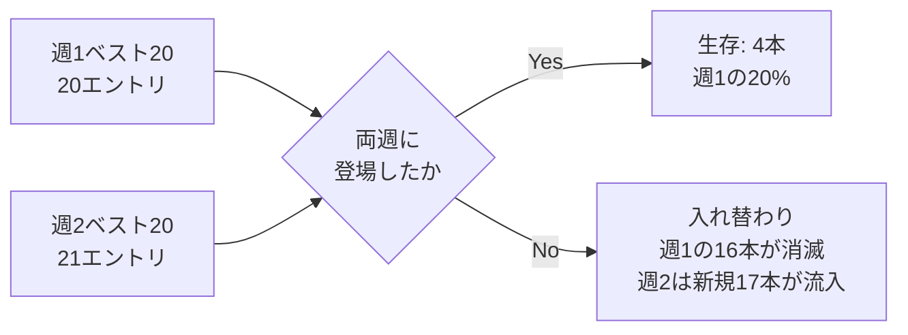

## TL;DR

- Qiita公式ニュースレター「先週いいねが多かった投稿ベスト20」を2週連続分（2026/08/10-16、2026/08/17-23）突き合わせた
- 両週にランクインし続けた記事は**20本中わずか4本（生存率20%）**。残り80%は1週間でランキングから消えた
- その4本のうち1本は、初登場時は10位・週間いいね50件だった記事が、翌週は**1位・週間357件（+614%）**まで加速していた
- 逆に初登場でいきなり1位（週間363件）を獲った記事は、翌週は3位・週間162件まで**-55.4%**の失速
- 「New（初登場）」ラベルは"話題になり始めた"ことは示すが、"まだ伸びる途中か、既にピークか"までは区別できない。1週間分のランキングだけでネタの旬を判断すると、2週目に化ける記事を取りこぼすリスクがある

## 背景・課題

Qiitaのトレンドは、記事のネタ探しのために定期的にチェックしています。その際いつも引っかかっていたのが、「先週No.1だった記事」を見て「これは今伸びているテーマだ」と判断していいのか、という点でした。ランキングは1週間分のスナップショットなので、その号だけを見ても「これから伸びる途中の記事」なのか「既にピークを過ぎて下り坂の記事」なのかは区別がつきません。

ちょうど2週連続でこのニュースレターが手元に残っていたので、感覚ではなく実際に数字を並べて検証してみました。

## 具体的な取り組み

### データソース

Qiita公式ニュースレター「先週いいねが多かった投稿ベスト20」の2通です。

| 号 | 計測期間 | 掲載順位数 |
|---|---|---|
| 週1 | 2026/08/10 〜 08/16 | 20位（同着込みで20エントリ） |
| 週2 | 2026/08/17 〜 08/23 | 20位（同着込みで21エントリ） |

このランキングの「いいね数」は累計値ではなく、**その計測期間中に新たに獲得した週間いいね数**です（ニュースレター本文に計測期間が明記されています）。この前提を取り違えると、「2週目にいいね数が減った＝人気が落ちた」ではなく「週間の新規獲得ペースが落ちた」という正しい読み方ができなくなるので注意が必要です。

### 方法

タイトル・著者名でエントリを突き合わせ、両週に登場した記事を「生存」、片方にしか登場しなかった記事を「入れ替わり」に分類しました。

### 結果：生存した4本の変化

| 記事 | 週1順位・週間いいね | 週2順位・週間いいね | 増減率 | 週1時点でNew |
|---|---|---|---|---|
| [エラーを3秒でAIに丸投げする若手を見て、AIから答えを取り上げることにした](https://qiita.com/jksoft/items/65f7824679ddf171a93d) | 10位・50件 | 1位・357件 | **+614.0%** | Yes（週1が初登場） |
| [AIが実装し、AIがテストし、AIが「問題ありません」と言う時代の品質保証](https://qiita.com/y0us91/items/2feffd2cc6c672717973) | 1位・363件 | 3位・162件 | -55.4% | Yes（週1が初登場） |
| [Claude Code／Codexに中～大規模開発を任せるためのタスク管理](https://qiita.com/Y-Y-dev/items/d526fb7cdbe35a3f9384) | 5位・98件 | 9位・48件 | -51.0% | No（週1以前から掲載継続） |
| [Web API設計の現在地2026](https://qiita.com/tatsuya582/items/a800739c02eadff68c70) | 2位・185件 | 19位・34件 | -81.6% | No（週1以前から掲載継続） |

4本のうち3本は失速していますが、1本だけ明確に逆行しています。「エラーを3秒でAIに丸投げする若手を見て～」は、週1では10位・週間50件というランキング下位の"控えめな初登場"でした。それが週2には週間357件を稼ぎ、ベスト20全体の1位に浮上しています。初登場週の順位だけを見ていたら、この記事を「そこそこの反応」で片付けてしまうところでした。

一方で「AIが実装し、AIがテストし、AIが『問題ありません』と言う時代の品質保証」は、初登場でいきなり1位（週間363件）を獲得した"即爆発型"でしたが、翌週は週間162件まで半減しています。トータルの累計いいね数では依然として大きいはずですが、勢いという意味では既にピークを過ぎたと読むのが自然です。

## 得られた知見・まとめ

- 週1掲載の20エントリのうち、週2にも残っていたのは4本（20%）。裏を返すと**週1掲載の80%（16本）は1週間でベスト20から姿を消し**、週2側もそのぶん17本の新顔で埋まっていました。ランキングの回転は想像より速い
- 「New」ラベルは初登場を示すだけで、その後伸びるか失速するかの情報は持っていません。初登場が下位（週1・10位）でも翌週に1位まで駆け上がる記事（+614%）がある一方、初登場でいきなり1位を獲った記事が翌週には半減する（-55.4%）ケースも同時に存在しました
- 1週間分のランキングだけを「今のトレンド」として扱うと、この「遅咲き」パターンを取りこぼします。ネタ探しの精度を上げるには、最低でも2週分は並べて増減の向きを見る必要があると分かりました
- 逆に「New」でない状態で複数週ランクインし続けている記事（今回で言う「Claude Code／Codexのタスク管理」「Web API設計の現在地2026」）は、初速はなくてもロングテールで読まれ続けている定番テーマの候補として見る価値がありそうです

## 代替手段との比較：単一週のランキングだけを見る場合との違い

| 観点 | 単一週のランキングだけ見る | 複数週を並べて増減を見る（今回の方法） |
|---|---|---|
| 必要な作業量 | ニュースレター1通を読むだけ | 過去分を保存し、タイトル・著者名で突き合わせる手間が発生 |
| 「即爆発して即失速」タイプの記事 | 検知できる（初登場で上位に来るため） | 検知できる（減少率まで分かる） |
| 「初速は弱いが2週目に伸びる」タイプの記事 | **見逃す**（週1では下位で目立たない） | 検知できる（増加率が可視化される） |
| 判断の速さ | 速い（その場で分かる） | 遅い（最低1週間分のラグが発生する） |

ネタの鮮度を優先するなら単一週で十分ですが、「本当に伸びているテーマ」を見極めたい場合は、最低1回分のラグを許容してでも複数週を突き合わせたほうが精度は上がる、というのが今回の結論です。

## よくある疑問

**Q. サンプルが2週間分だけでは少なすぎないか？**
A. その通りで、これは傾向の「存在」を確認した段階に過ぎません。継続的にニュースレターを保存して4〜5週分のデータが溜まれば、生存率がこの2週間の20%前後で安定するのか、それとも週によって大きくぶれるのかまで検証できます。

**Q. タイトル・著者名での突き合わせは正確か？**
A. 今回は該当記事のタイトルが2通の間で完全一致していたため問題ありませんでしたが、本来は記事URLのようなユニークなIDで突き合わせるほうが確実です。ニュースレター側にIDが記載されていないため、今回はタイトル一致で代用しました。

**Q. 週間いいね数と累計いいね数を混同していないか？**
A. 本文中の数値はすべて各ニュースレターに明記された「計測期間中の週間いいね数」であり、記事の累計いいね数ではありません。「AIが実装し、AIがテストし～」の週2・162件も、あくまで2週目単体の獲得数で、累計では週1の363件と合わせてさらに大きい値になっているはずです。

## 参考リンク

- [Qiitaニュース 2026-08-19号（週1データの出典）](https://qiita.com/official-columns/news/2026-08-19/)
- [Qiitaニュース 2026-08-26号（週2データの出典）](https://qiita.com/official-columns/news/2026-08-26/)
- [エラーを3秒でAIに丸投げする若手を見て、AIから答えを取り上げることにした](https://qiita.com/jksoft/items/65f7824679ddf171a93d)
- [AIが実装し、AIがテストし、AIが「問題ありません」と言う時代の品質保証](https://qiita.com/y0us91/items/2feffd2cc6c672717973)
- [Claude Code／Codexに中～大規模開発を任せるためのタスク管理](https://qiita.com/Y-Y-dev/items/d526fb7cdbe35a3f9384)
- [Web API設計の現在地2026](https://qiita.com/tatsuya582/items/a800739c02eadff68c70)
