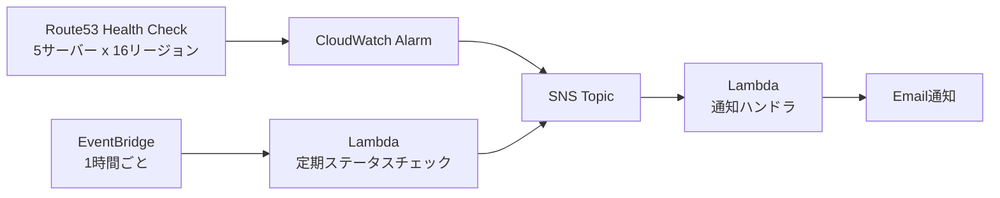

## TL;DR

- 外形監視SaaSを契約する前に、Route53ヘルスチェック（16リージョン）＋CloudWatchアラーム＋SNS＋Lambda（Python 3.9）で5サーバーの死活監視を自前で組んでみた。実測の月額内訳はRoute 53 $2.50、CloudWatch $2.00、SNS $0.001、Lambda $0（無料枠内）、CI/CD用CodePipeline $1.03で、**合計 約$5.53（約830円）**
- 社内の完了報告には「月額運用コスト$4.52」という別の数字も残っていた。原因はCodePipelineの$1.03を含むか含まないかの違いで、$4.52は監視システム本体のみのコスト。記事中で読者が検算できるように内訳を分けて示す
- 5サーバーを監視できていたはずが、**監視パスが`/wp-login.php`の1台だけ通知が未受信**だった。Lambda実行ログもSNSメトリクスも「送信成功」を示しているのに、実際には届いていなかった。原因は資料上特定できておらず、未解決のまま残っている
- 死活監視の基本構成を組んだ約7分後、自分で作った「異常検知→SSHで自動的にApacheを再起動する」自動復旧機能を削除した。作れることと、運用し続ける価値があることは別だと判断したため
- 単価は2025年7〜8月時点で筆者が実際に使った数字。最新の単価はAWS公式の料金ページと[AWS Pricing Calculator](https://calculator.aws/#/)で必ず確認してほしい

## 背景：外形監視に何を使うか

社内で運用している5台のサーバーの死活監視を、既存のPHPスクリプトによる簡易チェックから、CloudWatchベースの24時間監視に移行することにした。

外形監視SaaSを契約する選択肢もあったが、契約前に「AWSの基本サービスだけでどこまで安く、かつ実用的に組めるか」を自分で試算してから判断したかった。SaaS側の料金は契約プランやサーバー台数、チェック間隔によって大きく変わるため本記事では扱わない。ここで示すのはあくまで、Route53とCloudWatchとSNSとLambdaを組み合わせて自前で構築した場合の実測コストである。

## 構成：Route53ヘルスチェック＋CloudWatchアラーム＋SNS＋Lambda

最終的な構成は次の通り。

- **Route53ヘルスチェック**: 5サーバーを16リージョンから監視
- **CloudWatchアラーム**: ヘルスチェックの状態変化を検知
- **SNS**: アラームをトリガーにEmail通知を送信
- **Lambda（Python 3.9、2関数）**: 通知内容の整形を行うハンドラと、EventBridgeで1時間ごとに全サーバーの状態をまとめてレポートするステータスチェッカー
- **CloudFormation**: 上記インフラをコード管理
- **CodePipeline**: GitHubへのpush時にSAMで自動デプロイ

通知は当初Slack Webhookで組んでいたが、組織のポリシーでWebhookが繰り返し無効化される問題が発生した。代替としてAWS Chatbotを検討したものの、管理者権限が不足していて設定できず、最終的にSNS経由のEmail通知に切り替えている。「作りたかった構成」ではなく「権限の中で確実に動く構成」を選んだ形になる。

## 金額の内訳：$5.53と$4.52、どちらが正しいのか

実測の月額内訳は次の通り（2025年7〜8月時点、筆者環境）。

| 項目 | 月額 |
|---|---|
| Route 53 Health Checks（5個） | $2.50 |
| CloudWatch（アラーム・メトリクス） | $2.00 |
| SNS（Email通知） | $0.001 |
| Lambda | $0（無料枠内） |
| CodePipeline（CI/CD） | $1.03 |
| **合計** | **約$5.53（約830円）** |

社内の完了報告にはこれとは別に「月額運用コスト $4.52」という数字も残っていた。数字が食い違って見えるが、対象範囲が違うだけで矛盾ではない。

- 監視システム本体（Route53 + CloudWatch + SNS）: $2.50 + $2.00 + $0.001 ≒ **$4.50**
- そこに、1時間ごとの定期レポート機能を追加した分（Lambda実行720回/月 約$0.01 ＋ EventBridge 720回/月 約$0.001）: **+$0.021**
- 合計: $4.50 + $0.021 ≒ **$4.52**（＝完了報告側の数字）
- ここにCI/CD用のCodePipeline $1.03 を足すと $4.52 + $1.03 = $5.55 となり、README側の合計 $5.53 とは約2セントのずれが残る。これは各ドキュメントを別のタイミングで丸めて記録したことによる誤差と考えられる

つまり **$4.52は監視システム本体のみ、$5.53はCI/CDパイプライン込みの合計**。CodePipelineを使わず手動デプロイで運用するなら、実質$4.52前後で回せることになる。数字を1つだけ引用すると読者が誤検算するため、この記事では両方の内訳を残した。

## 落とし穴：5台中1台、通知が鳴っていなかった

ここが今回一番書きたかった部分になる。

5サーバーを監視する構成を組み、Email通知のテストも行った。しかし完了報告の時点で、**監視パスが`/wp-login.php`の1台だけ通知を受信できていなかった**。他の4台は正常に受信できている。

厄介なのは、サーバーが落ちていたわけではなく、通知の送信経路そのものが壊れていた点だ。監視対象は正常に動いており、異常を伝える側だけが黙っていたことになる。

- Lambdaの実行ログには「Email notification sent successfully」と出力されていた
- SNSのメトリクス上も送信済みとして記録されていた
- にもかかわらず、実際には届いていなかった

調査項目としてSNSサブスクリプションフィルターの確認、そのサーバー固有の設定確認、迷惑メールフォルダの確認、SNS配信ログの詳細分析が挙げられていたが、資料上はいずれも未着手のまま残っており、**原因は特定できていない。未解決のまま残っている課題**として正直に書いておく。

死活監視を組む上で一番怖いのは、サーバーが落ちることではなく、「監視は動いているつもりで、実は鳴らない経路が1本混ざっている」ことだと今回改めて感じた。ログ上は成功しているように見える通知ほど、実際に受信できているかを別途確認する必要がある。

## 作った自動復旧機能を、7分後に消した話

死活監視の基本構成を完成させた同じ日に、もう一段踏み込んだ機能を作った。「Route53ヘルスチェックで異常を検知したら、SSH経由でリモートサーバーに接続し、Apache/Bitnamiを自動的に再起動する」自動復旧機能である。

実装したのは次の3ファイル、合計458行。

- `auto_recovery_monitor.py`（163行）: HTTPのHEADリクエストで異常を検知する基本ロジック
- `ssh_recovery_monitor.py`（206行）: paramikoを使ってSSH経由で実際にApacheを再起動する処理
- `auto-recovery-template.yaml`（88行）: 15分間隔で監視・復旧を実行するCloudFormationテンプレート

動作仕様は、15分ごとの監視でエラーを検知したら即座に復旧コマンドを実行し、5分後に復旧できているかを再チェックするというもの。動かすための前提として、SSH秘密鍵をAWS Secrets Managerに保存すること、Lambdaから対象サーバーへSSH接続できるようセキュリティグループを設定すること、SSH接続先にsudo権限を持つユーザーを用意することが必要だった。

そして、このコミットのわずか**7分40秒後**に、同じ日のうちに追加した458行をすべて削除するコミットを行っている。削除理由としてコミットメッセージに残っているのは次の3点だった。

- 複雑化によるデグレリスク回避
- 安定した基本監視機能の維持
- 手動対応による確実な障害対応

自動復旧のコード自体は書けたし、ロジックとしても動くものだった。しかし、それを運用し続けるには、SSH秘密鍵の管理、Lambdaから本番サーバーへのSSH経路の維持、sudo権限を持つ接続用ユーザーの管理という、コードの外側にあるコストが常に発生し続ける。しかも直前の項目で書いた通り、通知網自体が5台中1台で欠けていたことに気づいたばかりだった。通知すら完全に信用できない状態で、人間の判断を介さずにリモートで自動的に再起動を仕掛ける仕組みを持つのは、障害対応というより新しい障害の火種を持つことに近い。

「作れること」と「持ち続ける価値があること」は別物だと分かってはいたつもりだったが、実際に自分の手で作って、7分後に自分で消すところまでやって初めて実感が伴った。最終的な構成は、1時間ごとに全サーバーの状態をまとめて通知する定期レポート機能だけを残す、シンプルな監視に戻している。

## Q&A

**Q. なぜ最初からEmail通知ではなくSlack Webhookを使おうとしたのか。**
A. 通知の見やすさと即時性を優先したためだが、組織のポリシーで外部Webhookが繰り返し無効化される問題が起き、代替のAWS Chatbotも管理者権限不足で設定できなかった。最終的に確実に届くSNS経由のEmail通知に切り替えている。

**Q. $4.52と$5.53、結局どちらを基準にすればいいのか。**
A. CI/CDまで含めて運用するなら$5.53、監視システム本体だけの実力値を知りたいなら$4.52で見るのが正しい。CodePipelineを使わず手動デプロイで運用するなら、実質$4.52に近い金額で回せる。

**Q. 自動復旧機能を持たないままで不安はないのか。**
A. 今回、通知経路自体が5台中1台で欠けていた実績がある。通知の完全性すら検証できていない段階で、人間を介さない自動復旧を仕掛ける方がリスクが高いと判断した。まずは「通知が確実に届く」ことを固めるのが先だと考えている。

**Q. 記事中の単価をそのまま自分の見積もりに使っていいか。**
A. いいえ。本記事の単価は2025年7〜8月時点で筆者が実際に使った数字である。リージョンや契約条件、時期によって変わるため、実際に検討する際はAWS公式の料金ページと[AWS Pricing Calculator](https://calculator.aws/#/)で必ず確認してほしい。

## 得られた知見・まとめ

- 5サーバーの死活監視は、Route53ヘルスチェック＋CloudWatch＋SNS＋Lambdaの組み合わせで月額$5.53（約830円）、CI/CDを除けば$4.52まで下げられた。SaaSを契約する前に、自前で組んだ場合のコストを一度実測しておく価値はある
- ただし「安く監視できる」ことと「漏れなく監視できている」ことは別問題。5台中1台、通知が届いていなかった実績があり、原因はまだ特定できていない。ログ上「送信成功」と出ていても、実際に受信できているかは別途確認が必要
- 自動復旧のような「作れる機能」を実装したこと自体は無駄ではなかったが、SSH秘密鍵の管理やセキュリティグループの設定など、コードの外側で発生し続ける運用コストを天秤にかけて、要らないと判断したら消す。今回はそれを作った7分後に実行した
- 数字が複数の資料で食い違っていたら、どちらか一方を選ぶのではなく、対象範囲の違いを読者が検算できる形で両方残す方が誠実だと感じた

## 参考リンク

- [Amazon Route 53 のヘルスチェックとDNSフェイルオーバー](https://docs.aws.amazon.com/ja_jp/Route53/latest/DeveloperGuide/dns-failover.html)
- [Amazon Route 53 の料金](https://aws.amazon.com/jp/route53/pricing/)
- [Amazon CloudWatch アラームでEメール通知を送信する](https://docs.aws.amazon.com/ja_jp/AmazonCloudWatch/latest/monitoring/AlarmThatSendsEmail.html)
- [Amazon CloudWatch の料金](https://aws.amazon.com/jp/cloudwatch/pricing/)
- [Amazon SNS の料金](https://aws.amazon.com/jp/sns/pricing/)
- [AWS CodePipeline の料金](https://aws.amazon.com/jp/codepipeline/pricing/)
- [AWS Pricing Calculator](https://calculator.aws/#/)
